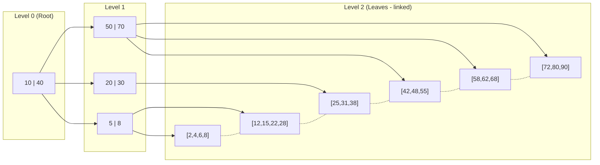
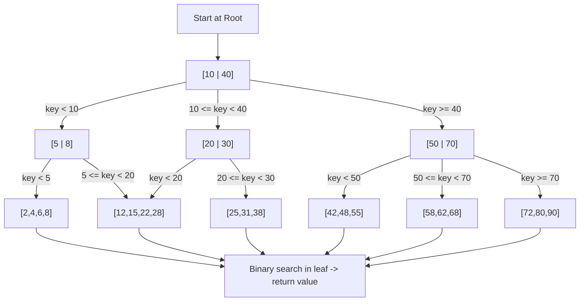
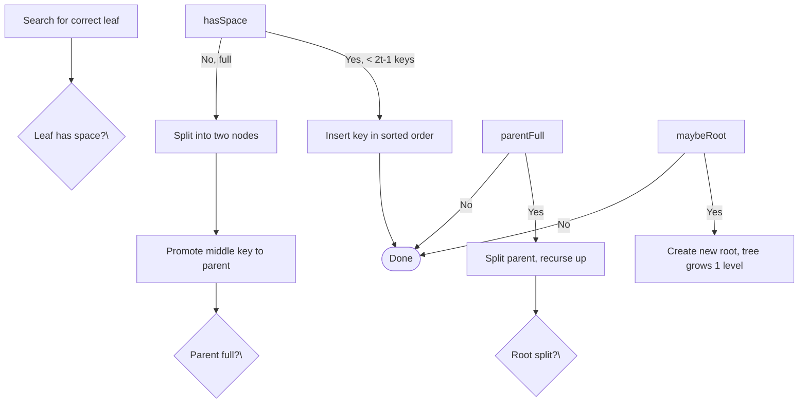

## Overview

The B+ Tree is an optimized variant of the B-Tree designed for efficient disk-based storage. Unlike B-Trees that store data in both internal and leaf nodes, B+ Trees store all data exclusively in leaf nodes while internal nodes contain only keys for routing. Leaf nodes are connected via a doubly-linked list, enabling fast range queries and sequential scans without traversing back through the tree.

B+ Trees are the dominant indexing mechanism in relational databases (MySQL InnoDB, PostgreSQL, Oracle), file systems (NTFS, ext4), and any system requiring high read throughput with predictable I/O patterns.

## Architecture Overview

Internal nodes route searches using keys only (gray boxes above), while leaf nodes hold all key-value pairs in sorted order (orange box). The dashed lines between leaves form a doubly-linked list enabling O(k) sequential range scans.

## Core Components

### 1. Internal Nodes

- Store only keys (no data), acting as routing guides
- Each key separates the key ranges of its children: `key[i]` is the smallest key in the right subtree
- Number of children = number of keys + 1
- Designed for maximum fan-out to minimize tree height and disk seeks

### 2. Leaf Nodes

- Store all key-value data records in sorted order
- Linked via a doubly-linked list for efficient range scans (O(k) where k = matching records)
- Each node points to next and previous leaf — enables bidirectional traversal
- All leaves reside at identical depth — guarantees uniform search cost

### 3. Root Node

- Topmost node of the tree; the entry point for all searches
- Can be internal or leaf (in tiny trees with a single node)
- Always maintained at the root during splits and merges

### 4. Minimum Degree `t`

- Every node (except root) holds at least `t - 1` and at most `2t - 1` keys
- A node with `2t - 1` keys is **full** and must split on insert
- A node with `t - 1` keys is **underflowing** and must merge or rebalance on delete
- The degree `t` is chosen to match one disk page/block, maximizing I/O efficiency

## Structure & Properties

### Fan-out and Height

- Keys per node: `n = page_size / key_size` — typically 100–10,000 for disk pages
- Height: **O(logₙ N)**, where `n` = keys per node, `N` = total records
- With `n = 200`, a 1 billion record index fits in **~5 disk seeks**
- All leaves at the same depth ensures uniform query latency

### Sequential Access

- Leaf nodes form a doubly-linked list — range queries stream sequentially without tree backtracking
- Enables efficient scans, `BETWEEN` queries, and ordered pagination
- Complexity: O(logₙ N) to find start key + O(k) to scan

## How It Works

### Search

1. Start at the root node
2. Binary search keys in current node to select the correct child
3. Traverse down to leaf node — O(logₙ N) height
4. Binary search within leaf for target key — O(log n) on small sorted array
5. Return value or "not found"

**Time Complexity: O(logₙ N)**

- **N** = total number of key-value pairs
- **n** = keys per node (fan-out, typically 100–10,000)
- Must always reach a leaf even if the key exists in an internal node

### Insert

1. Locate correct leaf via search — O(logₙ N)
2. If leaf has space (< 2t-1 keys), insert key in sorted order — done
3. If leaf is full (2t-1 keys):
   - Split into two nodes, each with t-1 keys
   - Promote the middle key to parent
   - If parent overflows, recurse upward — may increase tree height
4. Update leaf links and internal pointers

### Delete

1. Locate key in leaf — O(logₙ N)
2. If leaf has > t-1 keys, remove key — done
3. If leaf has exactly t-1 keys (underflow):
   - **Redistribute**: Borrow a key from an adjacent sibling that has > t-1 keys (parent key trickles down, sibling key moves up)
   - **Merge**: If both siblings are at minimum, merge leaf with sibling — pull down one parent key to serve as separator
   - If parent falls below t-1 keys, recursively handle upward
4. Update leaf links and internal node keys

## Advantages

- **Range Queries**: O(k) sequential scan via linked leaves — no tree backtracking
- **Balanced Depth**: All leaves at the same level — uniform O(logₙ N) latency
- **High Fan-out**: Internal nodes store only keys → fewer levels → fewer disk seeks
- **Disk-Optimized**: Block sizes match storage pages, maximizing I/O efficiency
- **Predictable**: Consistent performance regardless of data distribution or query type
- **Mixed Workloads**: Strong for both point lookups and range scans

## Disadvantages

- **Point Query Overhead**: Must reach leaf even if key exists in an internal node (B-Tree can return early)
- **Maintenance Complexity**: Splits/merges require careful pointer updates and rebalancing
- **Space Overhead**: Duplicate keys in internal nodes + leaf links increase storage footprint
- **Write Amplification**: Node splits/merges cause multiple disk writes — worse than LSM-Trees
- **Concurrent Access Locking**: Page-level locking in databases can become a bottleneck under high concurrency

## B+ Tree vs B-Tree

| Aspect                        | B+ Tree                                           | B-Tree                                         |
| ----------------------------- | ------------------------------------------------- | ---------------------------------------------- |
| **Data Storage**              | Only in leaf nodes                                | In internal and leaf nodes                     |
| **Range Queries**             | Excellent (O(k)) via linked leaves                | Poor (requires full traversal)                 |
| **Point Queries**             | Good (O(logₙ N)) — must reach leaf                | Slightly better (can return at internal node)  |
| **Fan-out**                   | Higher (keys only in internal nodes)              | Lower (keys + data in internal nodes)          |
| **Tree Height**               | Lower (due to higher fan-out)                     | Higher                                         |
| **Disk I/O Efficiency**       | Excellent (sequential leaf scans)                 | Good                                           |
| **Implementation Complexity** | Higher (leaf linking + splits)                    | Lower                                          |
| **Best For**                  | Databases, file systems, read-heavy & range-heavy | In-memory structures, occasional range queries |

## B+ Tree vs LSM-Tree

| Aspect                  | B+ Tree                               | LSM-Tree                                    |
| ----------------------- | ------------------------------------- | ------------------------------------------- |
| **Write Pattern**       | Random I/O (in-place page updates)    | Sequential I/O (append-only WAL + SSTables) |
| **Write Complexity**    | O(logₙ N) + potential split/merge     | O(1) amortized (WAL + MemTable)             |
| **Read Complexity**     | O(logₙ N) consistent                  | O(L × log M) typical, L = levels            |
| **Range Queries**       | Excellent (sequential leaf scan)      | Good (merge sorted SSTables per level)      |
| **Deletions**           | Immediate (merge or mark)             | Deferred (tombstone → compaction)           |
| **Write Amplification** | Lower (in-place)                      | Higher (compaction rewrites data)           |
| **Concurrent Writes**   | Page-level locking (can bottleneck)   | Lock-free via MemTable + background flush   |
| **Best For**            | Read-heavy, low-latency point lookups | Write-heavy, high-throughput ingest         |

## When to Use

Use B+ Trees when you need:

- **Range Queries**: Efficient sequential access via linked leaf nodes (e.g., `key BETWEEN X AND Y`)
- **Low Point-Query Latency**: Consistent O(logₙ N) with typically 2–4 disk seeks
- **Database Indexing**: Industry standard for relational databases due to balanced structure and I/O efficiency
- **Disk-Optimized Storage**: Maximizes data per block, minimizes seeks, and leverages sequential disk reads
- **Mixed Workloads**: Strong performance on both point queries and range scans

## When to Avoid

Avoid B+ Trees when:

- **Writes dominate**: Node splits/merges cause write amplification — LSM-Trees offer better O(1) write scaling
- **Data fits in RAM**: Hash tables or in-memory B-Trees are simpler and faster
- **Sub-millisecond latency required**: Multiple disk seeks make B+ Trees too slow
- **Bulk inserts frequent**: Cascading splits cause latency spikes
- **Only point queries**: Hash tables provide O(1) with less overhead
- **Frequent deletions**: Underfilled nodes require costly rebalancing

## Examples

- **Relational databases**: MySQL InnoDB, PostgreSQL, Oracle, SQLite
- **File systems**: NTFS, ext4, XFS
- **NoSQL databases**: MongoDB (secondary indexes)
- **Message queues**: Google Cloud Pub/Sub subscription indexes
