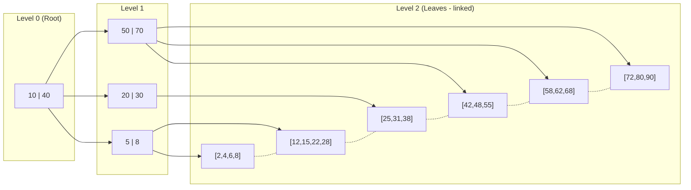
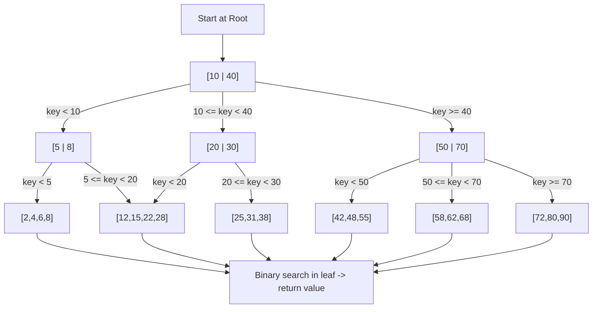
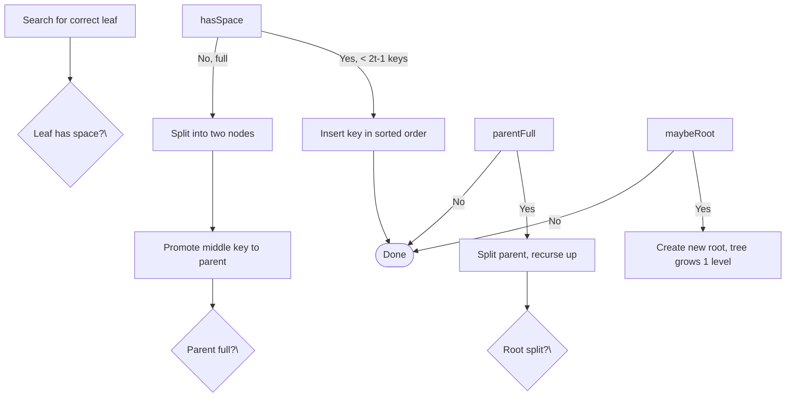

## Overview

B+ Tree 是 B-Tree 的一種最佳化變體，專為高效的 disk-based storage 而設計。與在 internal 和 leaf nodes 都儲存資料的 B-Tree 不同，B+ Tree 將所有資料僅存在 leaf nodes 中，internal nodes 只包含用於 routing 的 keys。Leaf nodes 透過 doubly-linked list 連接，使得 range queries 和 sequential scans 不需要遍歷整個 tree 就能快速完成。

B+ Tree 是關聯式資料庫（MySQL InnoDB、PostgreSQL、Oracle）、檔案系統（NTFS、ext4）以及任何需要高讀取吞吐量與可預測 I/O patterns 的系統中，最主要的 indexing mechanism。

## Architecture Overview

Internal nodes 僅使用 keys 來 routing searches（上方的灰色方塊），而 leaf nodes 則以排序後的順序儲存所有的 key-value pairs（橘色方塊）。Leaves 之間的虛線構成了一個 doubly-linked list，支援 O(k) 的 sequential range scans。

## Core Components

### 1. Internal Nodes

- 僅儲存 keys（不含 data），扮演 routing guides 的角色
- 每個 key 分隔其 children 的 key ranges：`key[i]` 是右子樹中最小的 key
- Children 數量 = keys 數量 + 1
- 設計目標是最大化 fan-out，以最小化 tree height 和 disk seeks

### 2. Leaf Nodes

- 以排序後的順序儲存所有的 key-value data records
- 透過 doubly-linked list 連接，支援高效的 range scans（O(k)，其中 k = 符合條件的記錄數）
- 每個 node 指向下一個和前一個 leaf — 支援雙向遍歷
- 所有 leaves 位於相同的 depth — 保證了統一的搜尋成本

### 3. Root Node

- 位於 tree 最頂端的 node；是所有搜尋的進入點
- 可以是 internal 或 leaf（在只有一個節點的極小型 tree 中）
- 在 splits 和 merges 過程中始終保持在 root 位置

### 4. Minimum Degree `t`

- 每個 node（除了 root）至少包含 `t - 1` 個 keys，最多包含 `2t - 1` 個 keys
- 包含 `2t - 1` 個 keys 的 node 是 **full** 的，insert 時必須 split
- 包含 `t - 1` 個 keys 的 node 是 **underflowing** 的，delete 時必須 merge 或 rebalance
- Degree `t` 的選擇需匹配一個 disk page/block，以最大化 I/O efficiency

## Structure & Properties

### Fan-out and Height

- 每個 node 的 keys 數量：`n = page_size / key_size` — disk pages 通常為 100–10,000
- Height：**O(logₙ N)**，其中 `n` = 每個 node 的 keys 數量，`N` = 總記錄數
- 當 `n = 200` 時，10 億筆記錄的 index 只需約 **5 次 disk seeks**
- 所有 leaves 位於相同 depth，確保了統一的 query latency

### Sequential Access

- Leaf nodes 形成 doubly-linked list — range queries 可以順序串流，不需要 tree backtracking
- 支援高效的 scans、`BETWEEN` 查詢和有序分頁
- 複雜度：O(logₙ N) 找到起始 key + O(k) 進行掃描

## How It Works

### Search

1. 從 root node 開始
2. 在當前 node 中對 keys 進行 binary search，以選擇正確的 child
3. 向下遍歷至 leaf node — tree height 為 O(logₙ N)
4. 在 leaf 內對目標 key 進行 binary search — 在小的有序陣列上為 O(log n)
5. 傳回 value 或 "not found"

**Time Complexity: O(logₙ N)**

- **N** = key-value pairs 的總數量
- **n** = 每個 node 的 keys 數量（fan-out，通常為 100–10,000）
- 即使 key 存在於 internal node 中，仍然必須到達 leaf 才會傳回結果

### Insert

1. 透過搜尋找到正確的 leaf — O(logₙ N)
2. 如果 leaf 有空間（< 2t-1 keys），按排序順序插入 key — 完成
3. 如果 leaf 已滿（2t-1 keys）：
   - 拆分為兩個 nodes，各包含 t-1 個 keys
   - 將中間的 key promote 至 parent
   - 如果 parent overflow，向上遞迴處理 — 可能增加 tree height
4. 更新 leaf links 和 internal pointers

### Delete

1. 在 leaf 中找到 key — O(logₙ N)
2. 如果 leaf 擁有 > t-1 個 keys，移除該 key — 完成
3. 如果 leaf 恰好有 t-1 個 keys（underflow）：
   - **Redistribute**：向相鄰的 sibling 借一個 key（sibling 擁有 > t-1 個 keys）（parent key 向下傳遞，sibling key 向上移動）
   - **Merge**：如果兩個 siblings 都處於最小數量，將 leaf 與 sibling 合併 — 從 parent 拉下一個 key 作為 separator
   - 如果 parent 的 keys 數低於 t-1，向上遞迴處理
4. 更新 leaf links 和 internal node keys

## Advantages

- **Range Queries**：透過 linked leaves 進行 O(k) 的 sequential scan — 不需要 tree backtracking
- **Balanced Depth**：所有 leaves 在同一 level — 統一的 O(logₙ N) latency
- **High Fan-out**：Internal nodes 僅儲存 keys → 層級更少 → disk seeks 更少
- **Disk-Optimized**：Block sizes 匹配 storage pages，最大化 I/O efficiency
- **Predictable**：無論資料分佈或查詢類型為何，效能一致
- **Mixed Workloads**：在 point lookups 和 range scans 上表現皆佳

## Disadvantages

- **Point Query Overhead**：即使 key 存在於 internal node 中，仍必須到達 leaf（B-Tree 可以在 internal node 提前傳回）
- **Maintenance Complexity**：Splits/merges 需要仔細的 pointer 更新和 rebalancing
- **Space Overhead**：Internal nodes 中的重複 keys + leaf links 增加了 storage footprint
- **Write Amplification**：Node splits/merges 導致多次 disk writes — 比 LSM-Trees 更差
- **Concurrent Access Locking**：資料庫中的 page-level locking 在高 concurrency 下可能成為瓶頸

## B+ Tree vs B-Tree

| Aspect                        | B+ Tree                                           | B-Tree                                         |
| ----------------------------- | ------------------------------------------------- | ---------------------------------------------- |
| **Data Storage**              | 僅在 leaf nodes                                   | 在 internal 和 leaf nodes                        |
| **Range Queries**             | 極佳（透過 linked leaves 的 O(k)）                 | 较差（需要完整遍歷）                             |
| **Point Queries**             | 良好（O(logₙ N) — 必須到達 leaf）                  | 稍好（可在 internal node 提前傳回）              |
| **Fan-out**                   | 較高（internal nodes 僅含 keys）                   | 較低（internal nodes 含 keys + data）            |
| **Tree Height**               | 較低（因較高的 fan-out）                          | 較高                                           |
| **Disk I/O Efficiency**       | 極佳（sequential leaf scans）                     | 良好                                           |
| **Implementation Complexity** | 較高（leaf linking + splits）                      | 較低                                           |
| **Best For**                  | Databases、file systems、read-heavy & range-heavy | In-memory structures、偶爾的 range queries       |

## B+ Tree vs LSM-Tree

| Aspect                  | B+ Tree                               | LSM-Tree                                    |
| ----------------------- | ------------------------------------- | ------------------------------------------- |
| **Write Pattern**       | Random I/O（in-place page updates）    | Sequential I/O（append-only WAL + SSTables） |
| **Write Complexity**    | O(logₙ N) + 可能的 split/merge         | O(1) amortized（WAL + MemTable）             |
| **Read Complexity**     | O(logₙ N) 穩定                         | O(L × log M) 一般情況，L = levels           |
| **Range Queries**       | 極佳（sequential leaf scan）           | 良好（merge sorted SSTables per level）      |
| **Deletions**           | 立即（merge 或標記）                   | 延遲（tombstone → compaction）               |
| **Write Amplification** | 較低（in-place）                       | 較高（compaction 重寫資料）                   |
| **Concurrent Writes**   | Page-level locking（可能成為瓶頸）      | Lock-free via MemTable + background flush   |
| **Best For**            | Read-heavy、低延遲的 point lookups      | Write-heavy、高 throughput 的 ingest         |

## When to Use

當你需要以下功能時，使用 B+ Tree：

- **Range Queries**：透過 linked leaf nodes 進行高效的 sequential access（例如：`key BETWEEN X AND Y`）
- **Low Point-Query Latency**：一致的 O(logₙ N)，通常只需 2–4 次 disk seeks
- **Database Indexing**：由於 balanced structure 和 I/O efficiency，是關係式資料庫的產業標準
- **Disk-Optimized Storage**：最大化每個 block 的資料量，最小化 seeks，並利用 sequential disk reads
- **Mixed Workloads**：在 point queries 和 range scans 上都有良好表現

## When to Avoid

以下情況不適合使用 B+ Tree：

- **Writes dominate**：Node splits/merges 會造成 write amplification — LSM-Trees 提供更好的 O(1) write scaling
- **Data fits in RAM**：Hash tables 或 in-memory B-Trees 更簡單且更快
- **Sub-millisecond latency required**：多次 disk seeks 使 B+ Tree 太慢
- **Bulk inserts frequent**：Cascading splits 會造成 latency spikes
- **Only point queries**：Hash tables 提供 O(1) 且 overhead 更低
- **Frequent deletions**：Underfilled nodes 需要昂貴的 rebalancing

## Examples

- **Relational databases**：MySQL InnoDB、PostgreSQL、Oracle、SQLite
- **File systems**：NTFS、ext4、XFS
- **NoSQL databases**：MongoDB（secondary indexes）
- **Message queues**：Google Cloud Pub/Sub subscription indexes
