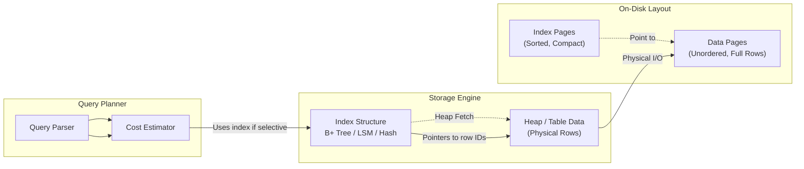

## Overview

Database indexes are data structures that dramatically accelerate query performance by eliminating full-table scans. Without an index, a database must examine every row — an O(n) linear scan — to find matches. With a well-designed index, the same query resolves in O(log n) or O(1) time by navigating a targeted structure.

Indexes are the single highest-impact tuning lever in database performance. Stripe relies on B+ Tree indexes to serve millions of per-request lookups against payment records. PostgreSQL's GiST and GIN indexes power full-text search and JSONB queries across multi-terabyte tables. But every index carries a cost: write amplification, storage overhead, and maintenance complexity. At scale, indexes become a core architectural trade-off, not an afterthought.

## Architecture Overview



The query planner evaluates whether an index scan is cheaper than a sequential scan based on estimated row counts, statistics, and I/O costs. If the index is selective enough, it navigates the index structure to find matching keys, then performs heap fetches to retrieve the full row data. For covering indexes, the entire query can be satisfied from the index alone — eliminating heap fetches entirely.

## Core Components

### 1. B+ Tree Index

The dominant index structure in relational databases (MySQL InnoDB, PostgreSQL, Oracle, SQL Server). All data lives in leaf nodes; internal nodes store only keys for routing.

- **Fan-out:** Typically 1,000+ children per internal node on 16KB pages, yielding a 3-4 level tree for billions of rows
- **Depth:** log_fanout(n) — for 1 billion rows with fan-out of 1,000, depth is exactly 3
- **Leaf linkage:** Doubly-linked list between leaf nodes enables O(k) range scans once the start key is located

**How it works:** Searches descend from the root, comparing the target key against internal node keys to pick the correct child pointer. At the leaf level, keys are scanned in sorted order. Inserts place the key at its sorted position and split the leaf page if it exceeds the fill factor (usually 90%). Splits propagate upward, potentially creating a new root level — this is the only operation that increases tree height.

**Limitations at scale:**

- **Hotspot on the root node:** Every lookup, insert, and delete passes through the root page, creating a concurrency bottleneck under heavy multi-threaded workloads.
- **Page split overhead:** Random page splits during inserts cause fragmentation and require locking or latching, which becomes visible in high-concurrency OLTP systems.
- **Buffer pool pressure:** As the tree grows beyond memory, the root and hot internal nodes dominate the buffer pool, evicting data pages and increasing disk I/O.
- **Wide keys hurt fan-out:** A composite index on wide columns (e.g., `(user_id, timestamp, event_type)`) reduces the number of keys per page, increasing tree depth and I/O per lookup.

**Complexity:**

| Operation           | Time         | Space                                                   |
| ------------------- | ------------ | ------------------------------------------------------- |
| Point lookup        | O(log n)     | —                                                       |
| Range scan (k rows) | O(log n + k) | O(k) for results                                        |
| Insert              | O(log n)     | O(1) amortized (page splits redistribute)               |
| Delete              | O(log n)     | O(1)                                                    |
| Index storage       | —            | O(n) — each key stored once, plus leaf linkage pointers |

**What is n:** Total number of rows in the indexed table. Tree depth grows as log_fanout(n) where fan-out is children per internal node (~1,000 on 16KB pages).

### 2. LSM-Tree Index

Used in NoSQL and columnar systems (Cassandra, ScyllaDB, RocksDB, HBase) where write throughput takes priority over read latency.

- **Write path:** In-memory MemTable (skip list) -> immutable SSTable on flush -> compaction across levels
- **Read path:** Probe MemTable, then L0 through LN until key is found; each level is approximately 10x larger than the previous
- **Compaction:** Background process that merges SSTables, removes duplicates, and reclaims tombstoned/deleted space

**How it works:** Every write is appended to the MemTable, an in-memory skip list supporting O(log n) insertions. When the MemTable reaches its size threshold (e.g., 128MB in RocksDB), it freezes and is flushed to disk as an L0 SSTable. L0 files overlap in key ranges. Background compaction merges L0 into L1, L1 into L2, and so on — each level is roughly 10x larger than the one above. During a read, the engine probes MemTable first (mutable, fastest), then L0 through LN, stopping at the first key found.

**Limitations at scale:**

- **Read amplification:** A key may exist in every level in an older form. Each level probe is a disk seek, so P95 read latency degrades as the tree deepens.
- **Compaction CPU and I/O:** Compaction rewrites every SSTable it touches, generating 2-10x more disk writes than the original data (write amplification). On NVMe this is manageable; on congested shared storage it steals bandwidth from reads.
- **Tombstone storms:** Deleted entries linger as tombstones until compaction removes them. After a bulk delete, reads pay for probing layers full of markers before returning "not found."
- **Stall on MemTable full:** If compaction falls behind writes, the MemTable fills and blocks new writes until space is reclaimed. This is a hard stall, not just a latency spike.

**Complexity:**

| Operation           | Time                                | Space                                                        |
| ------------------- | ----------------------------------- | ------------------------------------------------------------ |
| Point lookup        | O(log n) — probe MemTable + L0..LN  | —                                                            |
| Range scan (k rows) | O(n) — no ordering, full table scan | O(k) for results                                             |
| Insert              | O(1)                                | O(1) in MemTable; flush deferred                             |
| Delete              | O(1) — tombstone marker             | O(1) per tombstone                                           |
| Index storage       | —                                   | O(n) + compaction overhead — duplicates exist during merging |

**What is n:** Total number of key-value pairs in the table. Read cost depends on how many levels the key spans — a key written L times (via updates/deletes across flushes) costs O(L) disk probes.

### 3. Hash Index

Maps keys to row locations via a hash function. Supports only equality lookups (`=`, `IN`), not ranges.

- **Lookup:** O(1) average case for exact match queries
- **Collision:** Handled via chaining or open addressing; high-cardinality data minimizes collision probability
- **Memory-resident:** PostgreSQL's hash indexes are WAL-logged but less common than B+ Trees in practice

**How it works:** The key is hashed to a bucket address. The engine jumps directly to that bucket and resolves collisions (via chaining — linked list of entries in the same bucket, or open addressing — probing the next available slot). Perfect for primary key lookups where every query is `WHERE id = X`.

**Limitations at scale:**

- **No ordering or range support:** Queries like `WHERE created_at > '2024-01-01'` or `ORDER BY name` cannot use a hash index. The hash function destroys any notion of sort order.
- **Collision degradation:** Under high cardinality with a poor hash function, collisions cluster into a few buckets. Lookup degrades from O(1) to O(n) in the worst case — essentially a linear scan of a single bucket.
- **In-memory bottleneck:** Hash indexes fit best in memory. On-disk hash tables suffer from random I/O for each bucket jump, making them slower than B+ Trees for mixed read/write workloads.
- **Rehashing cost:** When the bucket count grows (dynamic resizing), the entire index must be rehashed — all keys rehashed into new buckets. This is a blocking operation in many engines.

**Complexity:**

| Operation            | Time                                             | Space                                          |
| -------------------- | ------------------------------------------------ | ---------------------------------------------- |
| Point lookup (=, IN) | O(1) average, O(n) worst case (all keys collide) | —                                              |
| Range scan           | Not supported                                    | —                                              |
| Insert               | O(1) amortized                                   | O(1) — append to bucket chain                  |
| Delete               | O(1) — remove from bucket chain                  | O(1)                                           |
| Index storage        | —                                                | O(n) — one entry per key, plus bucket overhead |

**What is n:** Total number of rows in the indexed table. Worst case occurs when a poor hash function maps all n keys to a single bucket, degrading lookup to O(n).

### 4. GIN and GiST Indexes

Specialized structures for complex data types — arrays, JSONB, full-text documents, and geometric types.

- **GIN (Generalized Inverted Index):** Stores a "postings list" — each distinct key (word, array element, JSONB path) maps to a list of row IDs. Building the index means scanning every document and recording which rows contain which terms. Searches follow the postings list for each term, then intersect or union the results.
- **GiST (Generalized Search Tree):** A balanced tree where each node stores a "cover" — a bounding region that contains all keys in its subtree. Searches traverse the tree by testing whether the query intersects the cover at each level. Supports custom operator classes for nearest-neighbor, range, and geometric predicates.

**Limitations at scale:**

- **GIN update cost:** Every insert, update, or delete requires modifying postings lists. Adding a single tag to a JSONB array may append to dozens of postings — this is the slowest index update pattern.
- **Postings list intersection overhead:** A query like `WHERE tags @> 'featured'` on a table with 10M rows where 5M contain that tag must intersect a very long postings list. Result set size directly determines index scan cost.
- **GiST approximation:** Many GiST operator classes return "candidate" results that are approximate. A secondary filter (index-style or bitmap check) is needed to eliminate false positives, adding overhead.
- **Storage explosion:** GIN indexes on high-cardinality JSONB fields (e.g., nested objects with many keys) can exceed the table size by 5-10x because each key-path combination generates a separate postings entry.

**Complexity:**

| Operation             | Time                                                                   | Space                                                                  |
| --------------------- | ---------------------------------------------------------------------- | ---------------------------------------------------------------------- |
| GIN point lookup      | O(k + m) — k = number of postings entries, m = rows in longest posting | —                                                                      |
| GIN range / full-text | O(k + m) — intersect/union multiple postings lists                     | O(k + m) for results                                                   |
| GiST lookup           | O(log n) — balanced tree descent, then二次 filter                      | —                                                                      |
| GIN Insert / Update   | O(k) — must update all postings for changed keys                       | O(k) per key added                                                     |
| GiST Insert / Update  | O(log n)                                                               | O(1)                                                                   |
| Index storage         | —                                                                      | O(n \* a) — a = average number of array elements or JSONB keys per row |

**What is n:** Total number of rows in the indexed table. **What is k:** Total number of index entries (posting keys) across all rows. **What is a:** Array width or JSONB fan-out — for a JSONB column with 10 nested keys per object, the index stores ~10x more entries than row count.

### 5. Secondary vs. Primary Index

- **Primary index:** The clustering key that determines physical row order. In InnoDB, every secondary index implicitly includes the primary key. Only one primary index per table.
- **Secondary index:** Any additional index on non-clustering columns. Requires a second lookup (bookmark lookup / heap fetch) to retrieve non-indexed columns unless it is a covering index.

**How it works:** In a clustered table (InnoDB, PostgreSQL with CLUSTER), rows are physically stored in the order of the primary key. The primary index is the table itself — searching the primary key reads data directly from leaf pages. A secondary index stores the indexed column(s) plus the primary key value. To resolve a non-covering query, the engine does a second lookup: follow the secondary index to the primary key, then traverse the primary index to find the full row. This two-hop pattern is the root of random I/O in database queries.

**Limitations at scale:**

- **Secondary index overhead:** In InnoDB, every secondary index entry stores the primary key. Wide or multi-column primary keys (e.g., `(tenant_id, id)`) bloat every secondary index, increasing memory pressure and disk I/O across all queries.
- **Non-clustered tables (Heap tables):** In PostgreSQL or MySQL MyISAM, rows have no inherent order. Secondary indexes point to physical row locations, meaning random I/O for every lookup. A query matching 10,000 rows triggers 10,000 random disk seeks.
- **Gap locks on secondary indexes:** Under serializable or repeatable read isolation, secondary index scans may lock index ranges (gap locks) to prevent phantom reads. High-contention secondary indexes on hot keys cause lock waits and deadlocks in distributed systems.

**Complexity:**

| Operation                            | Time                            | Space                                                              |
| ------------------------------------ | ------------------------------- | ------------------------------------------------------------------ |
| Primary key lookup                   | O(log n) — direct to data page  | —                                                                  |
| Secondary index point (covering)     | O(log n) — no heap fetch needed | —                                                                  |
| Secondary index point (non-covering) | O(log n) + O(1) heap fetch      | —                                                                  |
| Secondary index range (k rows)       | O(log n + k) + k heap fetches   | O(k) for results                                                   |
| Insert / Delete                      | O(log n) per index              | O(log n) per index                                                 |
| Index storage                        | —                               | Primary: O(n); Secondary: O(n \* p) where p = PK column byte width |

**What is n:** Total number of rows in the table. **What is p:** Size of the primary key in bytes. A composite PK `(tenant_id UUID, id BigInt)` adds 24 bytes to every secondary index entry, which compounds across N secondary indexes.

## How It Works

### Insert Path

1. The query planner determines which index(ies) apply to the query.
2. For B+ Trees: navigate from root to leaf (O(log n)), insert the key in sorted order, and split pages when they exceed fill factor (typically 90% to reserve space for future inserts).
3. For LSM-Trees: append to MemTable and WAL. No disk I/O during the write; flushing is asynchronous.
4. **Key insight**: In InnoDB, every secondary index implicitly includes the primary key column. This makes secondary indexes larger than necessary and increases index bloat during updates.

### Read Path

1. Planner evaluates index selectivity — the ratio of unique values to total rows. If selectivity is low (e.g., a boolean column where ~50% of rows match), a sequential scan is cheaper than random I/O between the index and heap.
2. For selective indexes: navigate to matching leaves, extract row identifiers, then fetch full rows from the heap.
3. **Key insight**: Covering indexes eliminate heap fetches entirely by including all columns referenced in the query. This transforms random I/O into sequential I/O — the single largest performance gain for hot queries.

### Delete Path

1. **B+ Trees:** Mark the entry as deleted (or remove it if the page fan-out remains acceptable). Under MVCC (PostgreSQL, InnoDB), the old version becomes a "dead tuple" visible to no active transaction.
2. **LSM-Trees:** Write a tombstone marker. The entry is logically deleted but physically present until compaction removes it. **Production gotcha**: High delete rates without compaction cause "tombstone amplification" — reads probe layers full of markers that return nothing.

## Comparison: Index Structures

| Aspect               | B+ Tree                | LSM-Tree              | Hash                | GIN/GiST                    |
| :------------------- | :--------------------- | :-------------------- | :------------------ | :-------------------------- |
| **Read Complexity**  | O(log n)               | O(log n) per level    | O(1) average        | O(n) postings scan          |
| **Write Complexity** | O(log n) + page splits | O(1) amortized        | O(1) amortized      | Slow — updates all postings |
| **Range Queries**    | Excellent              | Good                  | Not supported       | Depends on operator class   |
| **Storage Overhead** | Moderate               | Low (deduplication)   | Low                 | High (postings lists)       |
| **Best For**         | OLTP, general-purpose  | Write-heavy ingestion | Exact-match caching | JSONB, full-text, arrays    |

## When to Use

- **Foreign key columns:** Always index join columns to prevent O(n^2) nested loop joins. This is the single most important indexing rule.
- **High-selectivity filters:** Columns with near-unique values (UUIDs, emails, order IDs) benefit maximally from index lookups.
- **Sort and grouping:** `ORDER BY` and `GROUP BY` on indexed columns avoid in-memory sorts ("Using filesort").
- **Covering queries:** When a hot query only references columns in the index, an index-only scan eliminates heap I/O entirely.
- **Composite indexes on multi-column filters:** Apply the leftmost prefix rule — order columns by equality filters first, range filters last.

## When to Avoid

- **Low-selectivity columns:** Boolean flags, status enums with few values, or columns matching >10% of rows. Sequential scans are faster than random I/O.
- **Write-dominated workloads:** Every index adds overhead to INSERT, UPDATE, and DELETE. In write-heavy systems (event ingestion, logging), each redundant index saturates disk I/O.
- **Small tables:** If a table fits entirely in memory, a sequential scan is often faster than an index lookup regardless of size. The rule of thumb: below ~1,000 rows, indexes rarely matter.
- **Frequently updated columns:** In MVCC databases, updating an indexed column creates a new index entry and marks the old one dead. This causes index bloat and accelerates vacuum pressure.
- **Overlapping indexes:** If you have `(tenant_id, status)` and `(tenant_id, status, created_at)`, the narrower index is redundant — the wider one already supports all queries on the prefix.

## Operational Pitfalls at Scale

- **Write amplification:** Each additional index multiplies the cost of writes. A table with 5 indexes requires 5 index tree traversals per INSERT. In write-heavy systems, redundant indexes can saturate disk I/O and increase P99 latency.
- **Index bloat:** In MVCC databases (PostgreSQL, Oracle), frequent updates leave "dead tuples" in indexes. Without regular VACUUM, bloated indexes waste space and degrade scan performance. Monitor bloat ratio and schedule VACUUM ANALYZE accordingly.
- **The invisible lock:** Creating an index on a large production table (>100M rows) can block writes. Always use concurrent indexing to avoid locking.

  ```sql
  -- PostgreSQL: builds index without blocking writes
  CREATE INDEX CONCURRENTLY idx_name ON table(column);

  -- MySQL 8.0+: online DDL builds without exclusive lock
  ALTER TABLE table ADD INDEX idx_name (column), ALGORITHM=INPLACE, LOCK=NONE;
  ```

- **Statistic staleness:** The query planner relies on column statistics to estimate selectivity. If data distributions shift (e.g., a new enum value dominates), the planner may choose the wrong index. Run `ANALYZE TABLE` or `VACUUM ANALYZE` after bulk loads.
- **Duplicate and redundant indexes:** Running the same column in different orders creates two indexes that serve the same queries. Tools like `pt-duplicate-key-checker` (MySQL) or `pg_dirtyread` (PostgreSQL) help identify them.

## Tradeoffs Summary

| Aspect              | Trade-off                                                                                |
| :------------------ | :--------------------------------------------------------------------------------------- |
| **Read speed**      | Indexes transform O(n) scans to O(log n) or O(1) lookups — orders of magnitude faster    |
| **Write cost**      | Each index adds O(log n) overhead per INSERT/UPDATE/DELETE                               |
| **Storage**         | Indexes typically consume 20-40% of table size; GIN/JSONB indexes can exceed table size  |
| **Memory pressure** | Larger indexes displace data pages in the buffer pool, increasing disk I/O               |
| **Maintenance**     | MVCC databases require VACUUM to reclaim dead tuples; LSM-Trees require compaction CPU   |
| **Planner risk**    | Stale statistics cause the optimizer to pick wrong indexes — indexes can hurt if misused |
| **Best for**        | Read-heavy workloads, join columns, high-selectivity filters, covering queries           |
| **Avoid when**      | Write-dominated, low-selectivity columns, small tables, frequent column updates          |
