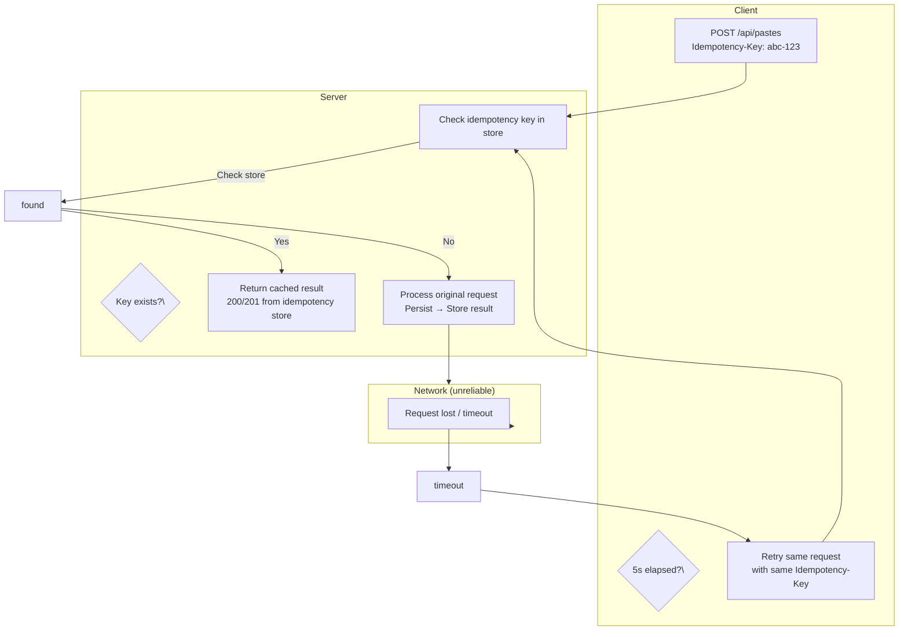
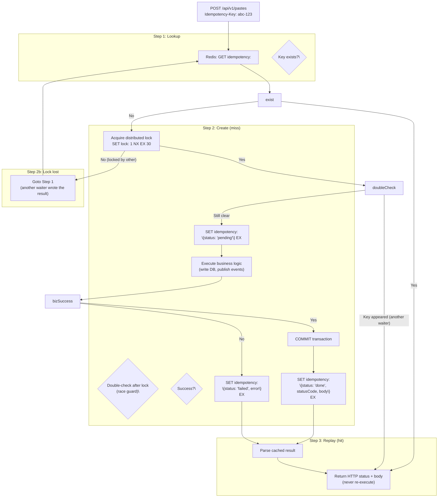

## Overview

An **Idempotency Key** is a client-generated unique identifier (typically a UUID v4) attached to write requests, ensuring that if the same request arrives multiple times — due to network timeout retries, client crashes, load balancer rebroadcasts, or proxy retries — the server processes it **exactly once**.

Idempotency is a first-order invariant in distributed systems. It sits at the intersection of **reliability** (never lose a request), **correctness** (never double-charge, never create duplicate records), and **resiliency** (clients can safely retry without coordination with the server).

Without idempotency, any retry strategy is fundamentally unsafe. TCP retransmission, HTTP client libraries, and load balancers all retry by default on timeout. A non-idempotent endpoint like `POST /api/v1/pastes` without idempotency guarantees means that a single client timeout can produce two identical pastes.

## Why Idempotency Is Hard

Idempotency is not simply "check if the request already arrived." The problem has three layers:

1. **Observability**: The client never knows whether its request was processed or lost. A timeout at 5s could mean: the request was dropped (server never saw it), the server processed it but the response was lost (server committed the work), or the server is temporarily slow. The client must retry, but the server must deduplicate.
2. **State tracking**: The server must persist the idempotency key + result mapping so that subsequent requests with the same key are deduplicated — even if the original request failed and is retried after a restart or instance failover.
3. **Lifetime management**: The stored mapping cannot live forever. It must expire (bounded retention), but the window must be long enough to cover all possible client retries, retries from downstream services (e.g., API gateway retries), and retries across different network paths.



The diagram shows the core problem: the client cannot distinguish between "request processed, response lost" and "request never arrived." The idempotency key + persistent mapping resolves this ambiguity.

## Idempotency Key Format and Generation

### Requirements for Key Generation

An idempotency key must satisfy two properties:

1. **Uniqueness across distinct requests**: Different requests must produce different keys.
2. **Immutability**: The key is generated once by the client and never changes across retries of the same request.

### Recommended Approach: UUID v4

```
UUID v4: xxxxxxxx-xxxx-4xxx-yxxx-xxxxxxxxxxxx
         (122 random bits, ~5.3 × 10^36 space)
```

- **Collision probability**: At 1M keys per second (~31.5 billion/year), the birthday bound collision probability is ~10^-16 — effectively zero for any production workload.
- **Client-generated**: Never server-generated, so retries use the same key automatically.
- **No coordination needed**: Clients don't need to sync with the server to generate keys.

### Alternative Approaches

| Method | Uniqueness | Unpredictability | Client Complexity | Recommendation |
| --- | --- | --- | --- | --- |
| **UUID v4** | Excellent | High | Trivial | **Default choice** |
| **Client-generated nonce (32 bytes, CSPRNG)** | Excellent | High | Low | Good for binary protocols |
| **Hash(request body + timestamp + client_id)** | Medium (hash collision) | Medium | Medium | Only if server must extract body metadata from key alone |
| **Server-assigned (GET /idempotency-keys first)** | Guaranteed | Medium | High | Too many round-trips; not suitable for low-latency paths |

**Avoid**: Timestamp-based keys alone (collision under retries), sequential counters (not unique across clients), SHA-256(body) alone (different clients sending the same body collide — always include client identity).

### Best Practices

- **Key size**: Store as raw UUID string (36 chars) or packed binary (16 bytes). UUID string is simpler; packed binary saves ~50% storage in Redis/DB.
- **Header naming**: Use `Idempotency-Key` as the de facto standard header name (popularized by Stripe API; widely adopted across REST APIs). Not registered in any RFC — it's a community convention.
- **Client responsibility**: Key generation, storage, and attachment are entirely the client's responsibility. The server only validates presence and uniqueness.
- **Store on the client**: Clients should persist the idempotency key → request mapping locally (e.g., in a client-side idempotency store) so that process restarts don't lose pending requests.

## Server-Side Implementation

### The Idempotency Protocol

The core algorithm follows a **check-then-create-then-store** pattern:



### Step-by-Step Breakdown

**Step 1 — Lookup**: Check if the idempotency key already exists in the store (Redis). If found with status `done`, immediately return the cached HTTP response (status code + body). This is the fast path.

**Step 2 — Create (idempotent)**: If the key does not exist, a distributed lock ensures only one concurrent retry wins (prevents duplicate processing from racing retries). The winner:
1. Sets a lock with `SET lock:<key> 1 NX EX 30` (30s timeout, prevents deadlocks)
2. **Double-checks** after acquiring the lock (another retry may have raced in and written the result)
3. Writes a `pending` sentinel to prevent other retries from entering the critical section
4. Executes the business logic (DB writes, event publishing, etc.)
5. Commits the transaction
6. Writes the final `\{status: 'done', statusCode, body\}` to the idempotency store
7. On **failure**: writes `\{status: 'failed', error\}` — future retries get an instant response instead of re-waiting for business logic to fail; on TTL expiry the entry is evicted, allowing the client to retry with a **new** idempotency key
8. Releases the lock (TTL expiry is sufficient; explicit unlock not strictly required)

**Step 3 — Return**: Return the HTTP response to the client. Subsequent retries hit Step 1 and get the replay.

### Key Design Decisions

| Decision | Choice | Rationale |
| --- | --- | --- |
| **Store type** | Redis primary, DB as safety net | O(1) lookup, built-in TTL, distributed-safe. DB `UNIQUE` constraint on idempotency key catches duplicates if Redis evicts a key. |
| **Lock strategy** | Redis `SET NX EX` | Prevents duplicate processing in race conditions |
| **TTL** | Pending: 10 min; Done: domain-dependent (24h payments, 1–4h simple writes) | Pending covers network retries; done covers client recovery and dispute windows |
| **Storage format** | `\{ status, statusCode, body \}` JSON | Compact, parseable, extensible |
| **Body stored?** | Yes (full HTTP response) | Avoids recomputing the response; guarantees byte-identical replay |

### Concurrency Control

The race condition scenario that **requires** the distributed lock:

```
Time  Client A (retry 1)              Client A (retry 2)
─  t0   GET idempotency:key → null
─  t1                                              GET idempotency:key → null
─  t2   SET lock:key 1 NX EX 30 → OK
─  t3                                              SET lock:key 1 NX EX 30 → FAIL (locked)
─  t4   Business logic...
─  t5   SET idempotency:key \{done, 201, body\}
─  t6   Return 201
─  t7                                              Goto GET → hits t5 result
```

Without the lock (retry 2 executes business logic), both requests would process the same work.

The **double-check after lock** guards a different path: if retry 2's lock acquisition *succeeds* after retry 1 has already written the result (a rare timing window), the double-check detects the key and short-circuits to replay instead of executing business logic.

### Storage Infrastructure

| Store | Pros | Cons | Best For |
| --- | --- | --- | --- |
| **Redis** | O(1) lookup, built-in TTL, atomic ops, single-node latency < 1ms | Requires separate cluster, single-node failure = dedup gap | **Default choice** for distributed services |
| **Redis Cluster** | Sharding + replication, no single point of failure | Higher complexity, ~2ms latency, key-space sharding | High-throughput (>10K req/s dedup) |
| **PostgreSQL** | ACID guarantees, no new infra, can share DB | Higher latency (~5ms), no native TTL, needs cleanup job | Low-throughput or when Redis is unavailable |
| **In-memory map** | Fastest (< 0.01ms), zero network hop | Lost on restart, no cross-instance sharing | Local cache layer only (never as sole store) |

**Recommended architecture**: Redis primary + DB as safety net. On Redis failure, fall back to DB `UNIQUE` constraint (catches duplicates if Redis evicts a key). Redis provides fast lookup; DB constraint provides the final guarantee. A cleanup cron prunes old DB rows.

### Lifetime Management

The idempotency key mapping has a **two-phase TTL lifecycle**:

| Phase | TTL | Reason |
| --- | --- | --- |
| **Pending** | 10 minutes | Covers all possible network retries (TCP, LB, client backoff). If business logic takes > 10 min, this is a design issue — long-running operations should use a different pattern (e.g., async job with a job ID). |
| **Done** | 24 hours | Covers extended client recovery: mobile app restart with no local cache, API gateway retry after 30-min outage, customer support asking "did my payment go through?" hours later. |

**Why 24h?** Not all retries happen within seconds. A customer support ticket can surface a "lost" payment 6 hours later. 24h is the practical upper bound for most payment/transaction idempotency windows. Beyond that, customers should reference a transaction ID, not retry the same request.

**Domain note**: 24h done TTL is appropriate for financial operations with dispute windows. For simple write endpoints (e.g., paste creation, event publishing), 1–4 hours is often sufficient. Shorter TTLs reduce storage cost and limit the window for accidental key reuse.

**Storage cost**: At 1M writes/day, 24h retention → ~1M active entries. Each entry is ~300 bytes (key 16B + JSON status/statusCode ~40B + response body ~250B) → ~300 MB. Fully manageable in Redis with automatic eviction of expired keys.

### Failure Modes

| Failure | Impact | Mitigation |
| --- | --- | --- |
| **Redis outage** | No dedup → duplicate processing | Fall back to DB with `UNIQUE` constraint on idempotency key; idempotent business logic as last resort |
| **DB UNIQUE violation** | 409 Conflict on retry | Application catches integrity error and returns cached result instead of error |
| **Storage full** | Redis OOM → all writes fail | Use `volatile-ttl` eviction policy — expires keys on TTL timeout before touching non-TTL keys. Avoid `allkeys-lru` which could evict active idempotency entries before expiration. |
| **Client retry during pending** | Lock acquisition contention | Acceptable — serialization is the desired behavior |
| **Clock skew across clients** | UUID collision if using time-based method | UUID v4 is random, not time-based — no skew impact |

## Advantages

- **Client simplicity**: Clients retry freely without coordination — standard exponential backoff works.
- **Server correctness**: Double-charging, duplicate records, and side effects are eliminated.
- **Operational safety**: Covers the full retry surface: TCP retransmit, LB rebroadcast, proxy retry, client crash-and-restart.
- **Audit trail**: The idempotency store is a tamper-evident log of all "attempted" operations — useful for debugging disputed transactions.
- **Composable**: Works with any downstream system — DB, message queue, third-party API. The idempotency guarantee is at the service boundary, not internal.

## Disadvantages

- **Storage overhead**: ~300 bytes per key; at scale, this adds up. Redis cluster management is additional operational cost.
- **Latency addition**: Two Redis ops (GET + SET) add ~2ms P95 — significant for sub-10ms endpoints.
- **Blocking long operations**: If the business logic takes longer than the TTL, the pending state expires and a retry can proceed — producing a duplicate.
- **No cross-service idempotency**: One service's idempotency key does not deduplicate across downstream services. Each hop needs its own key.
- **Debugging complexity**: "Did this request go through?" requires querying the idempotency store, not just the business database.

## Comparison: Idempotency Key vs Alternatives

| Approach | Safety | Client Effort | Latency | Storage | Recommendation |
| --- | --- | --- | --- | --- | --- |
| **Idempotency Key** | High (server-managed) | Low (attach header) | +2ms | ~300B/key | **Default for all write endpoints** |
| **DB UNIQUE constraint** | High (enforced at storage layer) | None (implicit) | +5ms | Index overhead | Essential as **second line of defense**, not primary mechanism |
| **Content hashing** | High (deduplicates identical payloads) | None | +SHA256 cost | ~32B/hash | Only works when payload is the key — fails with metadata changes |
| **Client-side sequencing** | High (monotonic counters) | High (client must track state) | 0ms | None | Good for streaming/messaging, not HTTP APIs |

**Key insight**: Idempotency keys are the **primary** mechanism; DB unique constraints are the **safety net**. Neither alone is sufficient — the key provides fast replay, the constraint prevents storage-level duplicates if the key is evicted.

## When to Use

Use idempotency keys when:

- **Write endpoint is observable**: Creating/updating resources, making payments, publishing events.
- **Network is unreliable**: Any system talking over TCP/IP needs retry safety.
- **Client may crash**: Mobile apps, browser tabs, and server-to-server integrations all lose in-flight state.
- **Idempotency matters**: Double-charging, duplicate records, or side effects (emails sent, inventory deducted) are unacceptable.
- **TTL window is bounded**: The retry window (10m–24h) is practical for your business domain.

## When to Avoid

Skip idempotency keys when:

- **Operation is already naturally idempotent**: `PUT /resource/\{id\}` (full replace), `DELETE /resource/\{id\}` (idempotent by nature).
- **Read-only endpoints**: `GET`, `HEAD` are already idempotent. No mechanism needed.
- **TTL window doesn't match business reality**: If disputes can surface weeks later (e.g., wire transfers), 24h key retention is insufficient — use a reference/transaction ID approach instead.
- **High-throughput firehose**: Event streams, log ingestion, telemetry — where millions of events/sec arrive, idempotency keys add prohibitive overhead. Use sequence numbers or content hashing instead.
- **Real-time gaming state**: Sub-millisecond updates where 2ms Redis overhead is unacceptable. Use client-side sequence numbers with server reconciliation.

## Tradeoffs Summary

| Aspect | With Idempotency Key | Without Idempotency Key |
| --- | --- | --- |
| **Duplicate handling** | Deduplicated by server | Duplicates processed (double-charge, extra records) |
| **Client retry strategy** | Safe: any retry interval | Unsafe: must track request state locally |
| **Latency overhead** | +2ms (Redis GET + SET) | 0ms |
| **Storage cost** | ~300 bytes/key + Redis cluster | 0 |
| **Failure mode** | Redis down = fallback or reject | Always "safe" but produces duplicates |
| **Debugging** | Idempotency store provides audit trail | No audit trail — must check business DB |
| **Complexity** | Medium (key generation, storage, cleanup) | Low |
| **Best for** | Payment, order creation, resource mutation | Read-only, already-idempotent operations |

## Examples

- **Stripe API**: `Idempotency-Key` header (UUID). 24h TTL. Industry reference implementation. Returns cached response with exact same status code and body.
- **AWS SDK**: Supports `ClientToken` parameter on S3 `PutObject`, DynamoDB `PutItem`, and EC2 `RunInstances` — manually provided by client, not auto-generated.
- **GitHub API**: `Idempotency-Key` for `POST /repos/\{owner\}/\{repo\}/dispatches`. 72h TTL (longer than most — acknowledges enterprise dispute windows).
- **Shopify API**: Idempotency key with 1-hour TTL. Returns `422 Unprocessable Entity` if key is reused after expiry.
- **Payment processors**: Adyen, Braintree, Square all support idempotency keys on charge/authorize endpoints.
