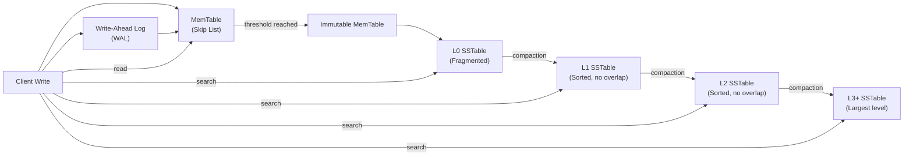
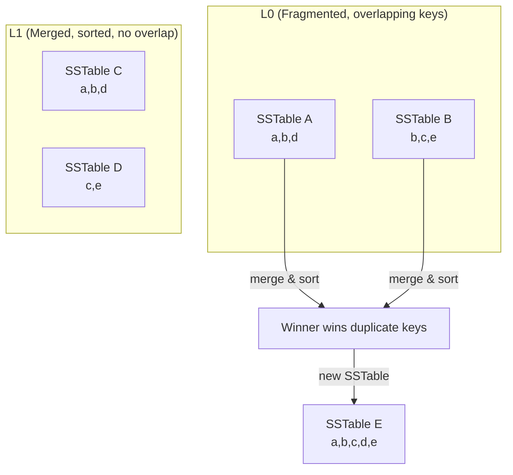
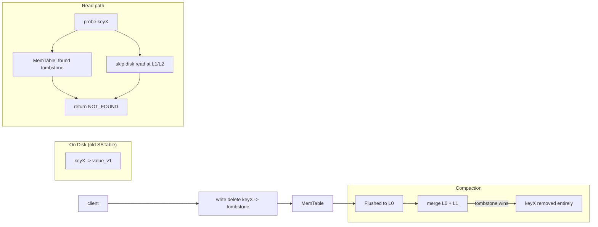

## Overview

The Log-Structured Merge-Tree (LSM-Tree) is a storage engine architecture designed for extreme write throughput by transforming random writes into sequential I/O operations. Unlike B-Trees that perform in-place updates, LSM-Trees use a log-structured approach where writes are appended to immutable files, enabling orders-of-magnitude higher write performance at the cost of increased read complexity.

LSM-Trees are foundational to modern distributed databases (RocksDB, Cassandra, HBase) and are optimized for SSD/NVMe storage and cloud-native environments where sequential writes are significantly faster than random I/O.

## Architecture Overview

A write enters the WAL for durability, then goes into the in-memory MemTable. When the MemTable fills up, it freezes and becomes an L0 SSTable on disk. Compaction continuously merges L0 files into L1, L1 into L2, and so on — eliminating duplicates and reclaiming space.

Reads probe MemTable first, then descend through levels L0 → L1 → L2+ until the key is found. Each level is typically ~10× larger than the one above.

## Core Components

### 1. MemTable (In-Memory Buffer)

- Mutable in-memory structure where new writes are first inserted
- Typically implemented as a skip list or balanced tree for O(log n) insertions
- Once it reaches a size threshold, it becomes immutable and is asynchronously flushed to disk as an SSTable in L0

### 2. WAL (Write-Ahead Log)

- Ensures durability by logging all writes before they're added to the MemTable
- In case of crash, WAL can reconstruct the MemTable state
- Sequential writes with minimal performance impact

### 3. SSTable (Sorted String Table)

- Immutable on-disk files containing sorted key-value pairs
- Stored in multiple levels (L0, L1, L2, ...)
- Each level has a size limit and contains larger files than the previous level
- Files are merged and compacted to maintain efficiency

#### SSTable Internal Structure

| Component                  | Purpose                                                                                                                                                                           |
| -------------------------- | --------------------------------------------------------------------------------------------------------------------------------------------------------------------------------- |
| **Data Blocks** (4KB–64KB) | Sorted key-value pairs stored sequentially; enables binary search and range scans                                                                                                 |
| **Index Block**            | First key of each data block; small enough to fit in memory for O(log M) block lookup                                                                                             |
| **Bloom Filter**           | Probabilistic check: "key definitely not present" (avoids disk reads). Never has false negatives, but may have ~1–5% false positives (cheap — results in unnecessary block reads) |
| **Footer/Metadata**        | File metadata and pointer to index block location                                                                                                                                 |

**Why sorted?** Sorted SSTables enable binary search via the index, efficient merge during compaction, and range query support via sequential scan.

## How It Works

### Write Path

1. **Append to WAL** — durability guarantee (O(1) per write, sequential I/O)
2. **Insert into MemTable** — O(log n) in-memory skip list insertion
3. **Acknowledge to client** — before any disk flush; this is what makes writes fast
4. **Async MemTable flush** — when MemTable reaches size threshold:
   - Freeze as immutable
   - Write sorted SSTable to L0 on disk
   - Create new empty MemTable for incoming writes

**Key insight**: Steps 1–3 complete in memory/disk sequential I/O. The async flush in step 4 never blocks the client.

### Read Path

Reads must search from the fastest layer outward until the key is found:

1. **Check current MemTable** — O(log n)
2. **Check immutable MemTables** — O(log n) per table
3. **Bloom Filter check** — per SSTable, O(k) filter lookups; skips disk read on definite misses
4. **Index + Data Block** — if Bloom Filter indicates possible match, binary search via index block to find data block
5. **Search L0 → L1 → L2 → ...** — return first match (newest version wins)

**Complexity**: Best case O(log n) — key in MemTable. Typical case O(L × log M) where L = levels, M = blocks per level. Worst case O(L × b) with Bloom Filter misses across all levels.

### Compaction

Compaction merges SSTables across levels to: (1) remove duplicate keys and tombstones, (2) maintain sorted order, and (3) reclaim space from deleted data.

**Compaction Strategies**

| Strategy         | Overlap Within Level | Read Amplification | Write Amplification      | When to Use                                         |
| ---------------- | -------------------- | ------------------ | ------------------------ | --------------------------------------------------- |
| **Tiered**       | Yes                  | Higher             | Lower                    | Write-heavy workloads, simpler to implement         |
| **Leveled**      | No                   | Lower              | Higher (O(log n) levels) | Read-heavy workloads, lower storage overhead        |
| **Hybrid (ICP)** | Partial              | Tunable            | Tunable                  | Mixed workloads (used by ScyllaDB, LevelDB default) |

- **Tiered**: SSTables are merged when a level is full. Lower levels may have overlapping key ranges, increasing read path length.
- **Leveled**: Each level is fully sorted with no overlaps. Every level is typically ~10× larger than the one above (the "fan-out" factor).
- The fan-out factor (usually 5–10) determines how many SSTables fit per level and directly affects both read and write amplification.

This shows how overlapping SSTables at L0 are merged during compaction: duplicate keys are resolved (newest wins), and the result is a single sorted SSTable at the next level with no overlap.

### Key Deletion

LSM-Trees handle deletions via **tombstones** rather than immediate removal:

1. A tombstone (key + deletion marker) is written to MemTable and eventually flushed to L0
2. Existing SSTables are immutable — the old value remains until compaction merges it away
3. During reads, tombstones take precedence — if found, the key is considered deleted even if older versions exist below
4. During compaction, tombstones and their corresponding values are removed together
5. Tombstones are retained until they propagate through all levels to prevent reappearing in reads

A delete is written as a tombstone in the MemTable. The old value on disk remains until compaction merges it away. During reads, the tombstone in MemTable takes precedence and prevents disk lookups. Once compaction runs, the tombstone and the old value are both eliminated.

**Tombstone Impact**: Tombstones increase read amplification (must be checked on every lookup) and compaction I/O. High deletion rates or expired tombstones that haven't been compacted can degrade performance. Many systems implement a configurable tombstone expiration window to prevent stale tombstones from accumulating.

## When to Use

LSM-Trees excel when write throughput is the primary concern:

- **High Ingest Rate** — Sequential I/O avoids the O(log n) node lookup and potential tree rebalancing of B-Trees
- **Write-Heavy Workloads** — Time-series data, event logging, messaging systems
- **SSD/NVMe Storage** — Sequential writes maximize SSD throughput while avoiding random write penalties
- **Cloud-Native Object Storage** — Immutable SSTables are perfectly suited for append-only stores like S3 (e.g., Amazon Athena, Presto on S3)
- **Batch Analytics** — Columnar LSM variants (e.g., RocksDB with column families) excel in OLAP engines

## When to Avoid

- **Read-Heavy Workloads (90%+ reads)** — B-Trees win due to single-tree traversal vs. multi-level LSM reads
- **Strict Point-Lookup Latency** — LSM reads have higher tail latency due to compaction interference and multi-level searches
- **High Deletion Rates** — Tombstone proliferation increases read amplification and compaction load
- **Small Datasets That Fit in Memory** — In-memory structures or simple file-based approaches are sufficient

## Comparison: LSM-Tree vs B-Tree

| Aspect                  | LSM-Tree                                                | B-Tree                                 |
| ----------------------- | ------------------------------------------------------- | -------------------------------------- |
| **Write Pattern**       | Sequential I/O                                          | Random I/O (in-place updates)          |
| **Write Complexity**    | O(1) amortized (WAL + MemTable)                         | O(log n) + potential rebalancing       |
| **Read Complexity**     | O(L × log M) typical                                    | O(log n)                               |
| **Read Amplification**  | Higher (multi-level search)                             | Lower (single traversal)               |
| **Write Amplification** | Higher (compaction rewrites data)                       | Lower (in-place updates)               |
| **Space Efficiency**    | Temporary overhead (multiple versions until compaction) | Good                                   |
| **Tombstone Handling**  | Required (background cleanup)                           | Not applicable (immediate deletion)    |
| **SSD Friendliness**    | Excellent (avoids random writes)                        | Poor (frequent random writes)          |
| **Best For**            | Write-heavy, high-throughput, cloud-native              | Read-heavy, low-latency, transactional |

## Tradeoffs Summary

| Aspect | LSM-Tree | B-Tree |
| --- | --- | --- |
| **Strength** | High write throughput | Low read latency |
| **Write I/O** | Sequential I/O | Random I/O penalty |
| **Read path** | Multi-level reads | Single-tree lookup |
| **Background work** | Compaction overhead | None (in-place) |
| **Deletions** | Tombstone management | Not applicable |
| **Lookup acceleration** | Bloom filter lookups | B-Tree node caching |
| **Cost** | Write amplification (compaction) | Tree rebalancing cost |
| **Best for** | Write-heavy workloads | Read-heavy workloads |

The tradeoff is fundamental: LSM-Trees sacrifice read simplicity for write speed by batching writes, merging in the background via compaction, and maintaining a multi-level on-disk structure. B-Trees do the opposite — fast point reads at the cost of expensive random writes and tree rebalancing.

## Examples

- **RocksDB / LevelDB** — Embedded key-value stores (MySQL secondary engine, CockroachDB, Kafka)
- **Cassandra / ScyllaDB** — Distributed wide-column stores
- **HBase** — Hadoop ecosystem columnar store
- **MySQL InnoDB** — Uses LSM-inspired change buffers (hybrid approach)
