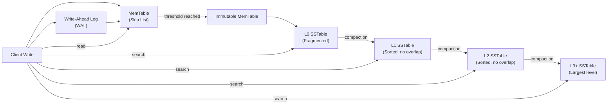
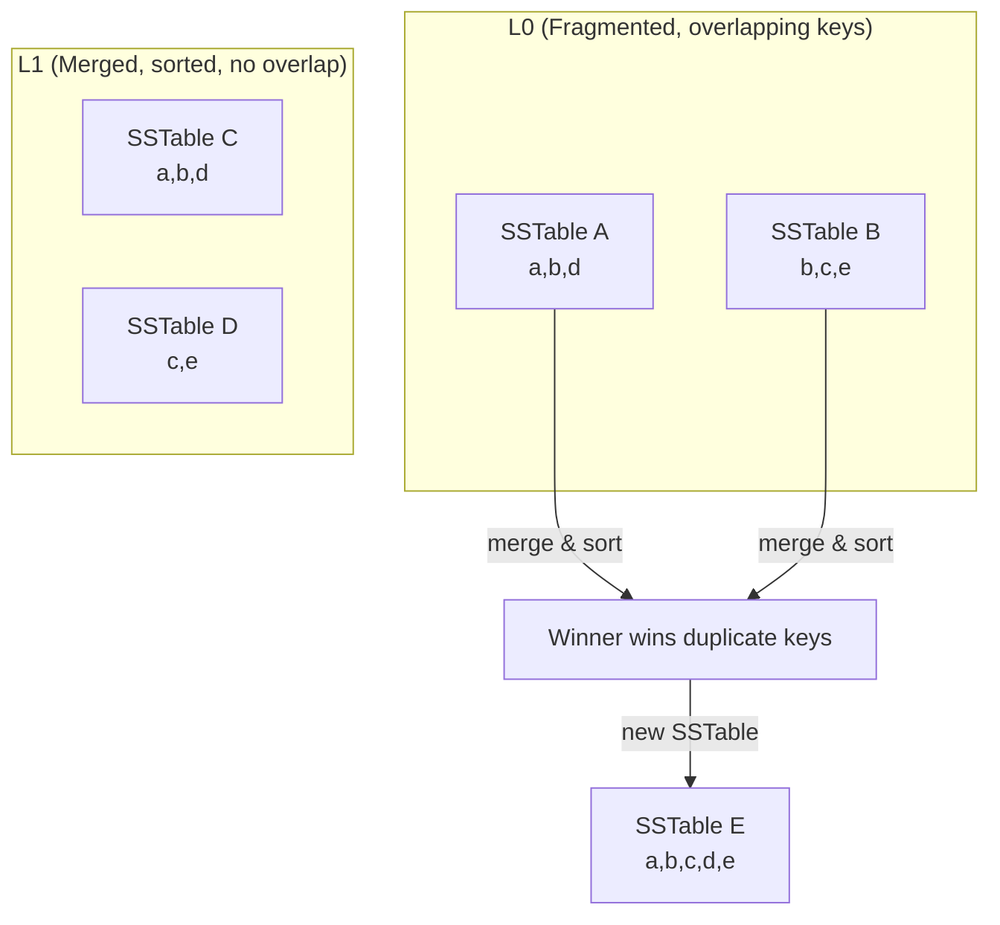
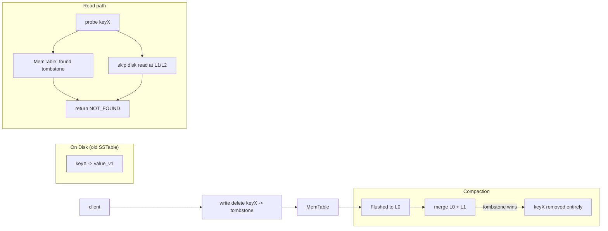

## Overview

The Log-Structured Merge-Tree (LSM-Tree) 是一種 storage engine 架構，透過將 random writes 轉換為 sequential I/O operations，實現極高的 write throughput。與 B-Tree 的 in-place updates 不同，LSM-Tree 採用 log-structured 方法，writes 被 append 到 immutable files 中，在 read complexity 增加的代價下，換取數量級更高的 write 效能。

LSM-Trees 是現代 distributed databases（RocksDB、Cassandra、HBase）的基石，針對 SSD/NVMe storage 和 cloud-native 環境最佳化，在這些環境中 sequential writes 遠比 random I/O 快。

## Architecture Overview

Write 進入 WAL 以確保 durability，然後進入 in-memory MemTable。當 MemTable 滿了之後，會 freeze 成為 disk 上的 L0 SSTable。Compaction 持續將 L0 檔案 merge 到 L1，L1 到 L2，以此類推 —— 消除 duplicate 並 reclaim space。

Reads 先 probe MemTable，然後由 L0 → L1 → L2+ 逐層搜尋直到找到 key。每一層通常比上一層大 ~10 倍。

## Core Components

### 1. MemTable (In-Memory Buffer)

- Mutable in-memory structure，新的 writes 首先被 insert 到這裡
- 通常實作為 skip list 或 balanced tree，支援 O(log n) insertions
- 達到 size threshold 後變成 immutable，並被 async flushed 到 disk，成為 L0 的 SSTable

### 2. WAL (Write-Ahead Log)

- 透過在所有 writes 加入 MemTable 之前先記錄 log，確保 durability
- 如果 crash，WAL 可以 reconstruct MemTable state
- Sequential writes，對效能影響極小

### 3. SSTable (Sorted String Table)

- Immutable on-disk files，包含 sorted key-value pairs
- 存放在多層（L0、L1、L2、...）
- 每一層有 size limit，包含的檔案比前一層大
- 檔案會被 merge 和 compaction 以維持效率

#### SSTable Internal Structure

| Component                  | Purpose                                                                                                                                                                           |
| -------------------------- | --------------------------------------------------------------------------------------------------------------------------------------------------------------------------------- |
| **Data Blocks** (4KB–64KB) | Sorted key-value pairs stored sequentially；支援 binary search 和 range scans                                                                                                 |
| **Index Block**            | 每個 data block 的 first key；足夠小到可以 fit in memory，實現 O(log M) block lookup                                                                                             |
| **Bloom Filter**           | Probabilistic check："key definitely not present"（avoid disk reads）。從不会有 false negatives，但可能有 ~1–5% false positives（成本低 —— 只導致不必要的 block reads） |
| **Footer/Metadata**        | File metadata 和 pointer 到 index block location                                                                                                                                 |

**Why sorted？** Sorted SSTables 讓 binary search（透過 index）、compaction 時高效的 merge、以及 range query 支援（sequential scan）成為可能。

## How It Works

### Write Path

1. **Append to WAL** — durability guarantee（O(1) per write，sequential I/O）
2. **Insert into MemTable** — O(log n) in-memory skip list insertion
3. **Acknowledge to client** — in before any disk flush；這也是 write fast 的原因
4. **Async MemTable flush** — when MemTable reaches size threshold：
   - Freeze as immutable
   - Write sorted SSTable to L0 on disk
   - Create new empty MemTable for incoming writes

**Key insight**：Steps 1–3 在 memory / disk sequential I/O 中完成。Step 4 的 async flush 永遠不會 block client。

### Read Path

Reads 必須從最快的一層開始搜尋，往外推直到找到 key：

1. **Check current MemTable** — O(log n)
2. **Check immutable MemTables** — O(log n) per table
3. **Bloom Filter check** — per SSTable，O(k) filter lookups；在 definite misses 時 skip disk read
4. **Index + Data Block** — 如果 Bloom Filter 顯示可能匹配，透過 index block binary search 找到 data block
5. **Search L0 → L1 → L2 → ...** — return first match（newest version wins）

**Complexity**：Best case O(log n) —— key in MemTable。Typical case O(L × log M)，其中 L = levels，M = blocks per level。Worst case O(L × b)，當 Bloom Filter 在所有層都 miss 時。

### Compaction

Compaction 跨層 merge SSTables 以：(1) 移除 duplicate keys 和 tombstones，(2) 維持 sorted order，(3) 從 deleted data 中 reclaim space。

**Compaction Strategies**

| Strategy         | Overlap Within Level | Read Amplification | Write Amplification      | When to Use                                         |
| ---------------- | -------------------- | ------------------ | ------------------------ | --------------------------------------------------- |
| **Tiered**       | Yes                  | Higher             | Lower                    | Write-heavy workloads， simpler to implement         |
| **Leveled**      | No                   | Lower              | Higher (O(log n) levels) | Read-heavy workloads， lower storage overhead        |
| **Hybrid (ICP)** | Partial              | Tunable            | Tunable                  | Mixed workloads（used by ScyllaDB，LevelDB default） |

- **Tiered**：SSTables 在 level full 時被 merge。Lower levels 可能有 overlapping key ranges，增加 read path length。
- **Leveled**：每一層完全 sorted，沒有 overlaps。每一層通常比上一層大 ~10 倍（"fan-out" factor）。
- Fan-out factor（通常 5–10）決定每個 level 可以放多少 SSTables，並直接影響 read 和 write amplification。

這展示了 L0 的重疊 SSTables 如何在 compaction 時被 merge：duplicate keys 被解決（newest wins），結果是在下一層產生一個 single sorted SSTable，沒有 overlap。

### Key Deletion

LSM-Trees 透過 **tombstones** 處理 deletions，而非 immediate removal：

1. Tombstone（key + deletion marker）被寫入 MemTable，最終 flush 到 L0
2. 現有的 SSTables 是 immutable —— old value 會留在磁碟上，直到 compaction merge 掉它
3. 在 reads 期間，tombstones 優先 —— 如果找到，key 被視為已刪除，即使下面還有 older versions
4. 在 compaction 期間，tombstones 和它們對應的 values 一起被移除
5. Tombstones 會被保留，直到 propagate 通過所有層，防止在 reads 中重新出現

Delete 被寫成 MemTable 中的 tombstone。Disk 上的 old value 會留在磁碟上，直到 compaction merge 掉它。在 reads 期間，MemTable 中的 tombstone 優先，避免 disk lookups。一旦 compaction 執行，tombstone 和 old value 都會被消除。

**Tombstone Impact**：Tombstones 增加 read amplification（每次 lookup 都要檢查）和 compaction I/O。高 deletion rates 或過期但還沒被 compaction 的 tombstones 會導致效能下降。許多系統實作可配置的 tombstone expiration window，防止 stale tombstones 累積。

## When to Use

LSM-Trees 在 write throughput 是首要考量時表現出色：

- **High Ingest Rate** —— Sequential I/O 避免 B-Tree 的 O(log n) node lookup 和潛在的 tree rebalancing
- **Write-Heavy Workloads** —— Time-series data、event logging、messaging systems
- **SSD/NVMe Storage** —— Sequential writes 最大化 SSD throughput，同時避免 random write penalties
- **Cloud-Native Object Storage** —— Immutable SSTables 非常適合 append-only stores 如 S3（例如 Amazon Athena、Presto on S3）
- **Batch Analytics** —— Columnar LSM variants（例如 RocksDB with column families）在 OLAP engines 中表現出色

## When to Avoid

- **Read-Heavy Workloads (90%+ reads)** —— B-Trees 勝出，因為是 single-tree traversal vs. multi-level LSM reads
- **Strict Point-Lookup Latency** —— LSM reads 有更高的 tail latency，因為 compaction interference 和 multi-level searches
- **High Deletion Rates** —— Tombstone proliferation 增加 read amplification 和 compaction load
- **Small Datasets That Fit in Memory** —— In-memory structures 或簡單 file-based approaches 就夠了

## Comparison: LSM-Tree vs B-Tree

| Aspect                  | LSM-Tree                                                | B-Tree                                 |
| ----------------------- | ------------------------------------------------------- | -------------------------------------- |
| **Write Pattern**       | Sequential I/O                                          | Random I/O (in-place updates)          |
| **Write Complexity**    | O(1) amortized (WAL + MemTable)                         | O(log n) + potential rebalancing       |
| **Read Complexity**     | O(L × log M) typical                                    | O(log n)                               |
| **Read Amplification**  | Higher (multi-level search)                             | Lower (single traversal)               |
| **Write Amplification** | Higher (compaction rewrites data)                       | Lower (in-place updates)               |
| **Space Efficiency**    | Temporary overhead (multiple versions until compaction) | Good                                   |
| **Tombstone Handling**  | Required (background cleanup)                           | Not applicable (immediate deletion)    |
| **SSD Friendliness**    | Excellent (avoids random writes)                        | Poor (frequent random writes)          |
| **Best For**            | Write-heavy, high-throughput, cloud-native              | Read-heavy, low-latency, transactional |

## Tradeoffs Summary

| Aspect | LSM-Tree | B-Tree |
| --- | --- | --- |
| **Strength** | High write throughput | Low read latency |
| **Write I/O** | Sequential I/O | Random I/O penalty |
| **Read path** | Multi-level reads | Single-tree lookup |
| **Background work** | Compaction overhead | None (in-place) |
| **Deletions** | Tombstone management | Not applicable |
| **Lookup acceleration** | Bloom filter lookups | B-Tree node caching |
| **Cost** | Write amplification (compaction) | Tree rebalancing cost |
| **Best for** | Write-heavy workloads | Read-heavy workloads |

Tradeoff 是根本的：LSM-Trees 犧牲 read simplicity 換取 write speed，透過 batch writes、在 background 中 merge（compaction）、維持 multi-level on-disk structure。B-Trees 則相反 —— 快速 point reads，但代價是昂貴的 random writes 和 tree rebalancing。

## Examples

- **RocksDB / LevelDB** —— Embedded key-value stores（MySQL secondary engine、CockroachDB、Kafka）
- **Cassandra / ScyllaDB** —— Distributed wide-column stores
- **HBase** —— Hadoop ecosystem columnar store
- **MySQL InnoDB** —— 使用 LSM-inspired change buffers（hybrid approach）
