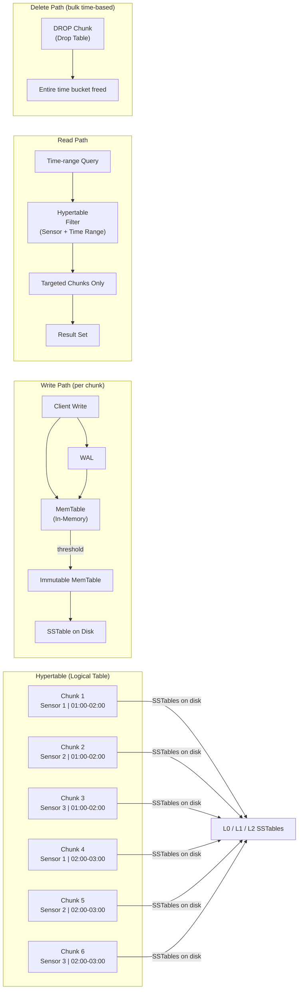
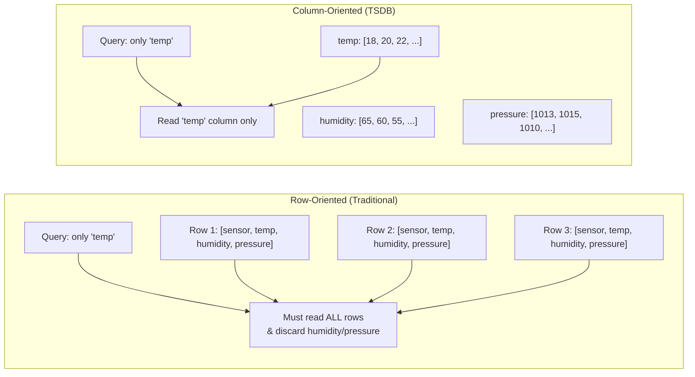
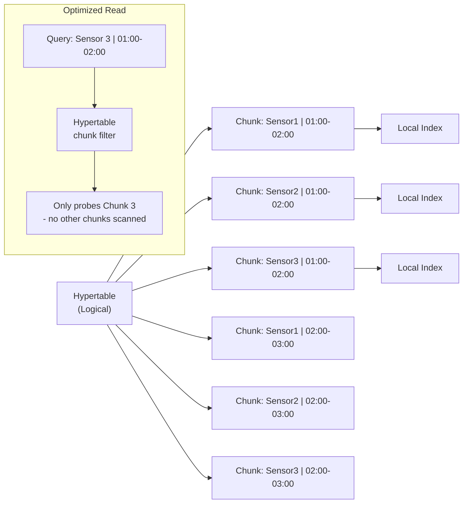
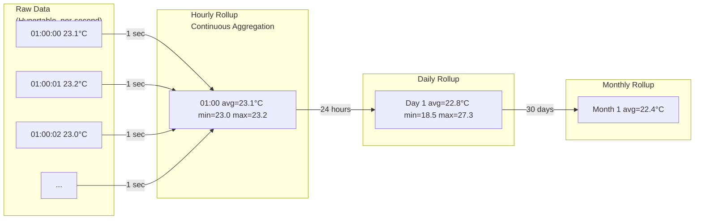
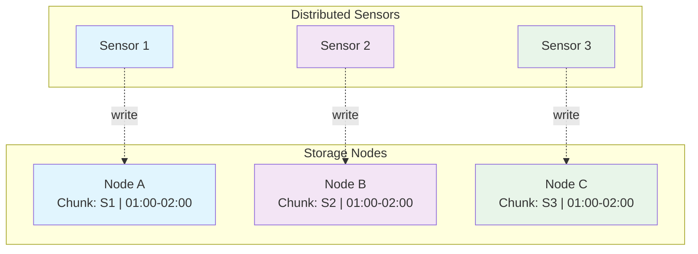
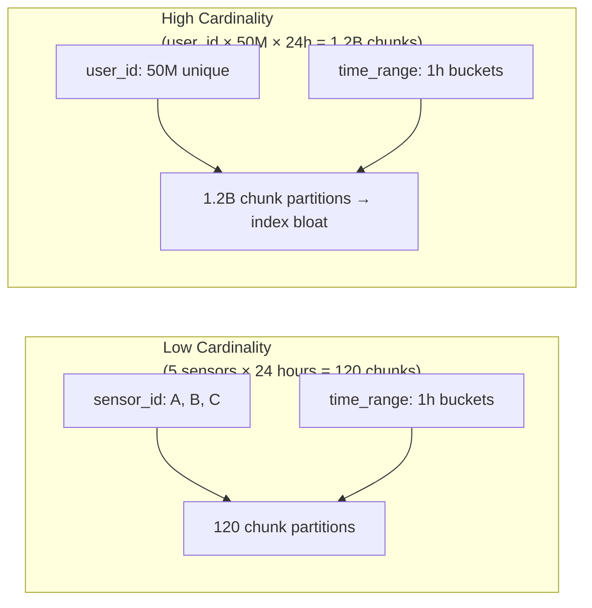

## Overview

A Time Series Database (TSDB) is purpose-built for time-series data: any data where the **time range** is the primary dimension of interest. Examples include metrics, logs, sensor readings, and event timestamps. Unlike general-purpose databases, TSDBs optimize three access patterns simultaneously:

1. **Time-range queries** — "Give me all readings from Sensor A between 1:00 and 2:00"
2. **High-write ingest** — thousands to millions of data points per second
3. **Bulk time-based deletes** — "Drop everything older than 30 days"

Popular TSDBs include **TimescaleDB**, **InfluxDB**, **VictoriaMetrics**, and **Apache Druid**.

Choosing a TSDB is not just "Postgres with a time column." The value proposition rests on three architectural choices that compound together: **columnar storage** (read efficiency), **time-partitioned chunks** (cache precision and bulk delete), and **LSM-tree writes** (write throughput). A TSDB is the right tool when your query workload is dominated by time-range scans over a subset of columns — not for mixed OLTP/OLAP workloads.

For high-cardinality dimensions (e.g., unique user IDs per data point), TSDBs struggle because every distinct tag value creates a separate index partition. **Pre-aggregation** (rollups, continuous aggregations) and **dimensional denormalization** are essential to avoid cardinality explosion.

### When a TSDB Is the Wrong Choice

Even when a workload looks like time-series data, other factors may make a TSDB a poor fit:

- **Frequent retroactive writes**: If you need to update or backfill data older than a few chunks, TSDBs are painful. LSM-trees optimize for append-only; mid-stream mutations require tombstoning the old row and inserting a new one, creating write amplification.
- **Point lookups with unpredictable keys**: TSDBs are terrible at arbitrary key lookups. If 30%+ of your queries are "give me value for this specific sensor at this exact timestamp," a key-value store or RDBMS will be faster.
- **Complex joins across entities**: TSDBs don't support meaningful JOIN operations. If you need to correlate time-series data with relational data (e.g., "show me sensor readings for sensors in region X that passed maintenance last week"), you'll need an application-layer join or a separate system of record.
- **Single-node throughput limits**: A single TSDB node typically saturates at 100K–500K points/second. For higher throughput, you need sharding — and sharding adds operational complexity (rebalancing, cross-shard queries, inconsistent time coverage across shards).

## Architecture Overview

A hypertable is a **logical abstraction** over many smaller **chunk tables**, each representing a specific (sensor, time-range) combination. Writes flow through WAL and MemTable into SSTables per chunk (LSM-tree pattern). Reads use hypertable filtering to target only relevant chunks. Bulk deletes are simply dropping a chunk table — O(1) compared to individual row deletions.

### Clustering & Sharding at Scale

For workloads exceeding a single node, TSDBs shard by time range (time-based sharding):

- **Horizontal sharding**: Each shard owns a time window. New shards are created as time progresses. This is simpler than key-based sharding because the shard assignment is deterministic from the timestamp.
- **Replication**: Each shard is replicated for HA (typically 2–3 replicas). Writes go to the leader; reads can be routed to followers for load distribution.
- **Operational cost**: Sharding introduces cross-shard query overhead (merge phase), uneven data distribution when some sensors generate more data than others, and the complexity of shard migration during rebalancing.

**Rule of thumb**: Stay on a single node until you hit >70% of its throughput or storage limit. The complexity of sharding is not worth it for single-node workloads.

## Architecture Overview

A hypertable is a **logical abstraction** over many smaller **chunk tables**, each representing a specific (sensor, time-range) combination. Writes flow through WAL and MemTable into SSTables per chunk (LSM-tree pattern). Reads use hypertable filtering to target only relevant chunks. Bulk deletes are simply dropping a chunk table — O(1) compared to individual row deletions.

## Core Components

### 1. Column-Oriented Storage

Time-series data typically has many columns (temperature, humidity, pressure, etc.) but queries usually access only one or two at a time. Storing data by column — not by row — means we fetch only the columns we need. This delivers three advantages:

- **Better data locality**: the OS page cache holds only queried columns, not wasted bytes from columns you'll never read
- **Better compression**: values within a single column are highly correlated (temperature doesn't jump randomly), enabling near-perfect compression with delta-of-delta or GOP encoding
- **Smaller cache footprint**: reading one column instead of full rows means more results fit in CPU L1/L2 cache

Production TSDBs go beyond simple columnar storage by applying **value encoding** specific to time-series semantics:

- **Delta-of-delta encoding**: Instead of storing absolute timestamps, store the delta from the previous timestamp. Then store the delta of those deltas. This turns uniformly-spaced sensor readings into near-zero values, which gzip or LZ4 compresses to nothing.
- **Sequence encoding**: For metrics sampled at fixed intervals, a sequence encoding (just the sample index) can make timestamps effectively free.
- **Float encoding**: IEEE 754 floats with similar values share long prefix bits — PFor (Packed Floating Point) or ZStandard can exploit this for 5–10x compression ratios over row-oriented storage.

These encoding choices are why TSDBs can store years of per-second data for millions of sensors at a fraction of the cost of a row-oriented database. The tradeoff is that **arbitrary column projections aren't free** — TSDBs are optimized for the query patterns you define upfront, not for ad-hoc queries on columns you didn't anticipate.

Row-oriented storage forces reading every full row even when only one column is needed. Column-oriented storage lets the query touch only the relevant column, improving cache efficiency and enabling better compression.

### 2. Hypertable & Chunk Tables

A **hypertable** is a logical table split into **chunk tables** along two dimensions:

| Dimension                 | Example Values                        |
| ------------------------- | ------------------------------------- |
| **Source** (e.g., sensor) | Sensor 1, Sensor 2, Sensor 3          |
| **Time Range**            | 01:00-02:00, 02:00-03:00, 03:00-04:00 |

Each chunk is a small, self-contained table with its own index.

The hypertable lets the query planner **prune irrelevant chunks** — a query for "Sensor 3, 01:00-02:00" touches exactly one chunk instead of scanning the entire table. Each chunk maintains its own index, so even within a chunk, lookups are fast.

#### Chunk Sizing Strategy

Choosing chunk size is a capacity-planning decision that affects read, write, and cache performance:

| Chunk Duration              | Pros                                                      | Cons                                                      | Best For                       |
| --------------------------- | --------------------------------------------------------- | --------------------------------------------------------- | ------------------------------ |
| **Too small** (seconds)     | Precise chunk pruning; small DROP TABLEs                  | Index bloat (one index per chunk); high metadata overhead | High-frequency trading ticks   |
| **Just right** (1h–24h)     | Balanced index size; fits comfortably in cache per sensor | Moderate metadata                                         | Most IoT / application metrics |
| **Too large** (days–months) | Fewer indexes; simpler metadata                           | Poor chunk pruning; cache misses from irrelevant data     | Rarely appropriate             |

**Rule of thumb**: Size chunks so that a single chunk fits entirely in the working set (OS page cache) for your most common queries. For TimescaleDB, the default is 1 hour — a reasonable starting point that you can tune based on cardinality and memory budget.

**Production gotcha**: When a new time dimension is introduced, existing chunks don't auto-repartition. You'll need to **reslice** (re-chunk) the hypertable, which is an expensive rewriting operation. Design your time range boundaries early and stick with them.

A less obvious but equally important consideration is **write amplification at chunk boundaries**. When chunks are too small, the index overhead per chunk (B-tree per chunk, LSM metadata per chunk) creates memory pressure on the DB server. The metadata for 100K chunks can easily exceed RAM, forcing index scans to hit disk.

### Downsampling & Continuous Aggregations

As data ages, query latency requirements typically relax: you need second-precision data for the last hour, but hourly averages for the last year. TSDBs handle this through **downsampling** (resampling raw data into coarser buckets):

### Downsampling & Continuous Aggregations

As data ages, query latency requirements typically relax: you need second-precision data for the last hour, but hourly averages for the last year. TSDBs handle this through **downsampling** (resampling raw data into coarser buckets):

- **Continuous aggregations** (TimescaleDB) or **downsampled retention policies** (InfluxDB) pre-compute aggregated views so queries over historical data never scan raw rows
- **Retention policies** automatically drop raw data after a defined period, then rely on rollups for longer queries
- **Materialized views** provide a snapshot at a point in time — useful for dashboards where you need the same answer across repeated queries

**Designing the downsampling cascade**: The key operational decision is choosing the right granularity at each level. A typical production setup looks like:

| Level           | Granularity | Retention  | Use Case                          |
| --------------- | ----------- | ---------- | --------------------------------- |
| Raw data        | 1–5 seconds | 7–30 days  | Debugging, incident investigation |
| 1-minute rollup | 1 minute    | 3–6 months | Short-term trend analysis         |
| 1-hour rollup   | 1 hour      | 1–2 years  | Capacity planning, SLA tracking   |
| Daily rollup    | 24 hours    | Forever    | Executive dashboards, compliance  |

**Staleness is the hidden cost**: Continuous aggregations are not instant — they lag behind raw writes. During active incidents, dashboards showing aggregated data may be 5–30 minutes stale. Always design alerting and incident response around raw data, not rollups.

Design the retention + downsampling pipeline from day one. It's a schema decision, and retroactively aggregating years of data is an expensive one-time rewrite.

### 3. Write Optimization: Local Chunks + LSM-Tree

Writes benefit from two complementary strategies:

- **Chunk locality**: Each chunk can be pinned to the same node where its sensor lives, avoiding network latency for distributed deployments
- **LSM-Tree + SSTable**: Writes first go to memory (MemTable), then asynchronously flush to disk as immutable SSTables — converting random writes into sequential I/O

#### Compaction: The Silent Resource Hog

LSM-trees have a hidden cost that catches most teams off line in production: **compaction**. When SSTables accumulate, the background compaction process merges them, removing tombstones and redundant writes. This is where 4–6x write amplification comes from — a single ingest write can trigger 5–6 disk writes during compaction.

Key operational signals to watch:

- **L0 disk pressure**: L0 SSTables are unsorted and must be checked on every read. Too many L0 files = reads slow down. Set L0 file count limits and adjust flush thresholds accordingly.
- **Compaction stall**: When disk I/O can't keep up with write throughput, the MemTable fills up and writes block. This is the most common cause of write backpressure in TSDBs.
- **Tombstone explosion**: Even with chunk-based deletes, partial deletes (e.g., dropping a specific sensor's data within a chunk) create tombstones that persist through compaction. Monitor tombstone count per SSTable.

**Tuning rule**: Set `flush_threshold` (MemTable size before flush) high enough to minimize SSTable count but low enough to prevent OOM. For high-throughput ingestion (>100K points/s), a 1–2 GB MemTable is typical.

Each sensor writes directly to its owning node, keeping chunks co-located. No cross-network fan-out for writes.

### 4. Delete Optimization: Drop Tables

In LSM-Trees, **deleting individual rows is as expensive as writing them** (tombstones propagate through MemTable and SSTables). For time-series workloads that routinely expire old data, this would be prohibitively expensive.

Chunk tables solve this: dropping a chunk (i.e., `DROP TABLE`) is an O(1) filesystem operation that instantly frees an entire time bucket.

```mermaid
flowchart TD
  subgraph LSMProblem["LSM-Tree Individual Delete (Expensive)"]
    step1["Write delete tombstone"] --> step2["Propagate through MemTable"]
    step2 --> step3["Flush to SSTable"]
    step3 --> step4["Compaction merges files"]
    step4 --> step5["Tombstone + value finally removed"]
    step5 -- "N deletes = N writes" --> expensive["Expensive: same I/O as writes"]
  end

  subgraph ChunkSolution["Chunk Drop (O(1))"]
    chunk["Entire time bucket\n(Sensor A, 01:00-02:00)"] --> droptable["DROP TABLE\n(chunk)"]
    droptable --> freed["All files freed instantly"]
    freed -- "1 operation" --> cheap["Cheap: no tombstones, no compaction"]
  end
```

Individual deletes in LSM-Trees create tombstones that must propagate through every layer — costing the same I/O as writes. Dropping a chunk table is a single filesystem operation that instantly releases an entire time bucket.

## How It Works

### Write Path

1. **Client sends data point** (sensor ID + timestamp + value)
2. **Hypertable routes to correct chunk** based on sensor and time range
3. **WAL + MemTable** — write logged for durability, then inserted in-memory (O(1) append)
4. **Acknowledge to client** — before any disk flush
5. **Async MemTable flush** — when threshold reached, chunk freezes into SSTable on disk

**Key insight**: The client never waits for disk I/O. Writes complete in memory, and compaction happens asynchronously in the background.

### Read Path

1. **Client issues time-range query** with optional sensor/filter criteria
2. **Hypertable chunk filter** eliminates irrelevant chunks (time pruning + sensor pruning)
3. **Probe only matching chunks** — each chunk has its own index
4. **Columnar scan** within matched chunks — only fetch queried columns

**Key insight**: A query for "Sensor 3, 01:00-02:00" touches exactly one chunk and one column, regardless of how many sensors or time ranges exist in the hypertable.

### Bulk Delete Path

1. **Client drops old data** by specifying a time range
2. **Hypertable identifies chunks** that fall entirely within that range
3. **DROP TABLE** per chunk — instant, O(1) filesystem operation
4. **No tombstones, no compaction needed** — entire file set is removed

**Key insight**: Expiring 30 days of data across 100 sensors is one operation per chunk, not billions of individual delete statements.

### Cardinality: The Silent TSDB Killer

Every unique combination of dimension values (tags, labels, indexes) creates a separate partition in the TSDB index. This is called **high cardinality** and is the most common production pitfall — so common that it has its own name in the industry: **cardinality explosion**.

The mechanism is simple but the impact is destructive: each unique tag combination creates metadata in memory (B-tree nodes, bloom filters, SSTable pointers). At 10M unique tag combinations, this metadata alone can consume 50–100 GB of RAM just for index structures — with zero data stored.

| Dimension Example            | Cardinality  | Risk Level           |
| ---------------------------- | ------------ | -------------------- |
| `machine_id` (100 machines)  | 100          | Safe                 |
| `region + service` (10 × 50) | 500          | Safe                 |
| `user_id` (10M users)        | 10,000,000+  | **Dangerous**        |
| `request_id` (per-request)   | Infinite     | **Never use as tag** |
| `session_id` (100M sessions) | 100,000,000+ | **Dangerous**        |

**Mitigations**:

- **Denormalize dimensions**: Embed the most-queried attributes directly into the table instead of treating them as tags
- **Sample or aggregate per-user data**: Don't store per-user metrics if you only ever query them in aggregate
- **Use approximate aggregations**: TSDBs like VictoriaMetrics and Druid have hyperloglog/density sketches for approximate distinct counts
- **Reject unknown tags at ingest**: Guard against tag value explosion from malformed data

### Tiered Storage & Cold Data

Production TSDBs separate hot and cold data onto different storage tiers:

- **Hot tier** — SSD / NVMe: Raw data, active chunks, queried frequently
- **Warm tier** — HDD / network storage: Aggregated data, queried occasionally
- **Cold tier** — S3 / object storage: Historical rollups, compliance data, queried rarely

TimescaleDB achieves this with **tablespaces** (placing chunks on different storage devices) and **data retention policies**. InfluxDB uses **bucket retention policies** with shard groups. VictoriaMetrics integrates with S3/GCS via archiving.

Raw per-second data on NVMe for 100M sensors costs $10k+/month. Rollups to 1-minute granularity on HDD drop that cost by 60×. Define your data lifecycle policy alongside the schema — storage tier is a schema decision, not an afterthought.

## When to Use

- **Metrics & Monitoring** — CPU usage, request latency, error rates over time
- **IoT Sensor Data** — temperature, pressure, vibration readings from thousands of devices
- **Log Aggregation** — time-stamped log entries with range-based retrieval
- **Financial Time-Series** — stock prices, trading ticks, order book data
- **Any workload where** ~80%+ of queries are time-range scans on a subset of columns

## When to Avoid

- **General OLTP** — Transactional workloads with mixed read/write patterns and complex joins
- **Low-frequency point lookups** — "Get me the value for this one key right now"
- **Heavy updates to past data** — TSDBs are append-optimized; updating old records is inefficient
- **Graph traversal** — Networked data with many-to-many relationships (use a graph database)

## Comparison: TSDB vs Traditional RDBMS

| Aspect               | Time Series Database                | Traditional RDBMS (B-Tree)          |
| -------------------- | ----------------------------------- | ----------------------------------- |
| **Storage**          | Column-oriented                     | Row-oriented                        |
| **Partitioning**     | Hypertable + chunks (sensor + time) | Manual partitioning or single table |
| **Write Pattern**    | LSM-Tree (sequential I/O)           | In-place updates (random I/O)       |
| **Write Complexity** | O(1) (WAL + MemTable)               | O(log n) + B-Tree rebalancing       |
| **Read (Range)**     | Fast (columnar + chunk pruning)     | Moderate (B-Tree range scan)        |
| **Read (Point)**     | Slower (multi-layer lookup)         | Fast (single B-Tree traversal)      |
| **Bulk Delete**      | O(1) per chunk (DROP TABLE)         | Expensive (DELETE + VACUUM)         |
| **Compression**      | High (columnar + similar values)    | Lower (row-oriented)                |
| **Concurrency**      | Low (append-only, limited locking)  | High (MVCC, row-level locking)      |
| **Best For**         | Time-range queries, high ingest     | Transactions, complex joins         |

### How PostgreSQL With a Time Column Compares

It's common to see teams add a `TIMESTAMP` column to a regular PostgreSQL table and call it a TSDB. Here's where that approach breaks:

| Scenario                | TSDB (TimescaleDB)    | Plain Postgres + Time Column  |
| ----------------------- | --------------------- | ----------------------------- |
| 1M inserts/sec          | Yes (LSM-tree flush)  | No (B-tree insert bottleneck) |
| DROP 30 days of data    | `DROP TABLE` (ms)     | `DELETE` + `VACUUM` (hours)   |
| 1-year retention        | 2 GB (compressed)     | 200 GB (no compression)       |
| Chunk-aware query plan  | Automatic pruning     | Full table scan or manual     |
| Partial index per chunk | Yes (per-chunk index) | Single bloated global index   |

PostgreSQL with TimescaleDB extension is essentially the bridge between these two worlds — it gives you RDBMS flexibility with TSDB performance. But vanilla PostgreSQL has no LSM-tree, no chunk pruning, and no columnar storage for time-series data.

## Tradeoffs Summary

| Aspect             | TSDB                             | RDBMS                   |
| ------------------ | -------------------------------- | ----------------------- |
| **Strength**       | Time-range queries + high ingest | General-purpose OLTP    |
| **Storage format** | Columnar                         | Row-based               |
| **Writes**         | Append-only, async flush         | In-place, synchronous   |
| **Deletes**        | Drop chunks (O(1))               | Row-by-row + vacuum     |
| **Compression**    | High                             | Moderate                |
| **Flexibility**    | Time-centric schema              | Any schema              |
| **Best for**       | Metrics, logs, IoT               | Transactions, CRUD apps |

The tradeoff is specialization: TSDBs sacrifice general-purpose flexibility for time-range query performance, high write throughput, and bulk time-based deletion. RDBMS engines do everything reasonably well but nothing exceptionally for time-series workloads.

At scale, the biggest hidden cost is **operational complexity from sharding and compaction**. A well-tuned single-node TSDB can handle more time-series workload than a missharded cluster. Don't shard until you have data proving you need to.
