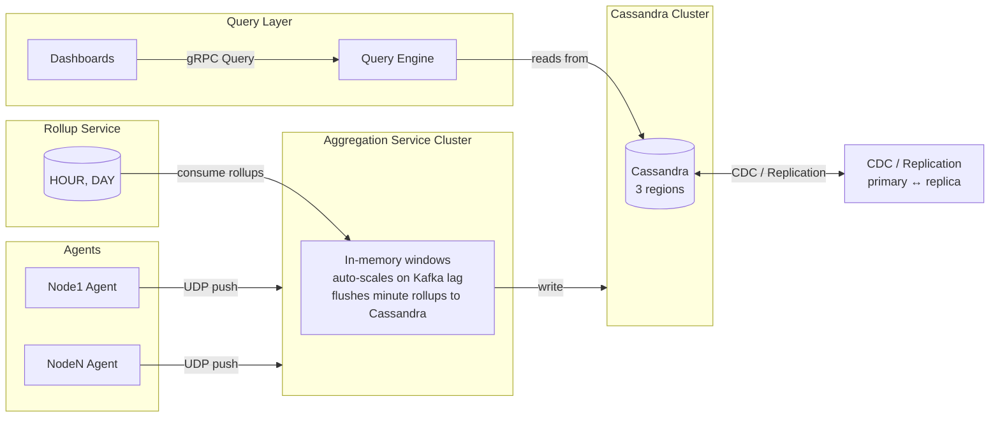
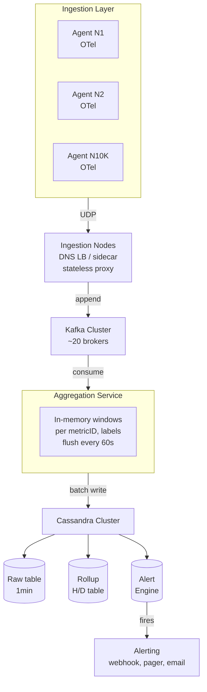

## Architecture Overview

### Design Rationale

- **Kafka as the ingestion backbone**: decouples ingestion from aggregation, absorbs spikes, provides replay capability.
- **In-memory windows for aggregation**: avoids the complexity of a streaming engine (Flink/Spark Streaming) by keeping aggregation simple and local. Stateless nodes scale horizontally.
- **Cassandra as the storage layer**: linearly scalable, handles high write throughput, native time-series support via clustering keys, multi-region replication built-in.
- **Query Engine as a read-side optimization**: reads from pre-computed rollups for long time ranges, raw data for short time ranges. No separate OLAP engine needed.

## Component Diagram

## Technology Choices

| Component | Choice | Rationale | Alternatives Considered |
|---|---|---|---|
| **Ingestion transport** | UDP (StatsD) + gRPC (OTLP) | UDP is simplest for agents — no TCP handshake, minimal CPU overhead. gRPC for critical metrics. | TCP (reliable but high overhead), MQTT (not designed for metrics) |
| **Message queue** | Kafka | High throughput, partition-based parallelism, replay capability, mature ecosystem. | RabbitMQ (lower throughput, no partitioning), Pulsar (simpler storage separation but less mature) |
| **In-memory window store** | In-process HashMap | O(1) insert, no network hop, simple TTL-based eviction. | Redis (adds network round-trip), RocksDB (persistent but adds latency) |
| **Time-series storage** | Cassandra | Linear write scaling, built-in multi-region replication, TTL-based compaction, familiar operations team. | ClickHouse (faster queries but no native replication), TimescaleDB (PostgreSQL-based, hard to scale writes) |
| **Query engine** | Custom (CQL + in-process aggregation) | PromQL is powerful but complex; a simpler query DSL reduces operational overhead. | PromQL engine (complex, high memory), Elasticsearch (expensive for numeric aggregation) |
| **Alerting** | Custom rule engine + Kafka consumer | Simple evaluation loop (every 60s), scales with rule count. | Thanos Rule (Prometheus-specific), Grafana Alerting (tightly coupled) |
| **Cross-region sync** | Debezium CDC + Kafka Connect | Log-based CDC captures all writes without app changes; Kafka Connect handles cross-region delivery. | Cassandra DR (native but limited to 2 clusters, no filtering) |