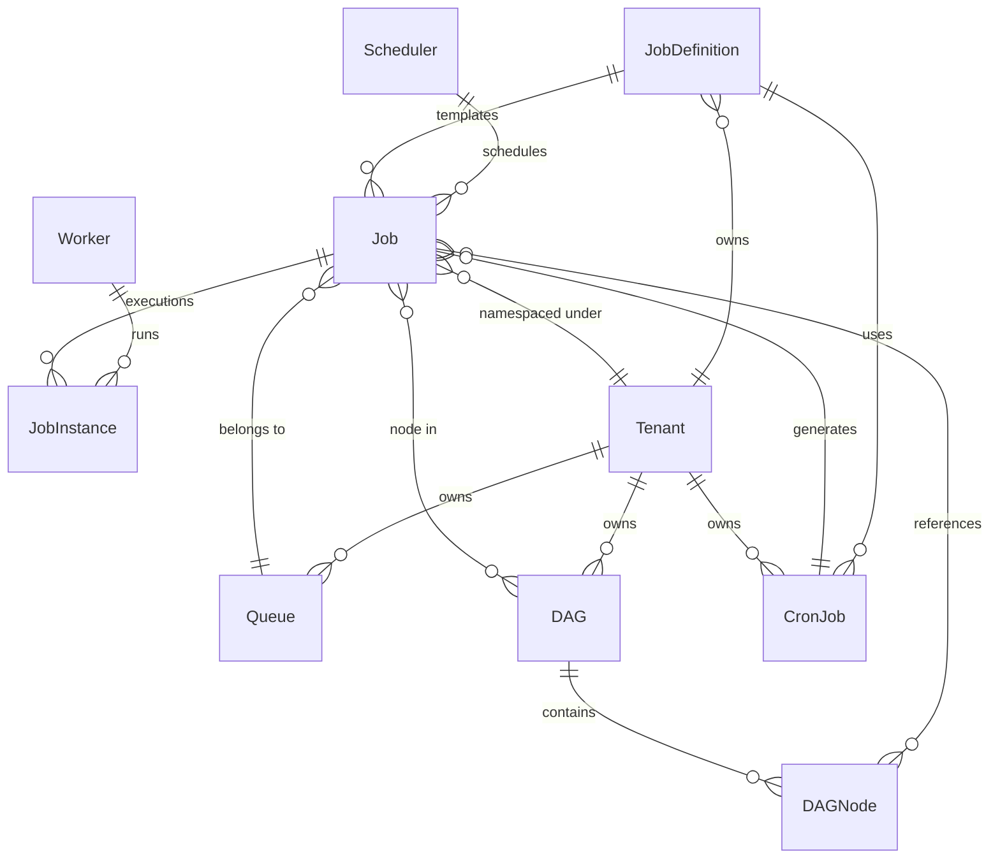

## Entity Definitions

### Job

The core unit of work. Represents a single task to be executed.

| Field | Type | Description |
|-------|------|-------------|
| `id` | UUID | Primary key |
| `name` | string | Human-readable name |
| `type` | enum [SINGLE, CRON, DAG] | Job type |
| `status` | enum [PENDING, QUEUED, SCHEDULED, RUNNING, SUCCESS, FAILED, CANCELLED, PAUSED] | Current state |
| `created_at` | timestamp | Job creation time |
| `updated_at` | timestamp | Last state transition time |
| `submitted_by` | string | User or service ID |
| `tenant_id` | string | Namespace/quota owner |
| `priority` | int | 1-100, higher = more important |
| `deadline` | timestamp (nullable) | Hard deadline for completion |
| `tags` | map&lt;string, string&gt; | Tags for grouping and filtering |
| `metadata` | JSON | Arbitrary key-value pairs |
| `retry_policy.max_retries` | int | Max retry attempts |
| `retry_policy.backoff_strategy` | enum [FIXED, EXPONENTIAL] | Backoff type |
| `retry_policy.backoff_seconds` | int | Backoff interval |
| `constraints.max_concurrent` | int | Per-tenant concurrency limit |
| `constraints.node_affinity` | map&lt;string, string&gt; | Preferred node labels |
| `constraints.node_anti_affinity` | map&lt;string, string&gt; | Excluded node labels |
| `constraints.taints` | list&lt;Taint&gt; | Accepted taints |
| `constraints.zones` | list&lt;string&gt; | Allowed AZs |
| `constraints.regions` | list&lt;string&gt; | Allowed regions |
| `environment` | map&lt;string, string&gt; | Environment variables |
| `secrets_ref` | list&lt;string&gt; | References to secret store |
| `config_maps_ref` | list&lt;string&gt; | References to config maps |

### Job Definition (Template)

Reusable blueprint for creating jobs. Avoids duplicating configuration.

| Field | Type | Description |
|-------|------|-------------|
| `id` | UUID | Primary key |
| `name` | string | Unique within tenant |
| `payload_type` | enum [SCRIPT, CONTAINER, COMMAND, K8S_CRONJOB] | Execution format |
| `payload` | string | The script, image URI, or command |
| `resource_request` | \{cpu, memory, disk, gpu, ephemeral_storage\} | Minimum resources required |
| `resource_limit` | \{cpu, memory, disk, gpu\} | Hard upper bounds |
| `retry_policy` | \{max_retries, backoff_strategy, backoff_seconds\} | Retry behavior |
| `timeout_seconds` | int | Max job lifetime |
| `environment` | map&lt;string, string&gt; | Environment variables |
| `secrets_ref` | list&lt;string&gt; | Secret references |

### Job Instance (Execution)

A single execution attempt of a Job. A retried job creates a new instance.

| Field | Type | Description |
|-------|------|-------------|
| `id` | UUID | Primary key |
| `job_id` | UUID | FK to Job |
| `instance_number` | int | 1, 2, 3... for retries |
| `status` | enum [PENDING, STARTING, RUNNING, COMPLETED, FAILED, KILLED] | Execution state |
| `started_at` | timestamp | Container start time |
| `completed_at` | timestamp | Container end time |
| `assigned_worker_id` | UUID | FK to Worker |
| `error_message` | string (nullable) | Failure reason |
| `error_code` | string (nullable) | Machine-readable error code |
| `exit_code` | int (nullable) | Unix exit code |
| `logs_ref` | string | URL/path to log store |
| `metrics.cpu_time_ms` | int | CPU time consumed |
| `metrics.memory_peak_mb` | int | Peak memory usage |

### CronJob (Recurring Schedule)

Defines a recurring job based on a cron expression.

| Field | Type | Description |
|-------|------|-------------|
| `id` | UUID | Primary key |
| `job_definition_id` | UUID | FK to JobDefinition |
| `cron_expression` | string | Standard 5-field cron |
| `timezone` | string | IANA timezone |
| `state` | enum [ACTIVE, PAUSED, DELETED] | Lifecycle state |
| `missed_runs_policy` | enum [SKIP, RUN_LATEST, RUN_ALL] | How to handle missed runs |
| `concurrency_policy` | enum [ALLOW, FORBID, REPLACE] | Overlap behavior |
| `next_run_at` | timestamp | Next scheduled execution |

### DAG (Directed Acyclic Graph)

Defines ordered execution across multiple jobs.

| Field | Type | Description |
|-------|------|-------------|
| `id` | UUID | Primary key |
| `nodes` | list&lt;DAGNode&gt; | Vertices in the graph |
| `edges` | list&lt;DAGEdge&gt; | Dependencies between nodes |
| `state` | enum [ACTIVE, PAUSED, COMPLETED, FAILED] | Lifecycle state |

DAGNode: references a Job via `job_id` with `alias` for display.

DAGTrigger: defines condition (SUCCESS, ALWAYS, FAILURE) from `source_node_id`.

### Worker (Execution Node)

A node that executes jobs. Part of a larger pool.

| Field | Type | Description |
|-------|------|-------------|
| `id` | UUID | Primary key |
| `hostname` | string | Machine hostname |
| `status` | enum [READY, BUSY, DRAINING, OFFLINE] | Health state |
| `last_heartbeat_at` | timestamp | Last heartbeat |
| `labels` | map&lt;string, string&gt; | Region, zone, node-type |
| `taints` | list&lt;Taint&gt; | Unschedulable conditions |
| `capacity` | \{cpu, memory, disk, gpu\} | Total resources |
| `allocatable` | \{cpu, memory, disk, gpu\} | Available resources |
| `running_job_ids` | list&lt;UUID&gt; | Currently executing jobs |

### Queue

Logical partitioning of jobs for priority-based and fair-share scheduling.

| Field | Type | Description |
|-------|------|-------------|
| `name` | string | Unique within tenant |
| `scheduling_algorithm` | enum [FIFO, PRIORITY, FAIR_SHARE, DRF] | Scheduling policy |
| `weight` | int | Relative weight for fair-share |
| `min_capacity` | float | Minimum cluster fraction (0-1) |
| `max_capacity` | float | Maximum cluster fraction (0-1) |

## Relationships

### Entity Relationship Diagram

### Key Relationship Rules

1. **Job → JobDefinition**: One-to-many. A JobDefinition is a template; many Jobs can be created from one definition.
2. **Job → JobInstance**: One-to-many. Each retry creates a new instance with an incremented `instance_number`.
3. **Job → Queue**: Many-to-one. Jobs are assigned to a queue at creation time; the queue determines the scheduling policy.
4. **Job → Worker**: Many-to-one. A running job is assigned to exactly one worker; a worker can run many jobs concurrently.
5. **CronJob → Job**: One-to-many. A single CronJob generates many Job instances over time.
6. **DAG → Job**: Many-to-many via DAGNode. Jobs participate in DAGs as nodes with conditional triggers.
7. **Scheduler → Job**: Many-to-one. The scheduler (leader) owns all scheduling decisions.
8. **Worker Health**: Workers send heartbeats at configurable intervals (default 5s). If 3 heartbeats are missed, the scheduler marks the worker as OFFLINE and reschedules its jobs.
