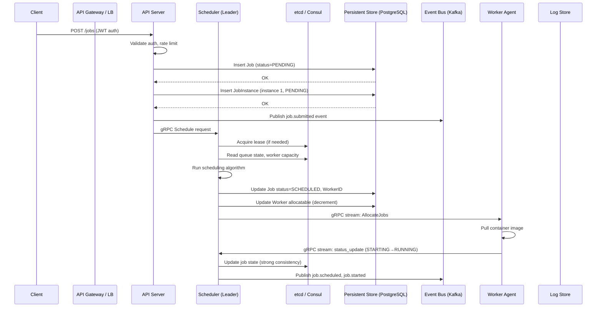
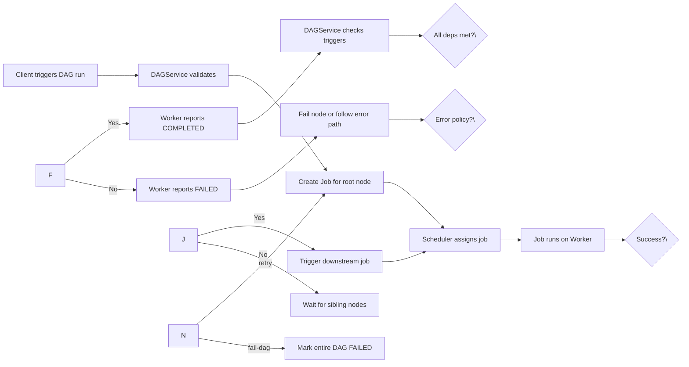
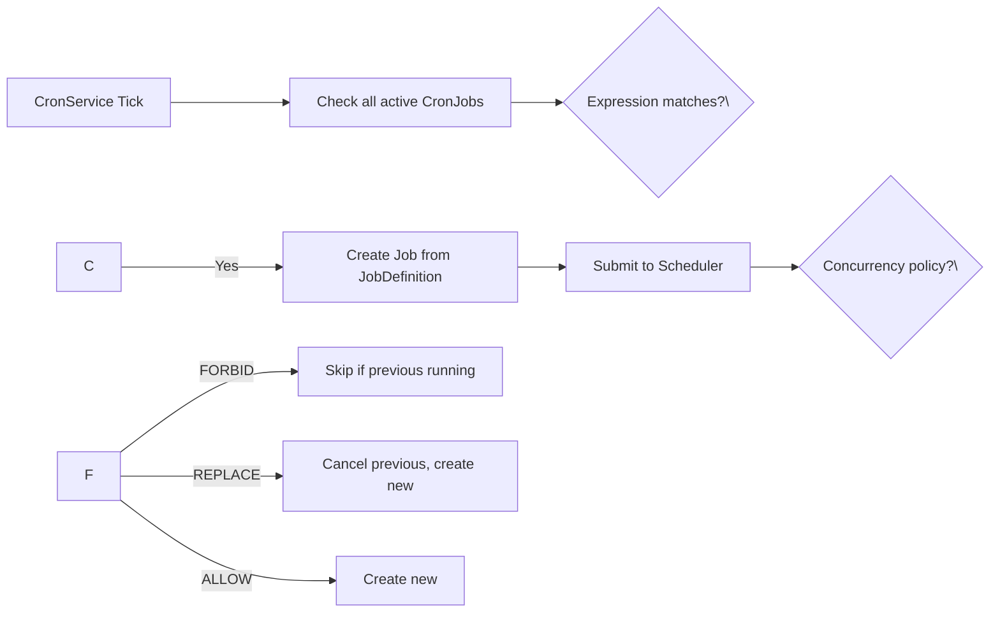

## Write Path

### Job Submission Write Path

1. **Client submits job** via REST/GraphQL API with job definition ID, priority, and constraints.
2. **API Server** authenticates the request, validates tenant quota, and persists the job as `PENDING` in PostgreSQL. A JobInstance row is created.
3. **Event published** to the event bus (`job.submitted`) for observability.
4. **Scheduler evaluates** the job immediately. Reads queue state and worker capacity from etcd, runs the scheduling algorithm.
5. **State committed**: Job status transitions to `SCHEDULED`, worker allocatable resources decremented.
6. **Worker notified** via bidirectional gRPC stream.
7. **Worker pulls** the container image and starts execution, reporting `STARTING → RUNNING`.
8. **Scheduler updates** etcd with running state (strong consistency) and publishes `job.started` to the event bus.

### DAG Execution Write Path

1. Client triggers a DAG run via `POST /dags/\{id\}/run`.
2. DAGService creates Job instances for root nodes (no incoming edges).
3. Jobs are submitted to the scheduler normally.
4. When a job completes, Worker reports the status. DAGService evaluates outgoing triggers.
5. If all dependencies are satisfied, the downstream job is created and submitted.
6. If any node fails with `fail-dag` error policy, the entire DAG is marked FAILED.

### Cron Job Write Path

1. CronService ticks every second on the scheduler leader.
2. Evaluates cron expressions against the current timestamp.
3. Concurrency policy determines behavior if previous instance is still running: FORBID (skip), REPLACE (cancel old, start new), or ALLOW (run in parallel).

## Read Path

### Job Status Read Path

Most reads hit a read replica or cache — the leader holds the authoritative state for scheduling decisions only.

| Read Type | Path | Latency Target | Notes |
|-----------|------|---------------|-------|
| Single job status | API → etcd (leader-owned key) | < 5ms | Strongly consistent |
| Job list (tenant) | API → Read Replica → PostgreSQL | < 50ms | Paginated, filtered by tenant_id |
| Job list (search) | API → OpenSearch | < 100ms | Full-text search on name, tags |
| Job logs | API → Log Store (Loki/Elastic) | < 200ms | Time-range filtered |
| Job metrics | API → Time-series DB (Prometheus) | < 50ms | Aggregated over time window |
| DAG status | API → DAGService → Job queries | < 100ms | Joins DAG nodes with job states |
| Worker status | API → etcd (worker lease key) | < 5ms | Reads worker lease |
| Queue utilization | API → etcd (queue metadata) | < 5ms | Queue length, backfill state |

### Cache Layer (Redis)

- **Job status cache**: TTL 1s for running jobs, 10s for completed/failed. Invalidated on state transition.
- **Worker capacity cache**: TTL 5s, updated on every heartbeat.
- **Queue length cache**: Updated on every enqueue/dequeue (no TTL).

## Sync/Replication Flow

### Scheduler Leader Election (etcd Raft)

- The scheduler runs an active-passive HA deployment using etcd's Raft consensus for leader election.
- Each scheduler instance holds a TTL lease in etcd, renewed via heartbeat every 1s.
- If 3 consecutive heartbeats are missed (3s detection), followers trigger an election.
- The winner re-syncs job state from PostgreSQL and takes over scheduling duties.

### State Replication Strategy

| Data Type | Storage | Replication | Consistency |
|-----------|---------|-------------|-------------|
| Job state | PostgreSQL (leader writes) + etcd (hot keys) | Leader → etcd (CAS) | Strong |
| Job state (reads) | PostgreSQL read replicas | Async replication | Eventual (< 100ms lag) |
| Worker registration | etcd (TTL keys) | Direct write | Strong (per-key CAS) |
| Queue metadata | etcd (persistent keys) | Leader-only | Leader owns all mutations |
| Job definitions | PostgreSQL (versioned) | Read replicas | Strong |
| Cron schedules | etcd (persistent keys) | Leader-only | Leader owns all mutations |
| Logs | Distributed log store (Loki/Elastic) | Multi-replica | Strong within shard |
| Event bus | Kafka (3 replicas) | Leader-based | Strong (ack=all) |

### Failover Recovery Flow

1. **Recovery trigger**: New scheduler leader detects stale leases.
2. **State reconstruction**: Loads all `SCHEDULED` and `RUNNING` jobs from PostgreSQL.
3. **Worker health check**: For jobs assigned to workers, pings each worker via gRPC.
4. **Dead worker handling**: Jobs on dead workers are reset to `QUEUED` and re-scheduled.
5. **Stale alive handling**: Jobs on workers that report a different state are reconciled.
6. **Queue re-evaluation**: Re-scheduled jobs re-enter the queue in their original priority order.

### Cross-Region Replication

| Component | Primary Region | Secondary Regions |
|-----------|---------------|-------------------|
| PostgreSQL | Leader writes | Async streaming replication |
| etcd | Single cluster (leader) | Cold standby followers |
| Event bus | Kafka primary | MirrorMaker 2 replication |
| Log store | Local write | Async cross-region replication |

Secondary regions handle reads and accept job submissions. Submitted jobs are queued locally and sync state to the primary region asynchronously. During a primary region outage, a secondary region can promote its scheduler to leader.
