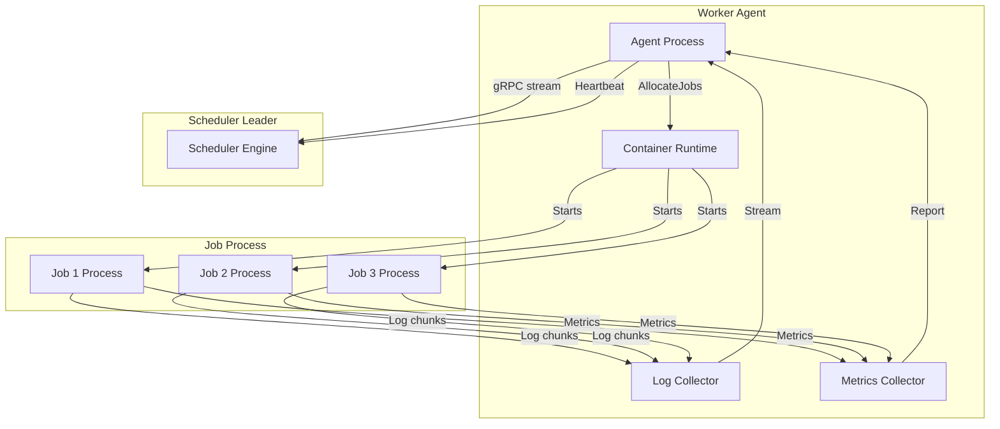

## Architecture Overview

### System Context

```mermaid
graph TB
    subgraph Clients
        UI[Web Dashboard]
        CLI[CLI Tool]
        CI[CI/CD Pipeline]
        API_CLIENT[Custom Service]
    end

    subgraph "Edge"
        CDN[Static Assets]
        WAF[WAF / TLS Termination]
        LB[Load Balancer]
    end

    subgraph "Control Plane"
        GW[API Gateway]
        AS[API Server]
        WS_SVC[WebSocket Server]
    end

    subgraph "Scheduler Plane"
        SCH_LEADER[Scheduler Leader]
        SCH_FOLLOWER[Scheduler Follower]
        SCH_FOLLOWER2[Scheduler Follower]
        CRON_SVC[CronService]
        DAG_SVC[DAGService]
    end

    subgraph "Coordination"
        ETCD[etcd Cluster]
        REDIS[Redis Cluster]
    end

    subgraph "Execution"
        WORKER1[Worker Node 1]
        WORKER2[Worker Node 2]
        WORKER3[Worker Node 3]
        WORKER_N[Worker Node N...]
    end

    subgraph "Storage"
        PG[(PostgreSQL)]
        KAFKA[(Kafka)]
        LOKI[(Loki)]
        TSDB[(Time-series DB)]
    end

    UI --> WAF --> LB --> GW
    CLI --> WAF --> LB --> GW
    CI --> WAF --> LB --> GW
    API_CLIENT --> WAF --> LB --> GW

    GW --> AS
    GW --> WS_SVC

    AS --> SCH_LEADER
    SCH_LEADER <.leader election.> ETCD
    SCH_LEADER --> SCH_FOLLOWER
    SCH_LEADER --> SCH_FOLLOWER2

    SCH_LEADER --> CRON_SVC
    SCH_LEADER --> DAG_SVC

    SCH_LEADER --> ETCD
    AS --> REDIS
    AS --> PG

    SCH_LEADER --> WORKER1
    SCH_LEADER --> WORKER2
    SCH_LEADER --> WORKER3
    SCH_LEADER --> WORKER_N

    WORKER1 <.gRPC stream.> SCH_LEADER
    WORKER2 <.gRPC stream.> SCH_LEADER
    WORKER3 <.gRPC stream.> SCH_LEADER

    WORKER1 --> KAFKA
    WORKER2 --> KAFKA
    WORKER3 --> KAFKA

    AS --> LOKI
    AS --> TSDB
    AS --> PG

    SCH_FOLLOWER -.failover.> SCH_LEADER
    SCH_FOLLOWER2 -.failover.> SCH_LEADER
```

### Core Design Principles

1. **Leader-only scheduling**: Only the scheduler leader makes scheduling decisions. Followers are hot standbys.
2. **Leader-write, leader-read for job state**: Job state mutations and reads happen on the leader via etcd CAS for strong consistency. Read replicas handle tenant-scoped list queries.
3. **Bidirectional gRPC for workers**: Worker agents maintain persistent streams to the leader — no HTTP polling for job assignment.
4. **Event-driven architecture**: All job lifecycle events are published to Kafka for downstream consumers.
5. **Tenant isolation by namespace**: Tenants are isolated via tenant_id scoping.

## Component Diagram

### Scheduler Internal Architecture

```mermaid
graph TB
    subgraph "API Layer"
        REST[REST Handler]
        GraphQL[GraphQL Handler]
        WS[WebSocket Handler]
    end

    subgraph "Scheduler Core"
        SCHED[Scheduler Engine]
        QUEUE[Queue Manager]
        PRIORITY[Priority Resolver]
        FAIRSHARE[Fair-Share Allocator]
    end

    subgraph "State Management"
        STATE[Job State Manager]
        WORKER_MGR[Worker Manager]
        LEASE[Lease Manager]
    end

    subgraph "Triggers"
        CRON[Cron Evaluator]
        DAG[DAG Trigger Engine]
        RETRY[Retry Orchestrator]
    end

    subgraph "Events"
        PUBLISHER[Event Publisher]
        WEBHOOK[Webhook Dispatcher]
    end

    subgraph "External"
        ETCD[etcd]
        PG[PostgreSQL]
        REDIS[Redis]
        KAFKA[Kafka]
    end

    REST --> QUEUE
    REST --> STATE
    GraphQL --> STATE
    WS --> PUBLISHER

    QUEUE --> PRIORITY
    QUEUE --> FAIRSHARE
    PRIORITY --> SCHED
    FAIRSHARE --> SCHED

    SCHED --> STATE
    SCHED --> WORKER_MGR
    SCHED --> LEASE

    STATE --> PG
    STATE --> ETCD
    WORKER_MGR --> ETCD

    CRON --> QUEUE
    DAG --> QUEUE
    RETRY --> QUEUE

    STATE --> PUBLISHER
    PUBLISHER --> KAFKA
    PUBLISHER --> WEBHOOK

    WS --> REDIS
```



### Component Responsibilities

| Component | Responsibility | Key Operations |
|-----------|---------------|----------------|
| **API Layer** | User-facing interfaces | REST API, GraphQL queries, WebSocket connections |
| **Scheduler Engine** | Core scheduling decisions | Runs scheduling algorithm, picks best worker for each job |
| **Queue Manager** | Queue ordering and backfill | Maintains priority order, handles fair-share weights |
| **Priority Resolver** | Priority calculation | Computes effective priority based on base priority, deadline pressure, age |
| **Fair-Share Allocator** | Inter-tenant fairness | Enforces min/max capacity per queue |
| **Job State Manager** | State persistence and lookup | CRUD on job state, state transitions, audit logging |
| **Worker Manager** | Worker registry and health | Heartbeat processing, capacity tracking, offline detection |
| **Lease Manager** | etcd lease coordination | Leader election, worker registration leases |
| **Cron Evaluator** | Cron trigger evaluation | Evaluates cron expressions every second |
| **DAG Trigger Engine** | DAG dependency resolution | Checks trigger conditions, creates downstream jobs |
| **Retry Orchestrator** | Retry scheduling | Applies backoff policy, reschedules failed instances |
| **Event Publisher** | Kafka event publishing | Publishes job lifecycle events |
| **Webhook Dispatcher** | Webhook delivery | Delivers webhook payloads with retry logic |

### Execution Node Architecture



Each worker node runs:
- **Worker Agent**: Communicates with scheduler via gRPC stream, receives job allocation commands.
- **Container Runtime**: Pulls images and executes job processes with resource limits (cgroups).
- **Log Collector**: Buffers and streams log output to the scheduler for forwarding to the log store.
- **Metrics Collector**: Collects per-job resource metrics (CPU, memory) and reports to the scheduler.

## Technology Choices

### Technology Stack Comparison

| Component | Option A (Chosen) | Option B | Rationale |
|-----------|-------------------|----------|-----------|
| **API Framework** | Go (Gin) | Node.js (Fastify) | Go provides low-latency gRPC integration, strong concurrency model, and easier co-deployment with scheduler logic |
| **Scheduler Core** | Go | Python | Go's concurrency primitives and low-latency GC are critical for p99 < 100ms scheduling decisions |
| **gRPC** | gRPC-Go | — | Native Go gRPC support, protobuf schema reuse across services |
| **Leader Election** | etcd (Raft) | Consul | etcd has lower latency for lease operations and is the Kubernetes ecosystem standard |
| **Persistent Store** | PostgreSQL | MySQL | PostgreSQL's JSONB column for flexible job metadata, better indexing for complex queries |
| **Read Replicas** | PostgreSQL streaming | — | Mature async streaming replication with < 100ms lag |
| **Event Bus** | Kafka | NATS JetStream | Kafka's durability (ack=all) and MirrorMaker 2 for cross-region replication |
| **Worker Coordination** | etcd TTL keys | Redis | etcd is already part of the coordination layer; avoids adding a separate dependency |
| **Cache** | Redis | Memcached | Redis provides pub/sub for cache invalidation and Lua scripts for atomic operations |
| **Log Store** | Loki | Elasticsearch | Loki is more storage-efficient. Elastic is chosen if full-text search on logs is required |
| **Time-series DB** | Prometheus | InfluxDB | Prometheus is the industry standard for infrastructure metrics |
| **Container Runtime** | containerd | Docker daemon | containerd is lighter and the CNCF standard |

### Why Not X?

**Why not a distributed scheduler (consistent hashing across scheduler instances)?**
At 100K concurrent jobs, a single-leader model can handle the throughput because scheduling is an O(N) operation over the pending queue. The bottleneck is database writes, not scheduling computation. A distributed scheduler adds complexity (partitioning, rebalancing) with marginal benefit. The leader approach guarantees globally optimal scheduling decisions and is how Kubernetes, Apache Mesos, and Airflow handle similar scale.

**Why not event-driven scheduling (batch scheduling every N seconds)?**
Immediate scheduling reduces job latency from submission to execution. With 60% of jobs being short-lived (< 30 min), batching introduces unacceptable latency (5-30s). We use immediate scheduling for all jobs.

**Why not MySQL over PostgreSQL?**
PostgreSQL's JSONB column type is essential for storing arbitrary job metadata and configuration without schema migrations. MySQL's JSON type is less mature for indexing complex queries.
