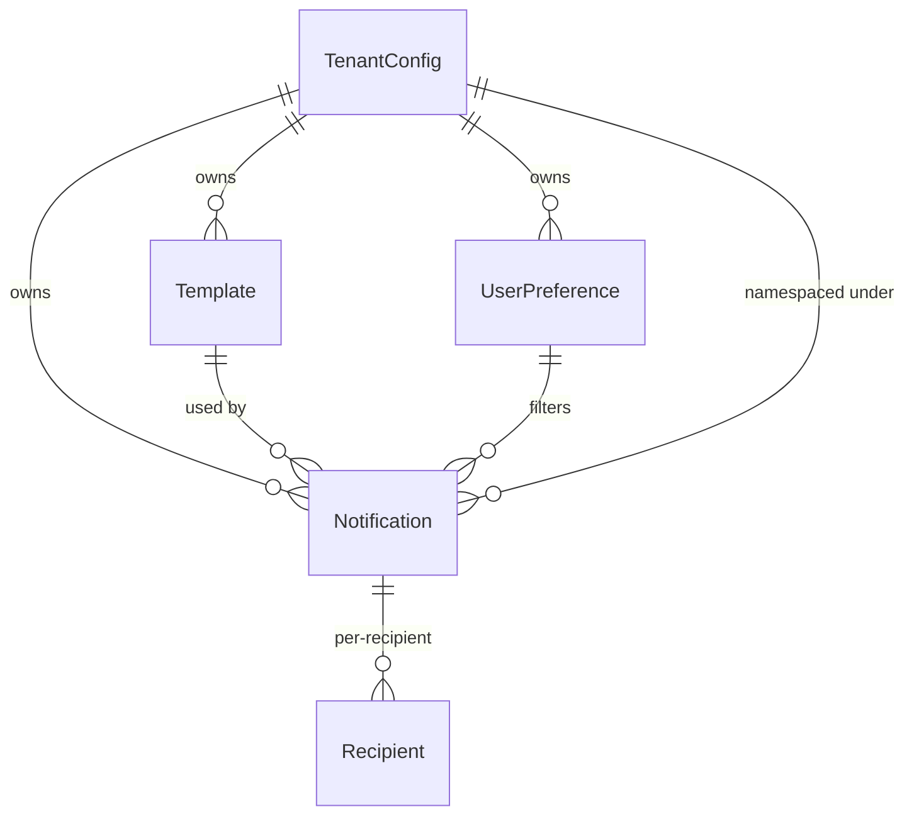
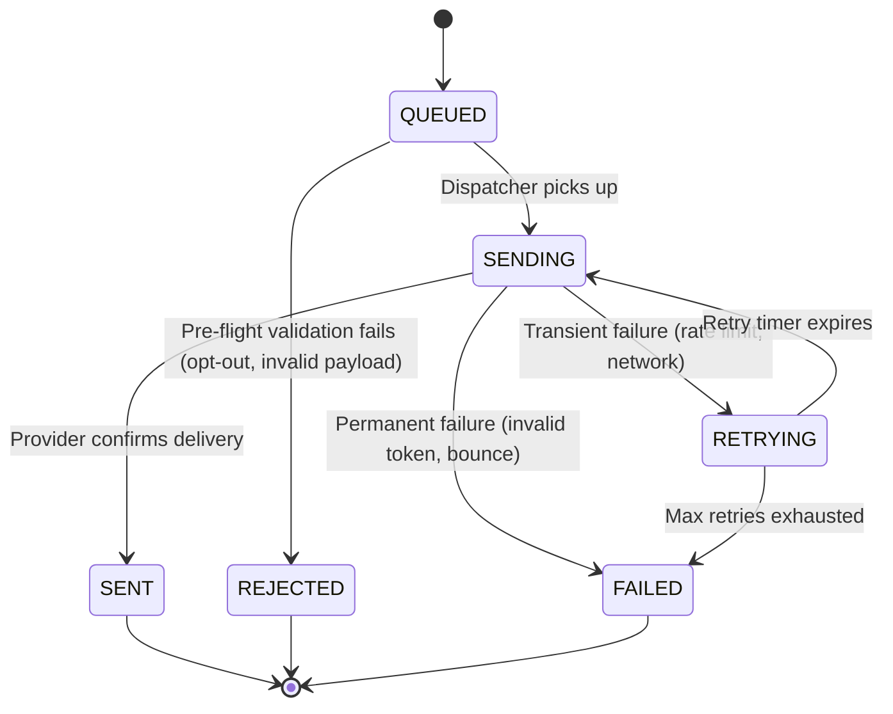
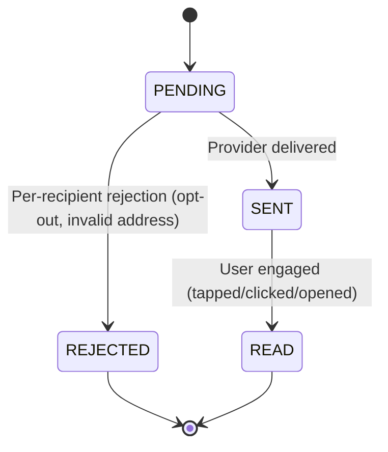

## Entity Definitions

### Notification

The atomic unit of delivery. Represents a single notification sent to one recipient via one channel.

| Field | Type | Description |
|-------|------|-------------|
| `id` | UUID | Primary key |
| `tenant_id` | string | Tenant that initiated the notification |
| `template_id` | string (nullable) | Referenced template for content |
| `content` | JSON | Rendered notification content |
| `channel` | enum [PUSH, EMAIL, SMS, IN_APP, WEBHOOK, SLACK] | Delivery channel |
| `status` | enum [QUEUED, SENDING, SENT, FAILED, REJECTED] | Delivery lifecycle |
| `created_at` | timestamp | Creation time |
| `updated_at` | timestamp | Last state change |
| `scheduled_at` | timestamp (nullable) | Scheduled delivery time |
| `delivered_at` | timestamp (nullable) | Provider confirmed delivery |
| `failed_at` | timestamp (nullable) | Max retries exhausted |
| `error_code` | string (nullable) | Last failure reason |
| `metadata` | JSON | Arbitrary key-value pairs |
| `priority` | enum [LOW, MEDIUM, HIGH, CRITICAL] | Delivery priority |
| `retry_count` | int | Number of delivery attempts |

#### Recipient (Embedded)

Per-recipient tracking within a batch notification:

| Field | Type | Description |
|-------|------|-------------|
| `user_id` | string | Target user |
| `address` | string | Device token, email, phone, webhook URL |
| `status` | enum [PENDING, SENT, FAILED, REJECTED] | Per-recipient status |
| `delivery_receipt` | JSON (nullable) | Provider delivery receipt |
| `read_at` | timestamp (nullable) | User read timestamp |

### Template

Reusable notification content template with variables.

| Field | Type | Description |
|-------|------|-------------|
| `id` | string | Unique within tenant |
| `name` | string | Human-readable name |
| `channel` | enum [PUSH, EMAIL, SMS, IN_APP, WEBHOOK, SLACK] | Applicable channel |
| `locale` | string | Template language (en, es, ja) |
| `subject` | string (nullable) | Subject line (email/push) |
| `body` | string | Template body with &#123;&#123; variables &#125;&#125; |
| `variables` | list&lt;string&gt; | Required variables |
| `payload` | JSON (nullable) | Push/webhook data payload |
| `is_active` | bool | Deployment status |

### UserPreference

Per-user channel opt-in/opt-out and quiet hours.

| Field | Type | Description |
|-------|------|-------------|
| `user_id` | string | Primary key |
| `tenant_id` | string | Tenant scope |
| `channels` | `map<channel, boolean>` | Per-channel opt-in |
| `quiet_hours_start` | time (nullable) | Quiet hours start |
| `quiet_hours_end` | time (nullable) | Quiet hours end |
| `preferred_locale` | string | Default template locale |
| `updated_at` | timestamp | Last preference change |

### TenantConfig

Per-tenant notification configuration and quotas.

| Field | Type | Description |
|-------|------|-------------|
| `tenant_id` | string | Primary key |
| `api_keys` | list&lt;string&gt; | Authentication keys |
| `rate_limits` | \{per_second, per_day\} | Quotas |
| `default_channels` | list&lt;channel&gt; | Default delivery channels |
| `priority_rules` | map&lt;priority, list&lt;channel&gt;> | Channel per priority |
| `webhook_url` | string (nullable) | Global webhook callback |
| `billing_plan` | string | Free/pro/enterprise tier |

## Relationships

### Entity Relationship Diagram

### Key Relationship Rules

1. **TenantConfig → Notification**: One-to-many. Each tenant owns their notifications and is subject to rate limits.
2. **Template → Notification**: One-to-many. A template generates many notifications; rendered content is stored in `content`.
3. **UserPreference → Notification**: Filtering. Before dispatch, the service checks `UserPreference` for channel opt-out and quiet hours.
4. **Notification → Recipient**: One-to-many. A batch notification (1 API call) creates N Recipient records.
5. **Priority routing**: `TenantConfig.priority_rules` maps notification priority to available channels (e.g., CRITICAL → [SMS, PUSH, EMAIL]).

## State Machines

### Notification Lifecycle

### Per-Recipient Engagement

