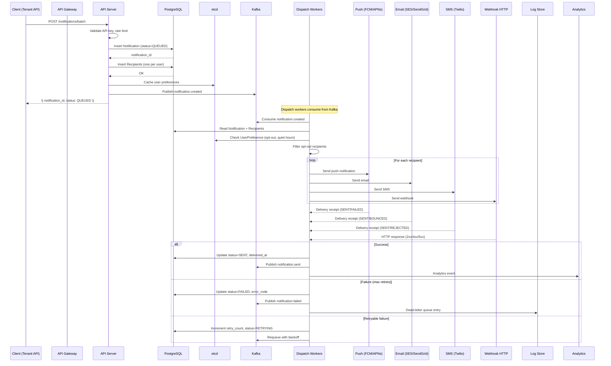
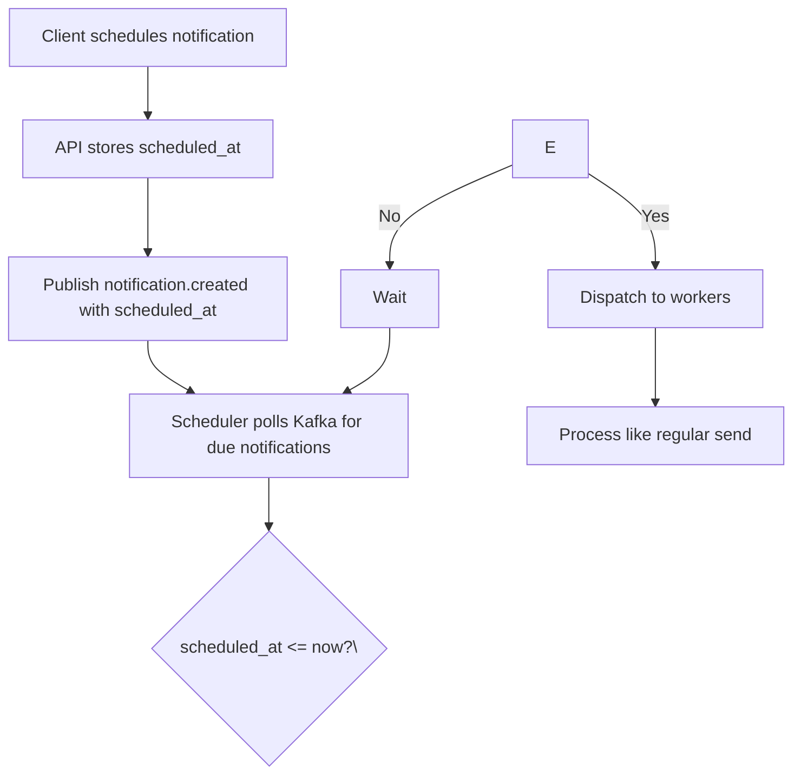
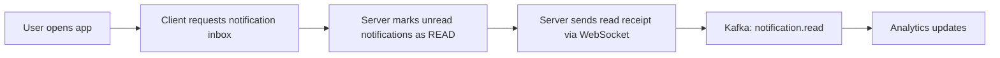
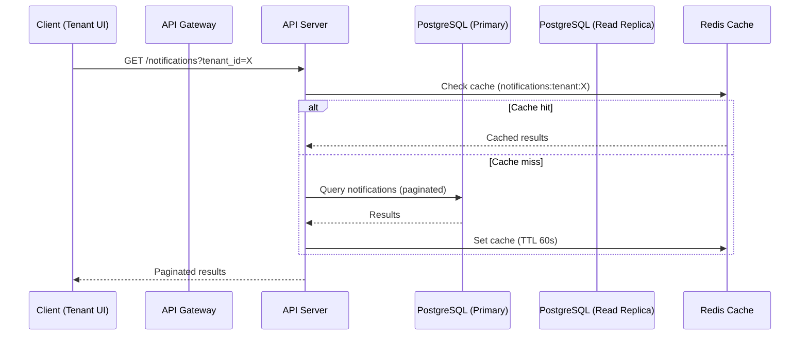
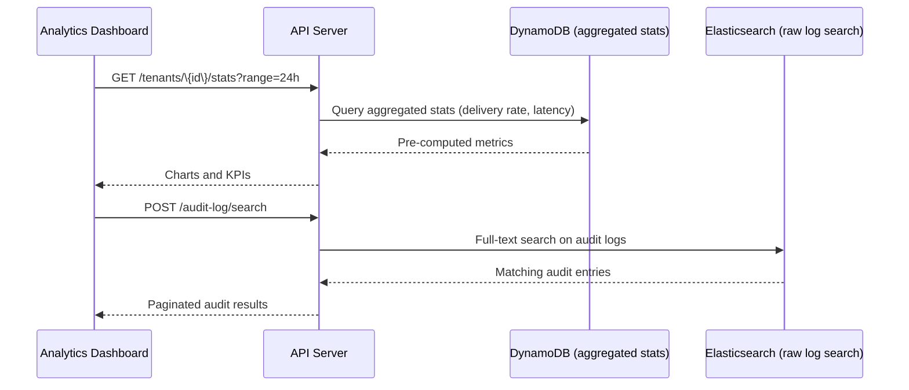
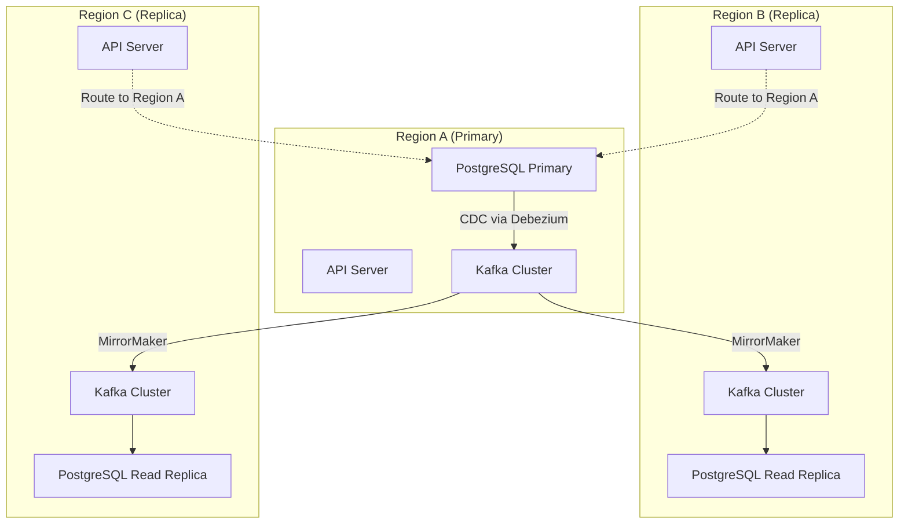
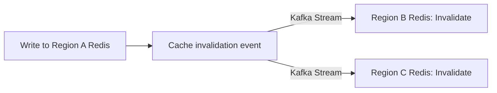
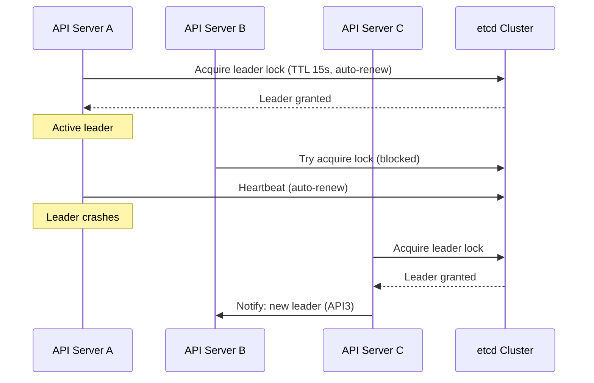
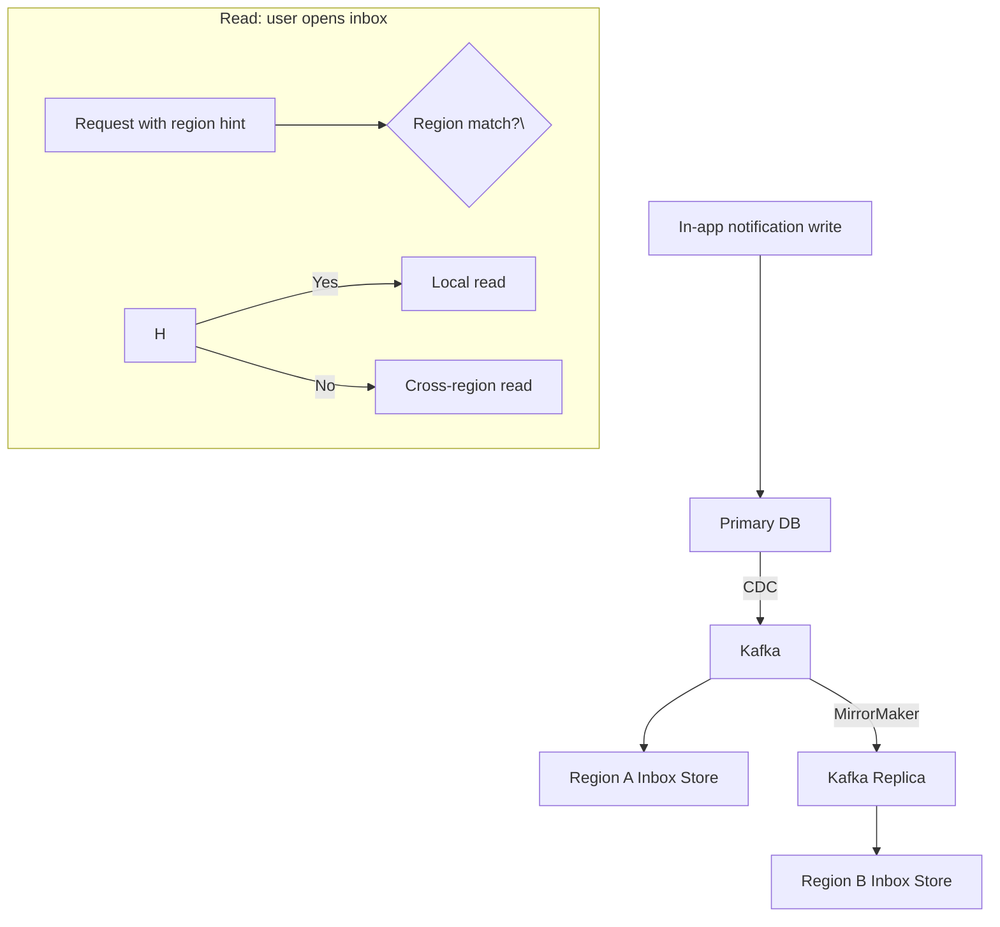

## Write Path

### Notification Send Write Path



1. **Client sends notification** via REST API with template, recipients, and channels.
2. **API Server** validates tenant auth, checks rate limits, renders template if provided.
3. **Persistence**: Notification record with QUEUED status created in PostgreSQL. Recipient records created.
4. **Event published**: `notification.created` to Kafka for downstream consumers.
5. **Dispatch workers** consume the event, check user preferences (opt-out, quiet hours), and filter recipients.
6. **Per-channel dispatch**: Workers send to FCM/APNs (push), SES/SendGrid (email), Twilio (SMS), or HTTP POST (webhook).
7. **Receipt handling**: On delivery receipt, status updated to SENT. On failure, retry with backoff. After max retries, moved to dead-letter queue.

### Scheduled Notification Write Path



1. Scheduled notification stored with `scheduled_at` timestamp and QUEUED status.
2. A scheduler component polls Kafka (or uses Kafka's time-based offset) for notifications whose `scheduled_at` less than or equal to now.
3. At the scheduled time, the notification is dispatched through the normal flow.

### Read Receipt Tracking Write Path



For push notifications: APNs/FCM callback → notification.read event → update database.
For email: open tracking pixel hits → server logs event → update database.

## Read Path

### Notification Status Query



1. Tenant queries notification status via REST API (GET /notifications).
2. **Cache layer**: Redis cache keyed by tenant_id + filter criteria. 60-second TTL to balance freshness vs. load.
3. **DB query**: Falls back to read replica for pagination and filtering (by status, channel, date range).
4. **Response**: Paginated list with status, channel, priority, and creation timestamp.

### Notification Detail Lookup

```mermaid
flowchart LR
    A[GET /notifications/\{id\}] --> B\{Cache hit?\}
    B -->|Yes| C[Return cached detail]
    B -->|No| D[Query PostgreSQL]
    D --> E[Cache result 30s]
    E --> F[Return detail]
    C --> G[Return detail]
```

### Tenant Analytics Read Path



## Sync/Replication Flow

### Multi-Region Replication



1. **Primary region** (Region A) handles all writes via PostgreSQL Primary.
2. **CDC (Change Data Capture)** via Debezium replicates DB changes to local Kafka.
3. **MirrorMaker** streams Kafka topics to replica regions (B, C) for read-replica sync.
4. **Replica regions** serve read queries (GET /notifications) from local read replicas.
5. **Write routing**: Cross-region write requests are routed to primary region API.

### Redis Cross-Region Cache Sync



- Cache invalidation events published to Kafka and streamed to replicas.
- No cross-region cache warm-up; miss penalty acceptable for notification reads.

### etcd Consensus for Leader Election



- etcd uses Raft consensus for leader election across 3 API server instances per region.
- Leader handles write coordination; followers queue writes via leader forwarding.
- TTL-based lease (15s) with auto-renewal; stale leaders naturally expire.

### Notification Inbox Replication



- Each region maintains a local in-app notification store for low-latency reads.
- CDC ensures eventual consistency across regions (typically < 100ms lag).
- Reads prefer local region; cross-region reads are acceptable for edge cases.
