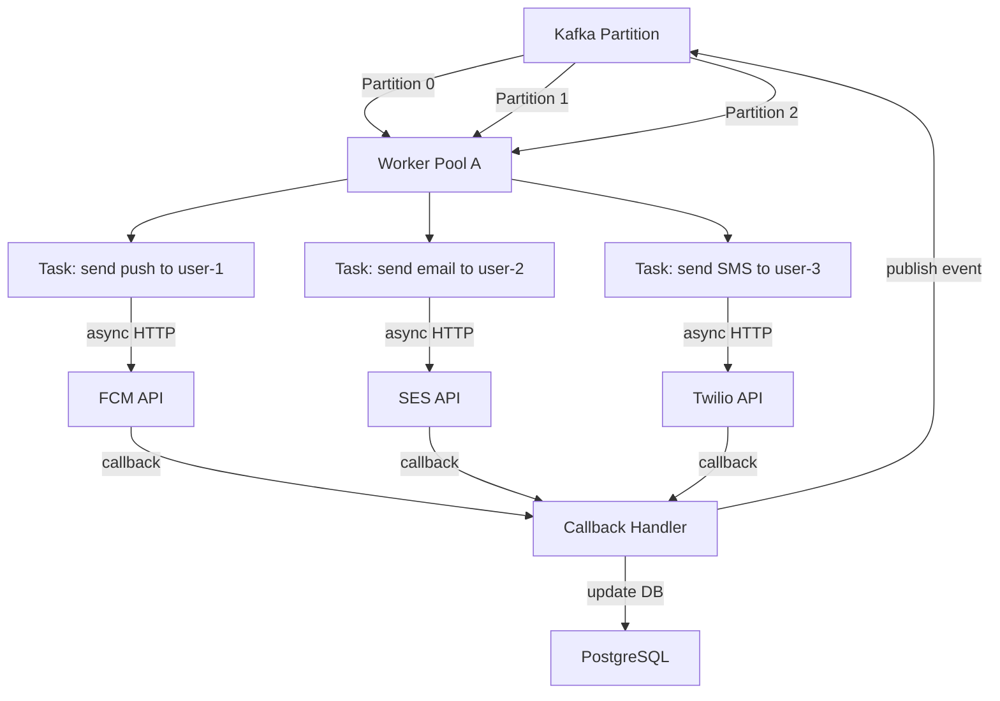

## Architecture Overview

### Design Philosophy

A notification service at scale needs to balance three competing priorities: **throughput** (1M notifications/sec), **low latency** (push < 3s), and **reliability** (exactly-once delivery semantics). The architecture separates concerns into four layers:

1. **API Layer** — request validation, auth, rate limiting, template rendering
2. **Queue Layer** — Kafka-based buffering that decouples ingestion from dispatch
3. **Dispatch Layer** — per-channel workers with retry, backoff, and dead-letter handling
4. **Observability Layer** — metrics, audit logs, and delivery tracking

### High-Level Architecture

```mermaid
graph TB
    subgraph Clients["API Clients (50K+ internal services)"]
        C1[Web App]
        C2[Mobile App]
        C3[Backend Services]
        C4[Partner Integrations]
    end

    subgraph Edge["Edge Layer"]
        DNS[DNS + Global LB]
        CDN[Edge Cache (templates, config)]
        WAF[WAF + DDoS Protection]
    end

    subgraph API["API Layer (Multi-region Active-Active)"]
        GW[API Gateway]
        AUTH[Auth Middleware]
        RL[Rate Limiter]
        API_SERVER[API Servers]
    end

    subgraph Core["Core Services"]
        TMPL[Template Service]
        Prefs[User Preference Service]
        BILL[Billable Event Producer]
    end

    subgraph Queue["Messaging Layer"]
        KAFKA[Kafka Cluster]
        DLQ[Dead-Letter Queue]
        SCH[Scheduler Topic]
    end

    subgraph Dispatch["Dispatch Layer"]
        PUSH_W[Push Dispatch Workers]
        EMAIL_W[Email Dispatch Workers]
        SMS_W[SMS Dispatch Workers]
        INAPP_W[In-App Dispatch Workers]
        WEBHOOK_W[Webhook Dispatch Workers]
    end

    subgraph Providers["External Providers"]
        FCM[FCM]
        APNs[APNs]
        SES[SES/SendGrid]
        TWILIO[Twilio]
        HTTP_EXT[HTTP Endpoints]
    end

    subgraph Storage["Storage Layer"]
        PG[PostgreSQL]
        REDIS[Redis Cache]
        ES[Elasticsearch]
        S3[S3 (raw logs)]
    end

    subgraph Observability["Observability"]
        MONITOR[Prometheus/Grafana]
        ALERT[AlertManager]
        DASH[Kibana Dashboard]
    end

    C1 --> DNS
    C2 --> DNS
    C3 --> DNS
    C4 --> DNS
    DNS --> WAF
    WAF --> GW

    GW --> AUTH
    AUTH --> RL
    RL --> API_SERVER

    API_SERVER --> TMPL
    API_SERVER --> Prefs
    API_SERVER --> BILL
    API_SERVER --> PG
    API_SERVER --> REDIS

    API_SERVER -->|Produce| KAFKA
    KAFKA --> SCH
    KAFKA -->|Consume| PUSH_W
    KAFKA -->|Consume| EMAIL_W
    KAFKA -->|Consume| SMS_W
    KAFKA -->|Consume| INAPP_W
    KAFKA -->|Consume| WEBHOOK_W

    PUSH_W --> FCM
    PUSH_W --> APNs
    EMAIL_W --> SES
    SMS_W --> TWILIO
    WEBHOOK_W --> HTTP_EXT

    PUSH_W --> DLQ
    EMAIL_W --> DLQ
    SMS_W --> DLQ
    WEBHOOK_W --> DLQ

    PUSH_W --> PG
    EMAIL_W --> PG
    SMS_W --> PG
    INAPP_W --> PG
    WEBHOOK_W --> PG

    KAFKA -->|CDC| ES
    PG -->|CDC| S3

    KAFKA -->|Metrics| MONITOR
    MONITOR --> ALERT
    ES --> DASH
```

### Key Design Decisions

| Decision | Choice | Rationale |
|----------|--------|-----------|
| Active-active vs active-passive | **Active-active** | Each region handles its own writes; cross-region replication via CDC |
| Kafka vs RabbitMQ | **Kafka** | Higher throughput, persistent log, replay capability for retry/dead-letter |
| PostgreSQL vs Cassandra | **PostgreSQL** | Strong consistency for notification state; read replicas for scale |
| etcd vs ZooKeeper | **etcd** | Simpler API, built-in leader election, native Go client |
| Redis vs Memcached | **Redis** | Pub/sub support for real-time cache invalidation |

## Component Diagram

### Service Decomposition

```mermaid
graph TB
    subgraph NotificationService["Notification Service"]
        subgraph APISvc["API Service"]
            API_VALIDATE[Tenant Auth]
            API_RATE[Rate Limiter]
            API_RENDER[Template Renderer]
            API_STORE[Persistence Layer]
        end

        subgraph DispatchSvc["Dispatch Service"]
            DISC_FILTER[Preference Filter]
            DISC_PUSH[Push Dispatcher]
            DISC_EMAIL[Email Dispatcher]
            DISC_SMS[SMS Dispatcher]
            DISC_WEBHOOK[Webhook Dispatcher]
            DISC_RETRY[Retry Engine]
        end

        subgraph PrefsSvc["Preference Service"]
            PrefsCache[Redis Cache]
            PrefsStore[PostgreSQL]
        end

        subgraph TemplateSvc["Template Service"]
            TmplCache[Redis Cache]
            TmplStore[PostgreSQL]
        end

        subgraph SchedulerSvc["Scheduler Service"]
            SchedulerPoll[Due Notification Poller]
            SchedulerReorder[Priority Queue]
        end
    end

    subgraph Infrastructure
        KAFKA[Kafka Cluster]
        PG[PostgreSQL]
        REDIS[Redis Cluster]
        ETCD[etcd]
    end

    API_VALIDATE --> PG
    API_RATE --> REDIS
    API_RENDER --> TmplCache
    API_STORE --> PG
    API_STORE --> KAFKA

    DISC_FILTER --> PrefsCache
    DISC_PUSH --> KAFKA
    DISC_EMAIL --> KAFKA
    DISC_SMS --> KAFKA
    DISC_WEBHOOK --> KAFKA
    DISC_RETRY --> KAFKA
    DISC_RETRY --> REDIS

    SchedulerPoll --> PG
    SchedulerPoll --> KAFKA
    SchedulerReorder --> KAFKA

    PrefsCache --> REDIS
    PrefsStore --> PG
    TmplCache --> REDIS
    TmplStore --> PG
```



### Component Responsibilities

| Component | Responsibility | Concurrency Model |
|-----------|---------------|-------------------|
| **API Service** | Request validation, auth, template rendering, DB persistence | HTTP/2, connection pooling |
| **Dispatch Service** | Per-channel delivery, receipt handling, retry logic | Goroutine pool (per-channel) |
| **Preference Service** | Opt-in/opt-out, quiet hours, locale resolution | Redis cache + PostgreSQL fallback |
| **Template Service** | Template CRUD, versioning, cache management | Redis cache with TTL |
| **Scheduler Service** | Scheduled notification dispatch, priority queue | Single-threaded with time-based timer |

### Dispatch Worker Concurrency Model



- **Kafka partitioning**: Notifications are partitioned by `tenant_id` to guarantee per-tenant ordering.
- **Worker pools**: Each channel has its own pool (e.g., 200 goroutines for push, 50 for SMS).
- **Async callbacks**: Provider responses arrive asynchronously via callback handlers.
- **Idempotency**: Each dispatch task has a unique `task_id`; duplicate deliveries are deduplicated.

## Technology Choices

### Technology Stack

| Layer | Technology | Why | Alternatives Considered |
|-------|-----------|-----|----------------------|
| **API Gateway** | Kong / Envoy | High throughput, rate limiting plugin, multi-region | NGINX, HAProxy |
| **API Server** | Go (Gin) | Low-latency, strong concurrency (goroutines), small binary | Node.js, Rust |
| **Dispatch Workers** | Go (goroutine pools) | Async I/O, connection pooling, fast startup | Java (thread pool), Python (asyncio) |
| **Message Queue** | Apache Kafka | Persistent logs, replay capability, MirrorMaker for cross-region | RabbitMQ (lower throughput), Pulsar (complexity) |
| **Primary DB** | PostgreSQL 15 | ACID compliance, JSONB for flexible content, logical replication | MySQL (weaker JSON), DynamoDB (no JOINs) |
| **Cache** | Redis 7 (cluster mode) | Low latency, pub/sub for invalidation, Lua scripts for atomicity | Memcached (no pub/sub) |
| **Coordination** | etcd | Leader election, config management, simple Raft API | ZooKeeper (legacy), Consul (heavy) |
| **Search** | Elasticsearch 8 | Full-text search for audit logs, Kibana dashboards | OpenSearch (AWS lock-in) |
| **CDC** | Debezium | PostgreSQL logical decoding, Kafka Connect ecosystem | pglogical (standalone, no Kafka integration) |
| **Monitoring** | Prometheus + Grafana | Standard observability stack, native Go metrics | Datadog (cost at scale) |
| **Logging** | ELK Stack | Centralized log aggregation, Kibana visualization | Splunk (cost) |

### Storage Capacity Estimates

| Storage | Technology | Capacity | Notes |
|---------|-----------|----------|-------|
| Notification records | PostgreSQL | 10B rows (~5TB) | Partitioned by tenant_id, monthly partitioning |
| Per-recipient records | PostgreSQL | 50B rows (~15TB) | One row per recipient per notification |
| Template storage | PostgreSQL | 10K templates | Negligible (~100MB) |
| Preference cache | Redis | 500M entries (~50GB) | 100M users × 5 channels × 1 byte per preference |
| Event log | Kafka | 7-day retention | ~500K events/sec × 7 days × 1KB = ~300GB |
| Audit logs | S3 + Elasticsearch | 90-day retention | ~1TB/month raw |
