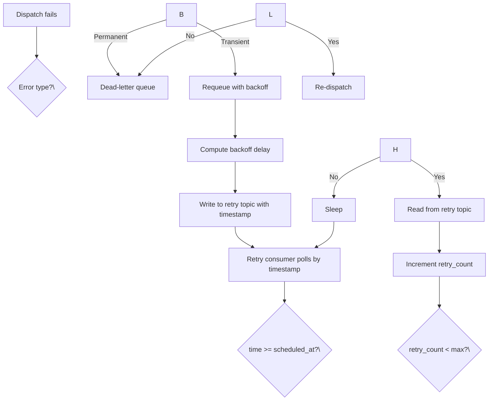
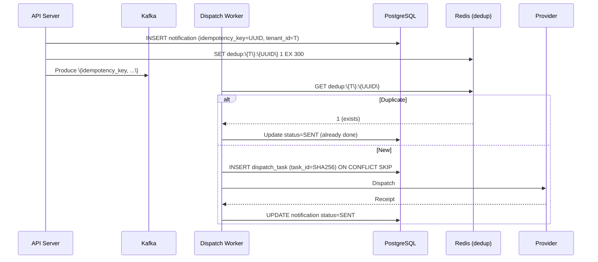

## Retry Strategy

Exponential backoff with jitter for transient failures. Max retries configurable per channel (push: 5, SMS: 3, email: 7). Backoff formula: `min(base * 2^attempt + jitter, max_delay)`. Base = 1s, max_delay = 5min. Jitter = random(0, 0.5s) to prevent thundering herd.

### Retry Queue Design

### Per-Channel Retry Settings

| Channel | Max Retries | Base Delay | Max Delay | Jitter | Rationale |
|---------|-------------|------------|-----------|--------|-----------|
| Push (FCM/APNs) | 5 | 1s | 5min | 0.5s | Provider-level retry exists |
| SMS (Twilio) | 3 | 2s | 5min | 0.5s | SMS charges per attempt |
| Email (SES) | 7 | 1s | 10min | 0.5s | Email delivery can be delayed |
| Webhook | 5 | 1s | 5min | 0.5s | Depends on target availability |

## Idempotency

Exactly-once semantics achieved through idempotency keys at two levels:

### Notification-Level Idempotency

Client generates a UUID v4 as `idempotency_key` per request. Server stores `(tenant_id, idempotency_key)` in Redis with 5-minute TTL. Duplicate requests within the window are deduplicated.

### Dispatch-Level Idempotency

Per-recipient dispatch uses `task_id = sha256(notification_id + recipient_id + channel + attempt_number)` as a unique identifier. Each dispatch attempts to `INSERT IGNORE` the task_id; duplicate detection prevents double delivery.

## Dead Letter Queue

DLQ stores notifications that exhausted all retries. Two categories:

| Category | Failure Types | Action |
|----------|--------------|--------|
| Permanent | INVALID_TOKEN, BOUNCED, CARRIER_REJECTED, HTTP_4XX | Archive to S3, notify operator |
| Retryable | RATE_LIMITED, TIMEOUT, UNKNOWN | Admin replay via API |

DLQ retention: 7 days (auto-expire). Stored in PostgreSQL + archived to S3 for audit.

## Delivery Guarantees

| Guarantee Level | Meaning | Implementation |
|----------------|---------|----------------|
| At-least-once | Message delivered 1+ times | Kafka `acks=all` + retry |
| At-most-once | Message delivered 0 or 1 times | No retry, fire-and-forget |
| Exactly-once | Message delivered exactly 1 time | Idempotency keys + dedup |

**We guarantee exactly-once** through the combination of:
1. Kafka idempotent producer (`enable.idempotence=true`, `acks=all`)
2. Redis-based idempotency key deduplication (5-minute window)
3. DB-level unique constraints on `task_id`
