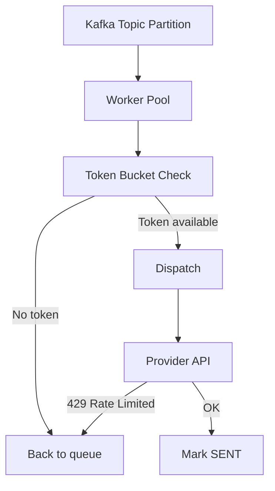
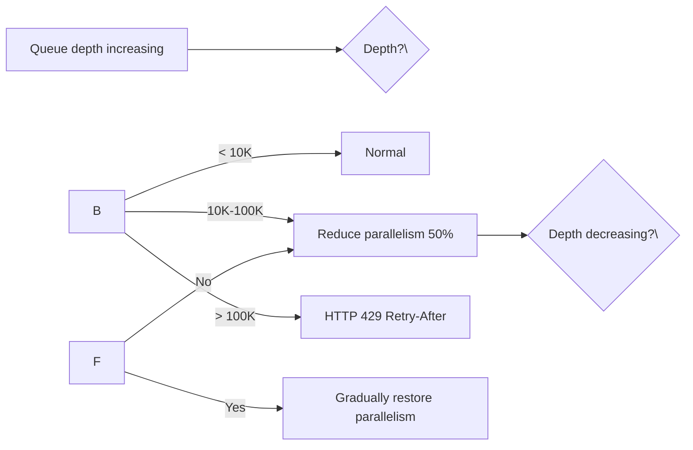
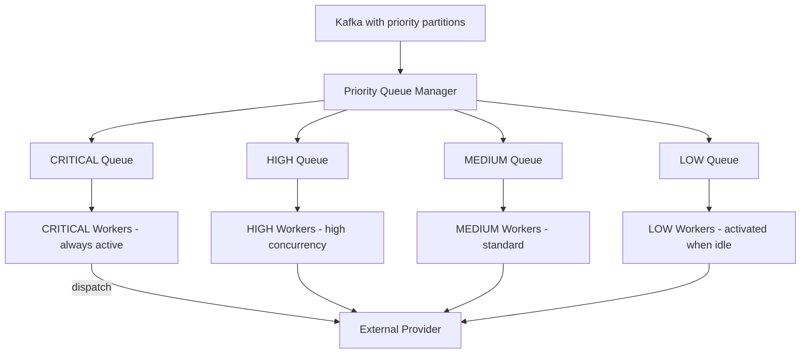

## Per-Channel Rate Limits

Each external provider has its own rate limits. We maintain per-channel worker buckets:

| Provider | Rate Limit | Implementation |
|----------|-----------|----------------|
| FCM | ~5M devices/project | Local token bucket, 200 goroutines |
| APNs | No hard limit | Local token bucket, connection pool (max 400) |
| Twilio | 500 SMS/sec | Local token bucket, 50 goroutines |
| SES | 500 sends/sec (new account) | Local token bucket, 50 goroutines |
| SendGrid | 10K emails/sec | Local token bucket, 100 goroutines |
| Webhook | Depends on target | Circuit breaker + per-target rate limiting |



## Global Throttling

Three-tier rate limiting prevents overload at different levels:

| Tier | Scope | Limit | Storage |
|------|-------|-------|---------|
| API Gateway (Global) | All tenants | 1.5M req/s (150% headroom) | Local memory (LB) |
| Per-Tenant | Single tenant | 10K req/s | Redis sliding window |
| Per-User | Anti-spam | 100 req/hour | Redis sliding window |

### Redis Sliding Window Implementation

```lua
-- Lua script for atomic sliding window rate limit check
local key = KEYS[1]
local now = tonumber(ARGV[1])
local window = tonumber(ARGV[2])
local max = tonumber(ARGV[3])

local window_start = now - window
redis.call('ZREMRANGEBYSCORE', key, '-inf', window_start)
local count = redis.call('ZCARD', key)
if count < max then
    redis.call('ZADD', key, now, now .. math.random(1000))
    redis.call('EXPIRE', key, window)
    return 1
end
return 0
```

## Backpressure Mechanisms

When the system is overloaded, it applies backpressure at multiple levels:

| Trigger | Metric | Threshold | Action |
|---------|--------|-----------|--------|
| Queue backlog | Kafka consumer lag | > 10K messages | Halve worker parallelism |
| Queue backlog | Kafka consumer lag | > 100K messages | Reject new requests (HTTP 429) |
| Worker memory | P95 GC pause | > 50ms | Reduce goroutine pool size |
| DB pool | Active connections | > 80% | Queue requests |
| DB pool | Active connections | > 95% | Fail fast with 503 |



## Priority Queues

Notifications are priority-ordered to ensure CRITICAL and HIGH priority messages are dispatched first:

| Priority | Queue Strategy | Example |
|----------|---------------|---------|
| CRITICAL | Dedicated queue, always active | Security alerts, OTP |
| HIGH | Separate queue, high concurrency | Transactional emails |
| MEDIUM | Standard queue | Order confirmations |
| LOW | Batch queue, can be deferred | Marketing, digest |


