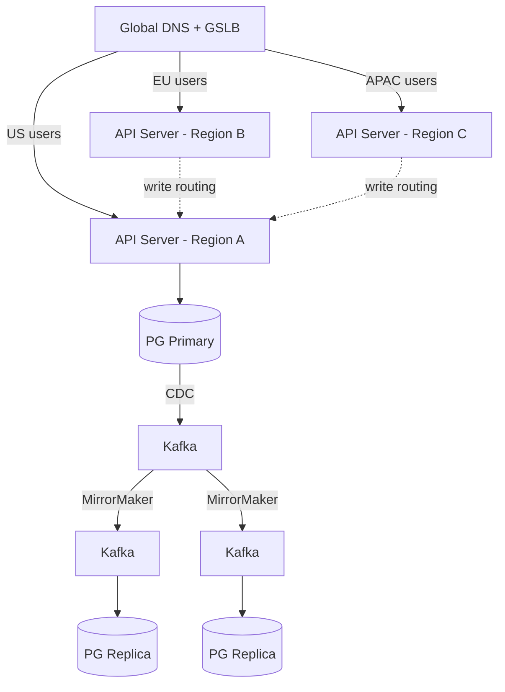
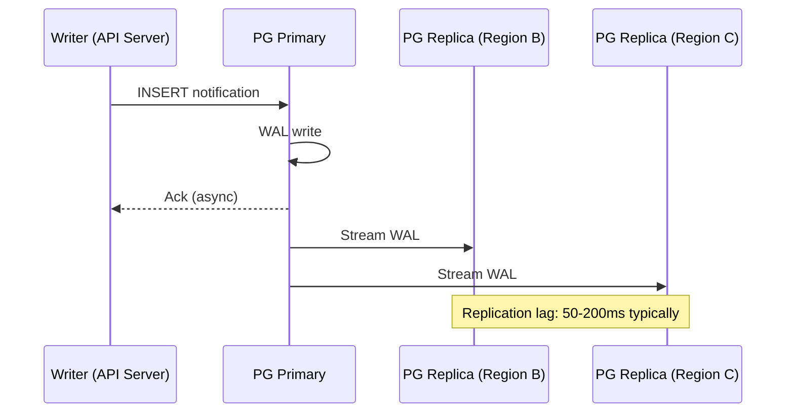
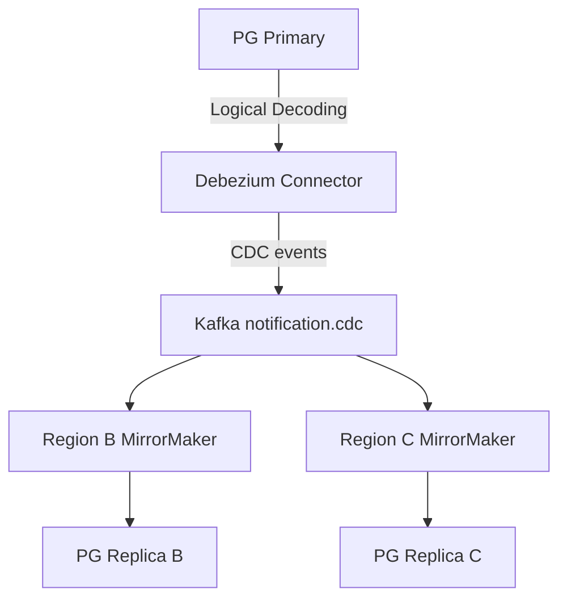
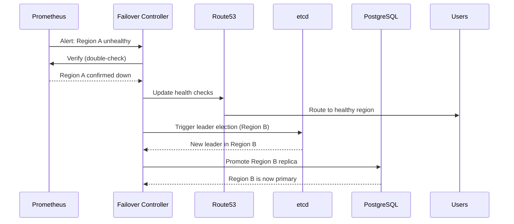

## Active-Active Architecture

Active-active ensures all regions serve traffic simultaneously:

| Region | Role | Write Target | Read Source |
|--------|------|-------------|-------------|
| US-East | Primary (leader) | Local PG Primary | Local PG Primary |
| EU-West | Replica | Route to US-East | Local PG Replica |
| AP-Southeast | Replica | Route to US-East | Local PG Replica |

**Why not local writes in replicas?** PostgreSQL supports only one primary. Multi-master replication would require complex conflict resolution (CRDTs, last-write-wins).



## Data Replication

### PostgreSQL Replication



### Kafka MirrorMaker

| Parameter | Value | Rationale |
|-----------|-------|-----------|
| Source cluster | Region A Kafka | Primary producer |
| Target clusters | Region B, C Kafka | Mirror consumers |
| Topic replication | All notification.* topics | Full event replay |
| Lag tolerance | < 1 second | Sufficient for eventual consistency |

### CDC Pipeline



## Geo-Routing

### DNS-Based Routing

| Algorithm | Use Case | Implementation |
|-----------|----------|---------------|
| Latency-based | Normal operation | Route53 latency routing |
| Weighted | Canary deployments | 90% region A, 10% region B |
| Failover | Region outage | Health checks → failover |

### Health Check Configuration

```
Interval: 10 seconds
Timeout: 5 seconds
Healthy threshold: 3 consecutive checks
Unhealthy threshold: 2 consecutive checks
```

With this config:
- **Detection time**: 10-15 seconds (first failed check + unhealthy threshold)
- **False positive rate**: < 0.01% (double-check with multiple endpoints)

## Failover Strategy

### Failover Scenarios

| Scenario | RTO | RPO | Automatic? |
|----------|-----|-----|------------|
| Single AZ outage | < 30s | 0 | Yes (auto-redirect within region) |
| Region outage | 60s | < 10s | Yes (DNS failover + PG promotion) |
| etcd leader crash | < 1s | 0 | Yes (automatic re-election) |
| Database corruption | 5 min | Depends | Manual (operator intervention) |

### Failover Flow


