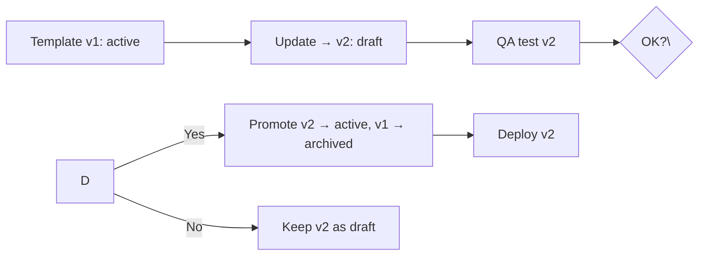
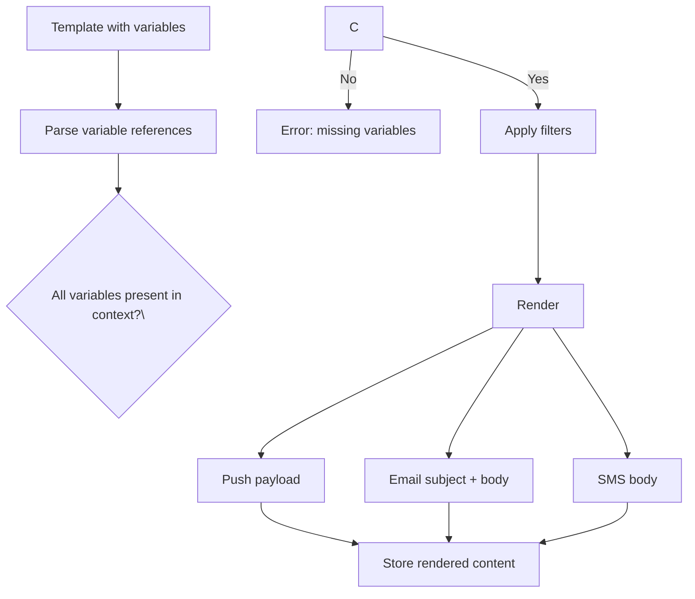
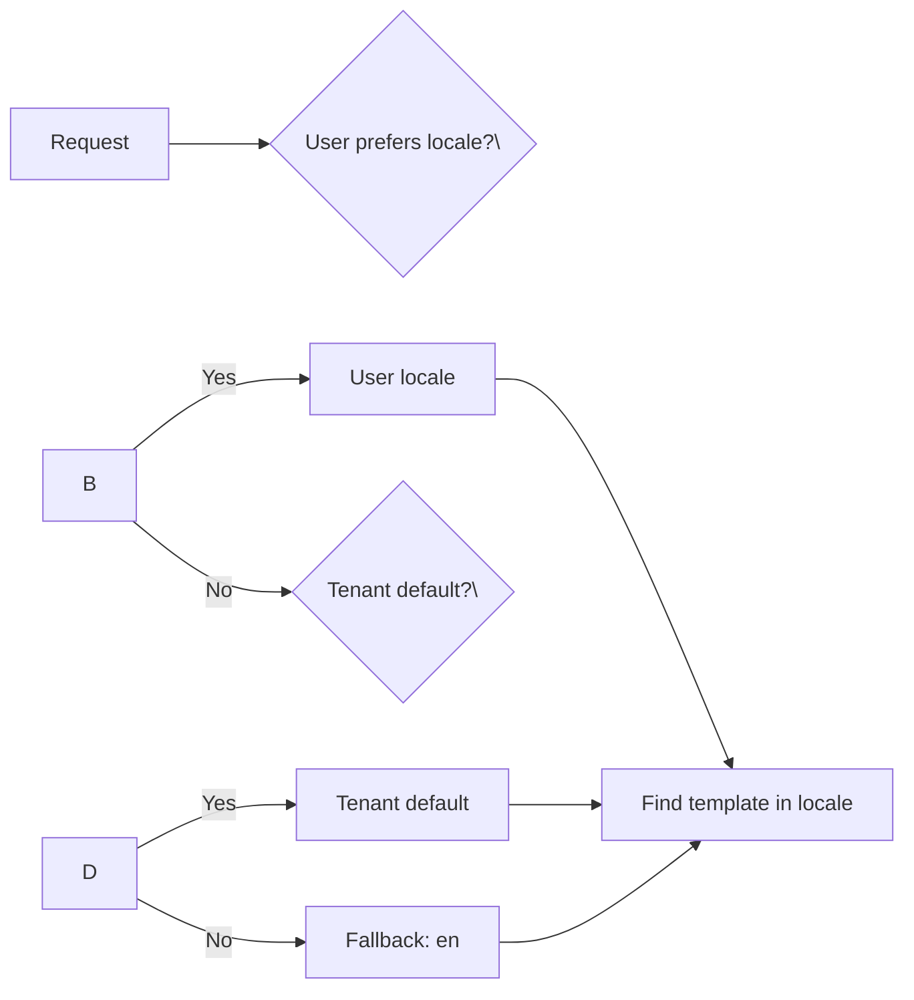
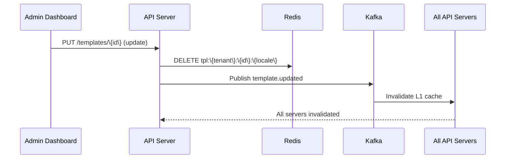

## Template Management

### Schema

| Field | Type | Description |
|-------|------|-------------|
| id | UUID | Primary key |
| tenant_id | string | Tenant scope |
| name | string | Human-readable name |
| channel | enum | Push, Email, SMS, etc. |
| locale | string | en, es, ja, etc. |
| subject | string (nullable) | Email/push subject |
| body | text | Template body with &#123;&#123;variables&#125;&#125; |
| payload | JSON (nullable) | Push/webhook data payload |
| variables | text[] | Required variable names |
| status | enum | draft, active, archived |
| created_at, updated_at | timestamp | Audit timestamps |

### Versioning

Templates are versioned to support A/B testing and rollback:



- **Active version**: only one active per (tenant, channel, locale)
- **Archived**: previous versions retained for 90 days
- **Draft**: can be tested with dry-run before promotion

## Variable Substitution

### Template Syntax

Jinja2-style: `\&#123;&#123;variable\\&#125;&#125; ` with optional filters:

```
Hello \&#123;&#123;user.name|escape\\&#125;&#125; , your order \&#123;&#123;order.id\\&#125;&#125;  has shipped.
Total: $\&#123;&#123;order.total|format_currency\\&#125;&#125; 
```

### Variable Resolution



### Supported Filters

| Filter | Purpose | Example |
|--------|---------|---------|
| escape | HTML/XSS escaping | `\&#123;&#123;name|escape\\&#125;&#125; ` → `&lt;script&gt;` |
| truncate | Limit length | `\&#123;&#123;name|truncate:20\\&#125;&#125; ` |
| format_currency | Format as currency | `\&#123;&#123;amount|format_currency\\&#125;&#125; ` → `$1,234.56` |
| default | Fallback value | `\&#123;&#123;name|default:Anonymous\\&#125;&#125; ` |

## Localization

### Locale Resolution Chain



### Locale Fallback

```
Requested: es-MX → Try: es-MX → Not found → Try: es → Found → Use es
Requested: de-DE → Try: de-DE → Not found → Try: de → Not found → Try: en → Found → Use en
```

### Push Notification Localization

Push notifications use **client-side localization** (keys + args) due to payload size limits:

```json
{
  "notification": {
    "title_loc_key": "order_shipped_title",
    "body_loc_key": "order_shipped_body",
    "loc_args": ["ORD-456"]
  }
}
```

The client resolves `title_loc_key` + `loc_args` to the user's language.

## Caching Compiled Templates

### Cache Hierarchy

| Layer | Storage | TTL | Hit Rate |
|-------|---------|-----|----------|
| L1 (in-process) | Go sync.Map | 5 min | ~60% |
| L2 (distributed) | Redis cluster | 1 hour | ~35% |
| L3 (persistent) | PostgreSQL | N/A | ~5% |

### Cache Invalidation



### Cache Key Design

| Layer | Key Format | Example |
|-------|-----------|---------|
| L1 | `tpl:\{tenant_id\}:\{template_id\}:\{locale\}` | `tpl:acme:welcome-email:en` |
| L2 | `tpl:\{tenant_id\}:\{template_id\}:\{locale\}` | `tpl:acme:welcome-email:en` |
