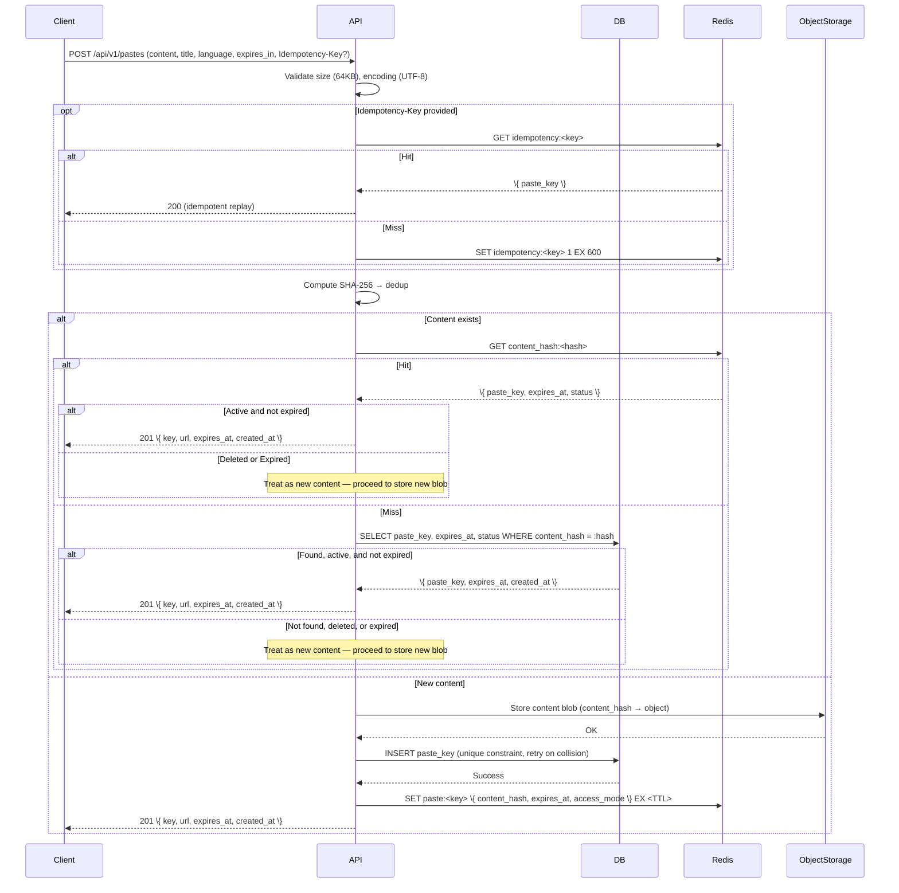
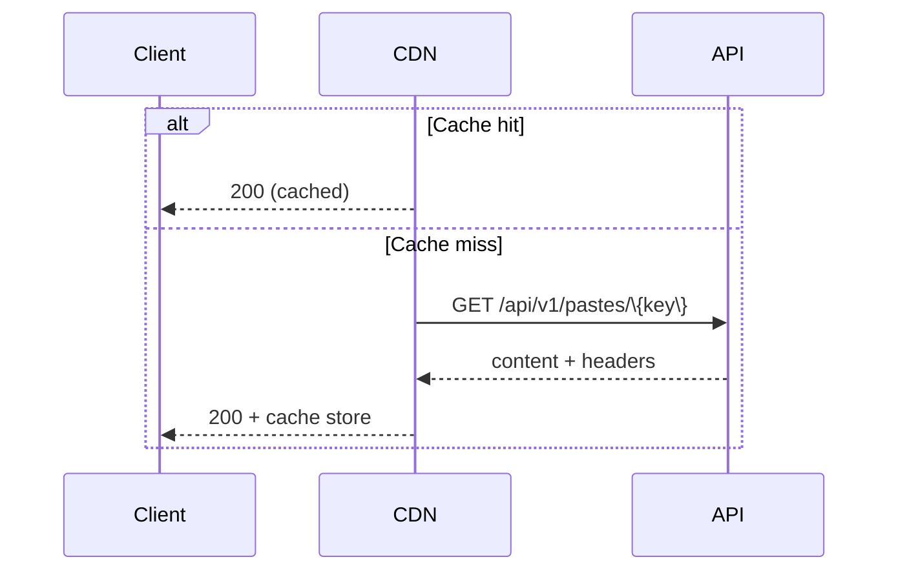
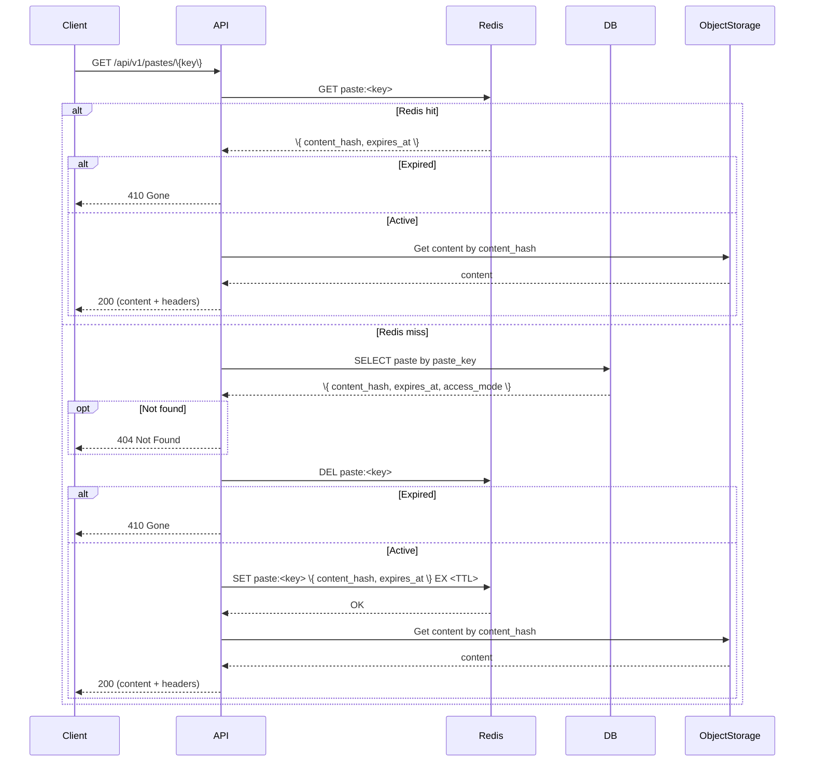
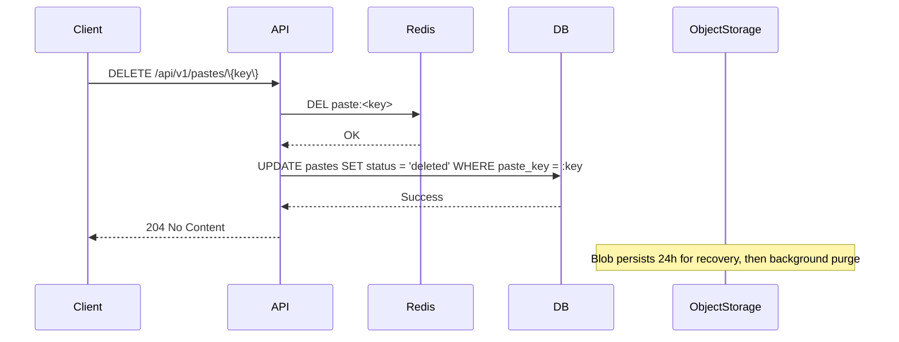

### Write Path

### Read Path

**Public/Unlisted (via CDN)**:

**Private + Backend (Redis → ObjectStorage)**:

### Deletion

### Expiration

- **Primary**: Lazy — expired status checked on every read (TTL on Redis entry + `expires_at < NOW()` check on DB fallback).
- **Secondary**: Periodic cleanup removes expired entries from Redis and purges soft-deleted blobs after 24 hours.

### Cache Hierarchy

CDN edge (ms) → Redis (sub-ms) → ObjectStorage (content blob). Redis stores only metadata (content_hash, expires_at, access_mode); the full content lives in the object store.
