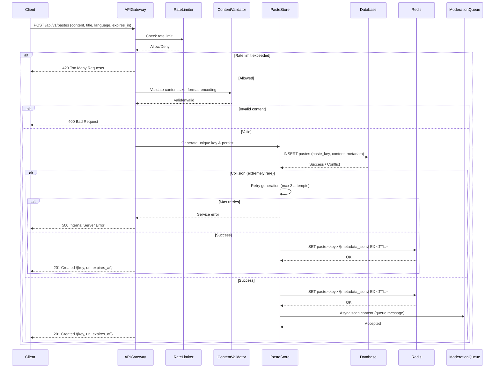
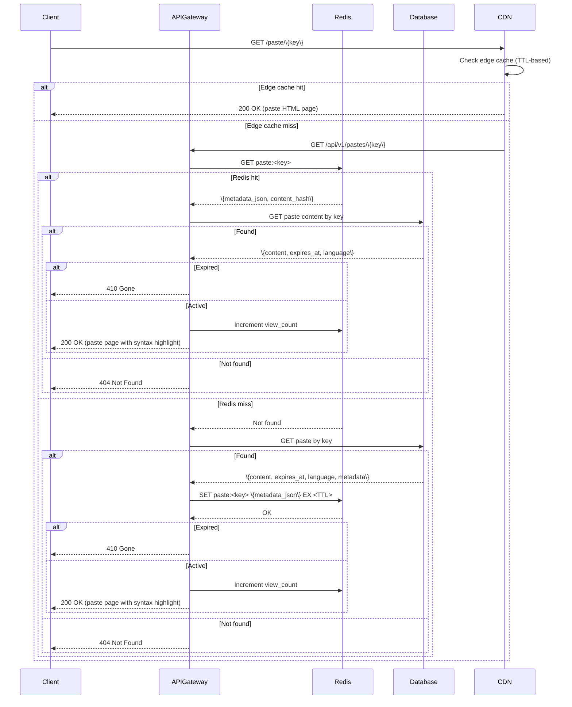
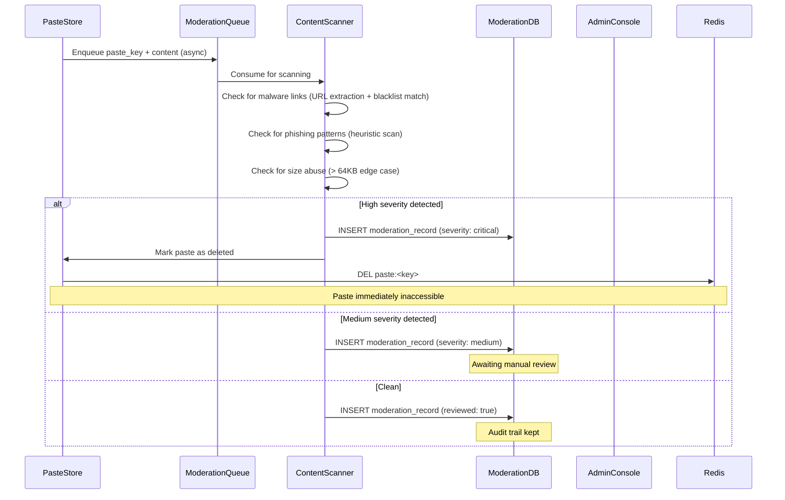
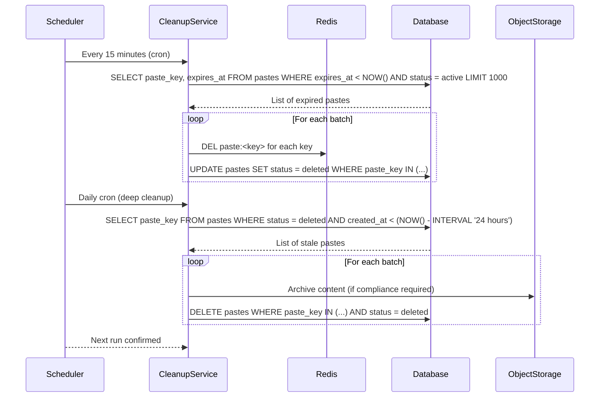

### 1. Paste Creation Flow (Write Path)

### 2. Paste Retrieval Flow (Read Path)

### 3. Content Moderation Flow

### 4. Expiration Cleanup Flow

### Key Design Principles

1. **Write Path**：Paste 建立是同步的，moderation 是異步的 — 使用者能立即收到回應
2. **Read Path**：兩層快取（Redis + CDN edge），在讀取時檢查 lazy expiration
3. **Eventual Consistency**：View count 是 eventually consistent 的 — 暫態的 counter 是可以接受的
4. **Caching Hierarchy**：CDN edge（ms）→ Redis（sub-ms）→ Database（5–10ms）
5. **Decoupling**：內容 moderation 透過 queue 異步執行 — 不會阻塞 critical path
6. **Idempotency**：Paste 建立接受 `Idempotency-Key` header
7. **Observability**：每個 critical path 都有 metrics、tracing 和 structured logging
8. **Fail-Safe**：元件故障時預設為安全狀態（404）
9. **Lazy Expiration**：過期的 pastes 在讀取時檢查 — 不需要昂貴的 background scans 來處理常規過期
10. **Zero Trust**：所有輸入在存取儲存前都經過驗證（大小、編碼、內容）

### Data Flow Performance Targets

- **Paste Creation**：P95 < 200ms（end-to-end，包含 moderation enqueue）
- **Paste Read**：P95 < 100ms（end-to-end，cache hit path）
- **Cache Hit Rate**：> 80%（Redis + CDN edge 合計）
- **Moderation Queue**：> 100 messages/sec 持續吞吐量
- **Database Write**：P95 < 10ms（single-shard indexed insert）
- **Database Read**：P95 < 5ms（single-shard indexed lookup）

### Failure Scenarios

1. **Redis Failure**：回退到直接 database reads（延遲增加但服務仍可存取）
2. **CDN Failure**：所有流量直接到達 origin（DB 負載增加但仍有功能）
3. **Database Failure**：提供 Redis 中的 stale cache entries（如果有），拒絕新寫入，返回 503
4. **Moderation Queue Backlog**：Queue 累積 — scanners 提高吞吐量；新的 pastes 仍然可以建立（moderation 是 async 的）
5. **Moderation Service Unavailable**：Pastes 未經掃描通過 — 恢復時重試掃描；嚴重的 pastes 由自動化 URL 掃描標記
6. **Cleanup Service Failure**：過期的 pastes 仍可存取直到重試 — 可以接受，因為讀取時也會檢查 TTL
7. **Rate Limiter Redis Failure**：回退到 per-instance in-memory counters（近似值，可能允許稍微超過限制）

### Data Consistency Model

- **Strong Consistency**：Paste 內容（paste_key → content）— single-shard writes，`paste_key` 有唯一約束
- **Eventual Consistency**：View count — 透過 Redis counter 接受暫態偏差
- **Cache Coherence**：Paste 刪除時 invalidation Redis；CDN TTL-based invalidation
- **Moderation Queue**：At-least-once delivery（async scan 可能重試）

### Scaling Strategy

- **Read Scaling**：Load balancer 後無狀態 API Gateway；Redis Cluster 提供 paste metadata；CDN 提供 rendered pages 的 edge caching
- **Write Scaling**：水平 row-level sharding — N 個 database shards 按 `paste_key` hash partition
- **Moderation Scaling**：Partitioned queue with parallel scanners；根據 queue depth auto-scale
- **Expiry Scaling**：讀取時 lazy expiration（主要）+ 定期 background cleanup（次要）
- **Cache**：Multi-tier — CDN edge（minutes）→ Redis（TTL-based）→ per-instance LRU（sub-ms, 5m TTL）

### Observability Implementation

1. **Metrics**（Prometheus）：Paste creation success/error rates、read P95 latency、cache hit/miss rates（CDN + Redis）、moderation queue depth、view count sync rate
2. **Tracing**（Jaeger）：End-to-end request flow，按元件分割 latency（CDN → Redis → DB）
3. **Logging**（ELK）：Structured JSON，包含 request ID、client IP（截斷）、paste_key、component name
4. **Alerting**（PagerDuty）：Error rate > 1%、latency > 200ms P95、cache hit rate < 70%、moderation queue backlog > 10K、database connection failures

### Integration Points

1. **Redis Cluster**：Paste metadata cache、view count increment、rate limiting
2. **Content Moderation Queue**：Async paste 掃描（Kafka 或 RabbitMQ）
3. **CDN**：Rendered paste HTML pages 的 edge caching（TTL 基於 `expires_at`）
4. **Database**：Primary paste storage（按 `paste_key` sharding）
5. **Object Storage**：Deleted pastes 的 compliance archive（選配，取決於 retention policy）
6. **Prometheus/Grafana**：Monitoring 和 alerting
7. **Jaeger**：Distributed tracing
8. **ELK Stack**：Log aggregation 和 search
