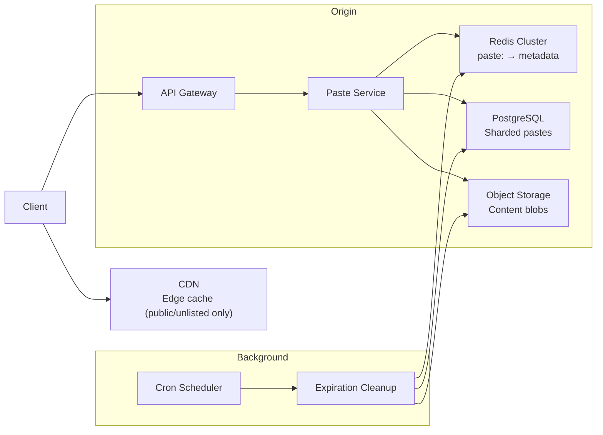

### Architecture



**Design decisions:**

1. **Idempotency pre-check**: Redis `idempotency:<key> → \{ paste_key \}` with 10-min TTL, hit → 200 replay (no redundant writes). Miss → `SET 1 EX 600` then continue normal flow.
2. **Four-tier cache**: CDN (public/unlisted) → Local LRU (per-instance) → Redis (metadata only) → ObjectStorage (content blob). 100:1 read/write ratio means ~95%+ of reads serve from cache.
3. **Content-addressed storage**: Content blob stored by SHA-256 `content_hash`; deduplication returns existing key for identical content.
4. **Row-level sharding**: `hash(paste_key) % N` across N PostgreSQL instances (N=10+). Each shard: 1 primary + 2 read replicas.
5. **Metadata/blobs separated**: Metadata in Redis + PostgreSQL; content in object storage (cost-effective for 3.65 TB/year).
6. **Fail-safe**: Default to 404 on component failure. Lazy expiration on read (primary) + periodic background cleanup (secondary).
7. **Multi-AZ deployment** to meet 99.9% availability target.

### Component Design

#### API Gateway

- Entry point: TLS 1.3 termination, rate limiting (sliding window via Redis sorted set), request routing.
- Stateless: Scales independently.

#### Paste Service

Core CRUD + cache coordination.

**Write**: Idempotency pre-check (Redis `idempotency:<key>`, 10-min TTL, hit → 200 replay) → Validate → Dedup (SHA-256) → Generate key → Write metadata (DB) → Write blob (ObjectStorage) → Warm cache → Return 201.

**Read**: Check access_mode → Public/unlisted via CDN, private direct to origin → Cache lookup (CDN → Redis → DB) → Fetch content from ObjectStorage by `content_hash`.

**Deletion**: Validate key → Mark DB row `status = 'deleted'` → Invalidate Redis → Return 204. Paste content is preserved for 24h recovery, then purged.

**Key generation**: CSPRNG (8-char key from `a-z2-7` alphabet = 32^8 ≈ 1.1T space), 3 retries on collision (DB unique constraint).

#### Redis Cluster (Distributed Cache)

- Key: `paste:<key>` → `\{ content_hash, expires_at, access_mode \}`
- TTL: Based on `expires_at`. Eviction: LRU, ~20GB capacity.
- Write-through on creation, invalidate on deletion.
- Cache hit rate target: > 99% combined (CDN + Local LRU + Redis).

#### Database Layer (PostgreSQL — Sharded)

- Row-level sharding by `hash(paste_key) % N` (MurmurHash3, N=10+).
- Each shard: 1 primary (writes) + 2 read replicas (reads, admin).
- Connection pooling.
- Async replication with WAL archiving to object storage.
- **Schema** (identical per shard):

```sql
CREATE TABLE pastes (
    paste_key VARCHAR(16) NOT NULL,
    title VARCHAR(256),
    language VARCHAR(64),
    content_hash CHAR(64),
    content_size INT,
    created_at TIMESTAMPTZ DEFAULT NOW(),
    expires_at TIMESTAMPTZ,
    access_mode VARCHAR(10) DEFAULT 'public',
    status VARCHAR(10) DEFAULT 'active',
    PRIMARY KEY (paste_key)
);

CREATE INDEX idx_content_hash ON pastes(content_hash);
CREATE INDEX idx_expires_at ON pastes(expires_at)
    WHERE expires_at IS NOT NULL AND status = 'active';
```

#### Object Storage

- Layout: `objects/<content_hash_prefix(2)>/<content_hash>.txt` — content-addressed by SHA-256 with 2-char prefix for key-space distribution.
- Durability: 99.999999999% (11 nines).
- Lifecycle: Active (indefinite) → Expired (TTL reached): blob retained 7 days then purge (grace period for lazy expiration edge cases) → Soft-deleted: 24-hour recovery window then purge → Orphaned blob: detected weekly, archived to cold storage, purged after 30 days.

### Scaling Strategy

| Component         | Method               | Capacity            |
| ----------------- | -------------------- | ------------------- |
| API Gateway       | Horizontal           | Scales to demand    |
| Redis Cluster     | Cluster + replication| 200K QPS total      |
| PostgreSQL Shards | Row-level sharding   | 50 writes/sec/shard |
| Object Storage    | Provider-native auto | 500 MB/s sustained  |
| CDN Edge          | Provider-native PoP  | 10K RPS/PoP         |

### Availability and Fault Tolerance

| Failure Scenario           | Response                                            | Recovery                  |
| -------------------------- | --------------------------------------------------- | ------------------------- |
| Redis Cluster failure      | Fall back to direct PostgreSQL reads                | Auto-recovery ~30s        |
| PostgreSQL primary failure | Connection pooler promotes replica; 1–2s outage | Automated failover |
| Object Storage outage      | Reject writes; reads via cache/DB still functional  | Provider-dependent        |
| CDN PoP failure            | Reroute to nearest healthy PoP                      | Automatic                 |
| Expiration Cleanup failure | Lazy expiration on reads still works                | Graceful degradation      |

- **Read availability**: 99.95%
- **Write availability**: 99.9%
- **RPO**: 0 for content; 1min for metadata
- **RTO**: < 5min read; < 15min write

### Health Check

- `/health`: Liveness — 200 if process alive.
- `/ready`: Readiness — 200 if PostgreSQL + ObjectStorage reachable; 503 if not. Partial Redis failure degrades gracefully.
