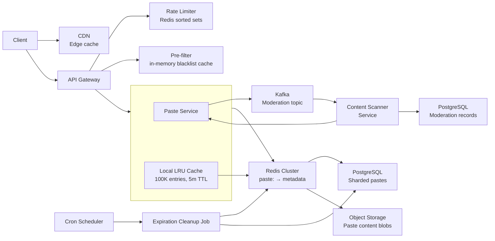

### Architecture Overview

系統採用 distributed、microservices-based 的 architecture，有明確的 separation of concerns：



關鍵 architectural decisions：

1. **Stateless API Gateway**：Independent scaling；處理 TLS termination、rate limiting、request routing、和 distributed tracing 的 request ID generation
2. **Two-tier caching**：Per-instance LRU（sub-ms，100K entries）供 hot pastes，Redis Cluster（ms）供 distributed caching（TTL 基於 `expires_at`，5m–24h）
3. **CDN edge caching**：Rendered paste pages 在 edge 被 cache（TTL 由 `expires_at` 驅動）—— 在 traffic 到達 origin 之前就處理了大部分 reads
4. **Row-level sharding**：Pastes 透過 `hash(paste_key) % N`（N=10+）分布在 N 個獨立的 PostgreSQL instances 上，每個有 1 primary + 2 read replicas
5. **Decoupled content moderation**：透過 Kafka async event ingestion；content scanning 永遠不會 block user-facing 的 create/read path
6. **Metadata 和 blobs 分離**：Paste metadata（key、title、language、expires_at）在 Redis/PostgreSQL；raw content 在 object storage（S3-compatible），供 cost-effective 的 long-term retention
7. **Fail-safe design**：Component failures 時 default 回 404；Redis failure 時 local cache fallback；database outage 時 reject new writes（而不是 reads）
8. **Eventual consistency**：Paste content 在 shard 內 strongly consistent；view count 透過 Redis counter eventually consistent
9. **Multi-tier caching capacity**：CDN 和 Redis capacity 設計為 10K RPS/PoP 和 200K QPS —— 遠高於所需的 ~4K RPS peak 和 ~50K QPS peak

### Component Breakdown

#### 1. API Gateway

- 所有 client requests 的 entry point（load balancer 後面 100+ instances）
- 處理：
  - TLS 1.3 termination（HTTPS）
  - 透過 Redis sorted set pipeline 的 rate limiting（< 2ms）
  - Content moderation pre-check（in-memory blacklist pattern cache，< 1ms）
  - 將 requests 路由到 Paste Service
  - Distributed tracing 的 request ID generation
- 不負責產生 paste keys、儲存 paste data、或管理 expiration
- Stateless：無 server-side session state
- Performance：P95 < 5ms（不包含 downstream calls）
- Language：Go 或 Rust，低 memory footprint 和高 concurrency

#### 2. Paste Service

核心 service，負責 paste CRUD、metadata management、和 cache coordination。

**Write Workflow**（由 Paste Service 執行；Gateway 負責 pre-checks）：

1. 驗證 content size（≤ 64KB）和 encoding
2. 決定 `paste_key`：如果有效且唯一則用 client-provided `key`（查 Redis → DB），否則產生 cryptographically secure random key（57-char alphabet，6-8 chars，最多 3 retries）
3. 計算 target shard：`hash(paste_key) % N`
4. 將 raw content 寫入 Object Storage（S3-compatible，single PUT）
5. 將 metadata 寫入 target PostgreSQL shard primary
6. 填滿 Redis cache（`SET paste:<key> \{metadata_json\} EX <TTL>`）
7. 填滿此 instance 的 local LRU cache
8. 將 content enqueue 供 async moderation（Kafka）
9. 回傳 201 Created

**Read Workflow**：

1. 在 Local LRU Cache 查詢 paste metadata
2. **Local hit** → 從 Object Storage 抓取 content（cross-AZ ~20ms）→ render（~2ms）→ 填滿 Redis → serve（~22ms）
3. **Local miss** → 在 Redis 查詢 metadata（~1ms）
4. **Redis hit** → 填滿 local cache → 從 Object Storage 抓取 content（cross-AZ ~20ms）→ render（~2ms）→ serve（~22ms）
5. **Redis miss** → 在 PostgreSQL shard 查詢（~5ms）→ 寫入 Redis + 填滿 local → 抓取 content（cross-AZ ~20ms）→ render（~2ms）→ serve（~27ms）
6. 透過 Redis atomic INCR 增加 view_count（non-blocking，async flush to DB）
7. 檢查 `expires_at` —— 過期 pastes 回傳 410 Gone
8. 回傳 200 OK 和 rendered paste page

**Short Key Generation**：

- Cryptographically secure random（OS CSPRNG 透過 `crypto/rand` 或 equivalent）
- Collision detection 透過 database unique constraint（最多 3 retries）
- Character set：57-char alphabet（`a-z` 排除 `l`、`A-Z` 排除 `I/O`、`2-9`；排除 0/O/1/I/l）—— 不是真正的 base62（57^6 = ~34.3B，57^8 = ~111T）

**Per-Shard Database Schema**（每個 shard 上相同）：

```sql
CREATE TABLE pastes (
    paste_key VARCHAR(8) NOT NULL,
    title VARCHAR(256),
    language VARCHAR(64),
    content_hash CHAR(64),
    created_at TIMESTAMPTZ DEFAULT NOW(),
    expires_at TIMESTAMPTZ,
    view_count BIGINT DEFAULT 0,
    access_mode VARCHAR(10) DEFAULT 'public', -- public | unlisted | private
    status VARCHAR(10) DEFAULT 'active',
    PRIMARY KEY (paste_key)
);

CREATE INDEX idx_content_hash ON pastes(content_hash);
CREATE INDEX idx_expires_at ON pastes(expires_at)
    WHERE expires_at IS NOT NULL AND status = 'active';
CREATE INDEX idx_status ON pastes(status);
```

**Performance Targets**：

- P95 creation latency：P95 < 200ms
- Database write（per shard）：P95 < 10ms
- Cache set（Redis）：P95 < 1ms

#### 3. Metadata and Blob Separation

Paste content 與 metadata 分開儲存：

- **Metadata**（Redis + PostgreSQL）：`paste_key`、`title`、`language`、`content_hash`、`expires_at`、`view_count`、`access_mode`、`status` —— 快速查詢，fit in memory
- **Content blobs**（Object Storage）：Raw paste text（每個最多 64KB），content-addressed by SHA-256 `content_hash` —— cost-effective、durable、long-term retention
- **為什麼這樣設計**：Object Storage（S3）成本約 $0.023/GB/month vs PostgreSQL SSD 約 $0.25/GB/month；100:1 read ratio 表示 metadata cache 消除了 95%+ 的 blob fetches

#### 4. Redis Cluster（Distributed Cache Tier）

- Cold 和 warm pastes 的 distributed cache
- Key format：`paste:<paste_key>` → `\{metadata_json\}`
- TTL：Active pastes 24 小時，time-limited pastes 匹配 `expires_at`
- Eviction：LRU policy，總共 ~20GB 供 100M cached entries（每 entry ~200 bytes）
- Consistency：Creation 時 write-through，deletion 時 invalidate
- High Availability：Redis Cluster with replication 和 automatic failover
- **Cache Hit Rate Target**：> 80% combined（Local LRU + Redis）
- **Read Path**：Local Cache → Redis → PostgreSQL

#### 5. Syntax Highlighting Index

- **目的**：將人類可讀的 language names（例如 "python"、"rust"）對應到 syntax highlighting engine tokens（例如 Prism.js / highlight.js language identifiers）
- **儲存**：小型 static lookup table（~500 entries，~50KB）；在 Paste Service instance 啟動時載入 via in-memory hash map
- **存取**：每次 paste render 時，查詢 `language` → `highlight_id` → < 0.1ms
- **Consistency**：Read-only，僅在 library upgrades 時更新（很少發生）
- **Alternative**：將 embedded JSON blob 存在 Paste Service binary 中 —— 不需要 external lookup

#### 6. Database Layer（PostgreSQL — Row-Level Sharded）

- **Primary storage**：Paste metadata，在 shard 內具有 strong consistency
- **Sharding strategy**：Row-level sharding —— N 個獨立的 PostgreSQL instances，每個執行相同的 `pastes` table schema，但儲存不相交的 row sets
- **Routing key**：`hash(paste_key) % N`（FNV-1a 32-bit，N 從 10 開始）
- **每個 shard**：1 primary（處理所有 writes）+ 2 read replicas（serve read requests 和 admin queries）
- **總 instances**：~30+（10 shards，每個 shard：1 primary + 2 replicas）
- **Connection pooling**：PgBouncer transaction mode per shard
- **Replication**：Async replication；failover 透過 PgBouncer + keepalived
- **Backups**：每日 `pg_basebackup` 到 S3 + WAL archiving 供 point-in-time recovery（7 天窗口）
- **Durability**：99.9999%（6 nines），透過每個 shard 內的 synchronous replication
- **Scaling**：如果 shard CPU/memory > 70% 加入第 3 個 replica；如果所有 shards > 80% rows 則加入新 shard 並 rebalance rows

#### 7. Object Storage（S3-Compatible）

- **目的**：Raw paste content blobs 的長期儲存
- **Layout**：`objects/<content_hash>.txt` —— content-addressed by SHA-256 hash of paste content
- **Lifecycle policy**：Expired/deleted objects 在 30 天後歸檔到 Glacier，1 年後 purged
- **Throughput**：500 MB/s sustained（支援 ~40K writes/sec，平均 10KB）
- **Durability**：99.999999999%（11 nines）—— provider-native durability
- **Cost**：約 $0.023/GB/month —— 比 block storage 便宜 10 倍

#### 8. Content Moderation Pipeline

- **Event Ingestion**：Paste Service 將 paste_key + content publish 到 Kafka topic（`moderation`，10 partitions，3x replication）
- **Consumers**：Content Scanner services 在 consumer group 中，每個 consume 從 subset of partitions
- **Scanning**：
  - URL extraction → 與 phishing/malware URL blacklists 比對（從 central store live-updated）
  - Regex-based heuristic scanning 掃描 suspicious patterns（credit cards、SSNs、credential dumps）
  - Size anomaly detection（單一 IP paste sizes 突然飆升）
- **儲存**：Moderation records 在 PostgreSQL（`moderation_records` table）
- **Critical findings 動作**：將 paste 標記為 `deleted`，invalidate Redis cache entry，enqueue cleanup
- **Performance**：每個 scanner instance sustained 200 messages/sec；依據 queue depth auto-scale
- **Fallback**：如果 moderation service 不可用，pastes 在未掃描情況下 pass through，recovery 時 retry

#### 9. Rate Limiter

- **Algorithm**：Sliding window via Redis sorted set —— ZADD 用 Unix timestamp 作為 member/score，ZREMRANGEBYSCORE eviction，ZCARD count，全部在單一 Redis pipeline 中（< 2ms）
- **Keys**：`rate:<client_ip>:create` 供 paste creation，`rate:<client_ip>:read` 供 read abuse prevention
- **Windows**：1 分鐘（每次請求）和 1 小時（per IP，供 abuse prevention）
- **Policies**：
  - 每 IP 10 requests/minute（anonymous creation）
  - 每 API key 100 requests/minute（authenticated）
  - 每 IP 1,000 requests/hour（read endpoint abuse prevention）
- **Distributed architecture**：Redis Cluster with consistent hashing by `client_ip`；5 nodes，replication factor 2
- **Fallback**：如果 Redis 當掉，用 per-instance in-memory counters（approximate，可能稍微 over-allow）
- **Response headers**：`X-RateLimit-Limit`、`X-RateLimit-Remaining`、`X-RateLimit-Reset`

#### 10. CDN Edge Cache

- **目的**：Rendered paste HTML pages 的 edge caching，serve reads 時不需要 hits origin
- **TTL strategy**：TTL 由 paste `expires_at` 驅動 —— 在 render time 計算，設定 `Cache-Control: max-age=<seconds_until_expiry>`
- **Edge locations**：透過 CloudFront/Cloudflare 全球 200+ PoPs
- **Hit rate**：~70-80% 的 read traffic（熱門 pastes 在 edge 被 cache）
- **Invalidation**：TTL-based（不需要 push invalidation）；對 deleted/moderated pastes，透過 CDN API purge
- **Performance**：Edge hit P95 < 20ms vs origin hit ~100ms

#### 11. Expiration Cleanup Job

- **Trigger**：Cron scheduler，每 15 分鐘執行一次（liveness check）+ 每日 deep cleanup
- **Liveness job**：`SELECT paste_key FROM pastes WHERE expires_at < NOW() AND status = 'active' LIMIT 1000`
- **Per batch action**：更新 status 為 `deleted`，invalidate Redis cache entries，不立即刪除 content
- **Deep cleanup（每日）**：Batch-delete 超過 7 天的 `deleted` pastes，如果 compliance 需要則 archive content 到 S3
- **Lazy expiration（主要）**：每次 read 時檢查 `expires_at` —— 過期 pastes 立即回傳 410 Gone
- **Performance**：Liveness 期間處理 ~50K expired pastes/hour；每日 deep cleanup 處理 ~100K records

### Data Flow Optimization

**Read Path（Cache-heavy，~95%+ requests 不需 hits PostgreSQL）**：

1. Client 透過瀏覽器請求 `/abc123`
2. CDN edge cache lookup（zero origin call，~10-20ms）
3. **CDN hit** → 立即 serve rendered HTML（總共 ~10-20ms）
4. **CDN miss** → Paste Service Local LRU cache lookup（~0.1ms）
5. **Local hit** → 從 Object Storage 抓取 content（~20ms cross-AZ）→ render → serve（總共 ~22ms）
6. **Local miss** → Redis lookup（~1ms）
7. **Redis hit** → 填滿 local cache → 從 Object Storage 抓取 content（~20ms cross-AZ）→ render → serve（總共 ~22ms）
8. **Redis miss** → PostgreSQL shard lookup（~5ms）→ 寫入 Redis + 填滿 local → 抓取 content（~20ms cross-AZ）→ render → serve（總共 ~27ms）
9. 所有 paths 都透過 Redis INCR 遞增 view_count（non-blocking，async flush）

**Write Path（Cold Path）**：

1. Client POST `/api/v1/pastes`，附上 content、title、language、expires_in、（可選 `key`、`access_mode`）
2. API Gateway 檢查 rate limit（Redis sorted set）和 content pre-filter（in-memory moderation cache）
3. Paste Service：
   - 驗證 idempotency key（`Idempotency-Key` header）—— 如果有，查 Redis `idempotency:<key>` 看 24h 內是否有 prior result；找到則回傳 cached 201
   - 驗證 content size（≤ 64KB）和 encoding
   - 決定 `paste_key`：如果有 client-provided key 則使用（查 Redis → DB 確認唯一性，被佔用回傳 409），否則產生 57-char alphabet random key（6-8 chars，最多 3 retries）
   - 計算 target shard：`hash(paste_key) % N`
   - 上傳 raw content 到 Object Storage（`PUT /objects/<content_hash>.txt`，~20ms cross-AZ）
   - 插入 metadata 到 target shard 的 primary（single-shard write，< 10ms）
   - 寫入 metadata 到 Redis（`SET paste:<key> \{json\} EX <TTL>`，< 1ms）
   - 填滿 instance 的 local LRU cache
   - 將 idempotency key 存在 Redis 中（`SET idempotency:<key> <result_json> EX 86400`）
   - 將 content enqueue 供 async moderation via Kafka（non-blocking）
4. 回傳 201 Created，附 `\{key, url, expires_at\}`

**Paste Deletion Flow**：

1. Client 送出 `DELETE /api/v1/pastes/\{key\}`
2. API Gateway 檢查 rate limit（read endpoint abuse prevention）
3. Paste Service：
   - 在 cache → Redis → PostgreSQL shard 查找 paste
   - 驗證 ownership（private pastes：檢查 API key owner；public/unlisted：任何 client 都可刪除）
   - 如果 active：設定 status = `deleted`，invalidate Redis cache entry，如果有則 purge CDN cache
   - 如果已過期：回傳 410 Gone
   - 如果找不到：回傳 404 Not Found
4. Background deep cleanup job（每日）回收 row 和 object storage blob

**Paste List Flow**（Read-heavy，touching DB）：

1. Client 請求 `GET /api/v1/pastes?page=1&per_page=20&sort=new`
2. Paste Service 檢查 Local LRU cache（cache 最後一頁或 hot pages）
3. `sort=new` 時：在 read replica 上 query `SELECT ... FROM pastes WHERE status = 'active' ORDER BY created_at DESC LIMIT 20 OFFSET ...`
4. `sort=hot` 時：查詢 Redis sorted set `hot:pastes`（score = `view_count`，透過 async counter flush 更新）—— 回傳 top N，其餘從 DB read replica 補齊
5. 套用 access_mode filter（listing 中只有 `public` pastes）
6. 回傳分頁結果（每頁最多 100 筆，防止 full-table scans）

**Moderation Flow（Async，Non-Blocking）**：

1. Paste Service 將 paste_key + content publish 到 Kafka `moderation` topic
2. Content Scanner 從 partition consume message
3. 將 URLs 與 live blacklist 比對，執行 heuristic pattern matching
4. **Clean**：Record reviewed=true，不作進一步動作
5. **Critical finding**：將 paste status 更新為 `deleted`（透過 Paste Service API），invalidate Redis cache，purge CDN cache —— 下次 read 回傳 410 Gone
6. **Medium severity**：排入 moderation dashboard 等待人工審查

**Expiration Flow（Lazy + Periodic）**：

1. **主要 —— Lazy expiration**：每次 read 時，serve 前檢查 `expires_at`
   - Active → 正常 serve
   - Expired → 回傳 410 Gone，enqueue background status update
2. **次要 —— Periodic liveness check**：每 15 分鐘，batch-query `WHERE expires_at < NOW()`
   - 將 active expired pastes 的 status 更新為 `deleted`
   - Invalidate Redis cache entries
3. **第三 —— Deep cleanup**：每日 job，刪除超過 7 天的 `deleted` records
   - Archive content blobs 到 S3（如果 compliance 需要）
   - Purge database rows

**View Count Update（Eventually Consistent）**：

1. 每次 read 都透過 atomic INCR 在 Redis 中遞增 `view_count`
2. Background worker 將累積的 counters batch flush 到 PostgreSQL（每 60s，~10K counters/batch）
3. Stale counters 是可以接受的 —— 使用者不依賴精確數字
4. Cache miss read 時，也立即 flush 該 paste 的 counter

### Scaling Strategy

| Component | Scaling Method | Capacity |
| --- | --- | --- |
| API Gateway | Horizontal（Kubernetes deployment） | 100+ instances |
| Local LRU Cache | Embedded per-instance（100K entries，~10MB） | No network overhead |
| Redis Cluster | Cluster（Sharding + Replication） | 200K QPS total |
| PostgreSQL Shards | Row-level sharding（10+ shards，每個 1 primary + 2 replicas） | 50 writes/sec/shard |
| Object Storage（S3） | Auto-scaling（provider-native） | 500 MB/s sustained |
| Kafka | Partitioned topic（10 partitions，3x replication） | 200 messages/sec/scanner |
| CDN Edge | Provider-native global PoP network | 10K RPS/PoP |
| Rate Limiter | Redis Cluster with consistent hashing by client_ip | 20K ops/sec/node |
| Content Scanner | Horizontal（Kafka consumer autoscale） | Auto-scales by queue depth |
| Expiration Cleanup | Bounded batch（LIMIT 1000 per run，每 15 分鐘執行） | ~50K expired pastes/hour |

### Availability and Fault Tolerance

| Failure Scenario | Response | Recovery |
| --- | --- | --- |
| Local LRU Cache miss | Fall through to Redis, then PostgreSQL | Natural: cold reads always miss |
| Redis Cluster failure | Fall back to direct PostgreSQL reads (higher latency, service available) | Redis Cluster auto-recovery ~30s |
| PostgreSQL primary failure | PgBouncer promotes replica; 1–2s outage window | Automated failover |
| PostgreSQL shard failure | Serve from read replicas (reduced write capacity); alert oncall | Automated failover + rebuild |
| Object Storage outage | Reject writes with 429; reads via cache/DB still functional | Provider-dependent (typically RPO < 1s) |
| CDN PoP failure | Traffic rerouted to nearest healthy PoP | Automatic (provider-native) |
| Kafka outage | Paste writes proceed; moderation batched in-service queue, replay on recovery | In-memory buffer (bounded, 5s) |
| Moderation Scanner failure | Pastes created without scanning; queued for retry on recovery | Consumer group rebalance |
| Rate Limiter Redis failure | Per-instance in-memory counters (approximate, slightly over-allow) | Fast local degradation |
| Expiration Cleanup failure | Lazy expiration still works on reads; expired pastes served until next run | Graceful degradation |

**Service Level Objectives**：

- **Read availability**：99.95%（允許所有 components 總共 ~4h/month downtime）
- **Write availability**：99.9%（允許 ~43min/month downtime）
- **RPO**：paste content 為 0（同步寫入 object storage + DB）；view count 為 1min
- **RTO**：read path < 5min；write path < 15min

### Observability

- **Metrics**（Prometheus）：HTTP status codes、paste creation success/error rates、read P95 latency by path（cache hit vs miss）、cache hit/miss rates（per tier: CDN, Local, Redis）、database P95 latency by shard、Kafka lag 和 queue depth、rate limit violations、view count flush rate、moderation queue depth、shard disk usage
- **Tracing**（Jaeger）：End-to-end request flow with latency breakdown by component（CDN → Local Cache → Redis → PostgreSQL → Object Storage）、moderation pipeline 的 dependency call graphs（Paste Service → Kafka → Content Scanner）
- **Logs**（ELK）：Structured JSON with request ID、client IP（截斷到 /24 for IPv4）、paste_key（如有）、component name、error context、moderation flag status
- **Alerting**（PagerDuty）：Error rate > 1%、latency > 200ms P95（write）或 > 100ms P95（read）、cache hit rate < 70%、moderation queue backlog > 10K、database connection failures、shard disk > 90%、Redis cluster node failures
- **Dashboards**（Grafana）：Real-time traffic volume（reads/writes/sec）、success/error rates、system health per component、storage usage by tier、expiration backlog、moderation queue depth trends、view count sync lag

### Security

- **Input validation**：Content ≤ 64KB、拒絕無效 UTF-8、strip null bytes、所有 field 限制 string lengths
- **Content scanning**：Async scan  phishing links、malware patterns、credential dumps（SSN、credit card regex）、size abuse detection
- **Rate limiting**：Per-IP（10 req/min anonymous、100 req/min API key）和 per-endpoint limits 防止 DDoS 和 abuse
- **HTTPS**：所有 endpoints 強制 TLS 1.3+
- **API key management**：Secure storage（encrypted at rest）、automated rotation every 90 days
- **DDoS protection**：整合 cloud provider 的 DDoS mitigation（AWS Shield / Cloudflare）
- **Data sanitization**：所有 user input 在儲存前 sanitized；paste content 絕不在 unsafe contexts 執行或 render
- **Content moderation**：Critical findings auto-block pastes；medium severity 排入人工審查；所有 action 有 audit trail
- **Cache security**：Paste metadata keys prefix 為 `paste:<key>` 防止 namespace collisions；Local LRU 不儲存 metadata hash 之外的 user data
- **Compliance**：GDPR right-to-deletion —— pastes 在請求時 purged；data 匯出到 S3 供 archival retention policy

### Cost Optimization

- **Metadata/blob separation**：Metadata（Redis/PostgreSQL）與 content blobs（S3）分開儲存 —— 100:1 read ratio 表示 95%+ 的 reads 只 touch metadata，避免昂貴的 blob fetches
- **Storage tiering**：Hot metadata 在 Redis（ms latency）、paste content 在 S3 Standard（< 30 天 pastes）、S3 Glacier（retention window 內的 expired pastes）、deleted pastes 30 天後 purge
- **Caching efficiency**：> 80% combined cache hit rate（CDN + Redis + Local）保持 95%+ 的 reads 不碰 primary database
- **CDN offloading**：~75% 的 read traffic 由 edge serve，不 hits origin infrastructure
- **View count optimization**：Async batch flush（每 60s，~10K counters）vs per-read updates 減少 database write pressure
- **Database sharding efficiency**：Row-level sharding by paste_key hash 確保 even load distribution；所有 shards > 80% capacity 時 auto-sharding
- **Expiration lifecycle**：Lazy expiration on-read（zero infra cost）+ periodic batch cleanup（bounded LIMIT 1000）避免昂貴的 full-table scans
- **Moderation scaling**：Kafka-backed async processing with auto-scaling consumers —— idle scanners 消耗最少資源，依據 queue depth scale up
- **Right-sizing Redis**：~20GB 供 100M cached entries（每 entry ~200 bytes）—— 考慮 100M+ total pastes，cluster size 算 modest；cold pastes 自然 expire
- **Off-peak scaling**：Non-critical components（moderation scanners、deep cleanup jobs）可以在 off-peak hours scale down 而不影響 SLA

### Health Check / Readiness

- **Liveness**（`/healthz`）：Simple check —— 如果 process alive 回傳 200；不做 dependency checks
- **Readiness**（`/ready`）：檢查 PostgreSQL 和 Object Storage 的 connections（兩者都必要）；任一 down 回傳 503。Partial Redis failure 不觸發 503（service 透過 direct DB reads gracefully degrade）
- **Kubernetes integration**：Liveness probe 每 10s 執行（initialDelay: 5s）；readiness probe 每 5s 執行；自動重啟 unhealthy pods
- **Database health**：Periodic `SELECT 1` 檢查 primary 和第一個 replica；primary 不可達時標記 pod not-ready（read replica failover 觸發 rebalance）

### Private Paste Support

Schema 包含 `access_mode`（`public`/`unlisted`/`private`）—— `public` 和 `unlisted` 只在 paste listing API 的 visibility 不同：

- **Private pastes**：Rendered page 直接由 origin serve（bypasses CDN），content 以 `Cache-Control: no-store` 傳遞，防止任何層級 cache
- **Access control**：Private paste keys 不在任何 public index 列出；lookup 仍走 Local Cache → Redis → PostgreSQL path，但 response 中有 `Cache-Control` header override
- **Security note**：Private pastes 依賴 key obscurity（64-bit key space）—— 非 cryptographic。需要更强保護時，可選 password-based access tokens client-side 儲存
- **Read path difference**：Private pastes skip CDN → 直接 hits Paste Service，origin load 增加 ~5ms latency

### Multi-Region / Disaster Recovery

- **Primary-active, standby**：一個 region 處理所有 traffic；secondary region 以 async 方式 mirror PostgreSQL sharded primaries（cross-region replication lag：~10s）
- **Failover process**：Manual trigger（可自動化）—— promote secondary replicas 到 primary、更新 DNS（Route53 latency-based routing）、reconfigure API Gateway endpoints
- **Estimated RTO**：15–30 分鐘（DNS TTL-based propagation）
- **Recovery procedure**：Secondary promotes、從上次 cross-region snapshot 還原、replay WALs、reconfigures cache layer 指向新 region
- **Multi-region write**（當前設計未實作）：需要 distributed consensus protocol 或 conflict-free replicated data types —— defer 到 scale-out phase

### API Versioning

- **Version in path**：`/api/v1/pastes` —— response shape 或行為的變更在 v1 內 backward-compatible；breaking changes 增加 version number
- **Client version header**：`X-API-Version: 2024-01-01` 為選配，允許 clients opt into 新功能同時保持預設行為
- **Deprecation policy**：之前 deprecated 的版本在 6 個月內仍可用，附 `Sunset` response header 警告
- **Backward compatibility**：New fields 可加到 responses；remove fields 需要 v2 endpoint

### Rate Limiting by API Key

- **Key-based rate limit**：當 `Authorization: Bearer <key>` 存在時，用 `rate:<api_key>:create` 而不是 `rate:<client_ip>:create` 以 aggregate across devices
- **Key lookup**：API key 在 session 第一次請求時用 Redis keyring（`apikeys:<key_id>`）驗證，之後 local cache
- **Fallback**：如果 API key cache 不可用，fallback 到 IP-based rate limits（looser limits）避免 blocking legitimate traffic
