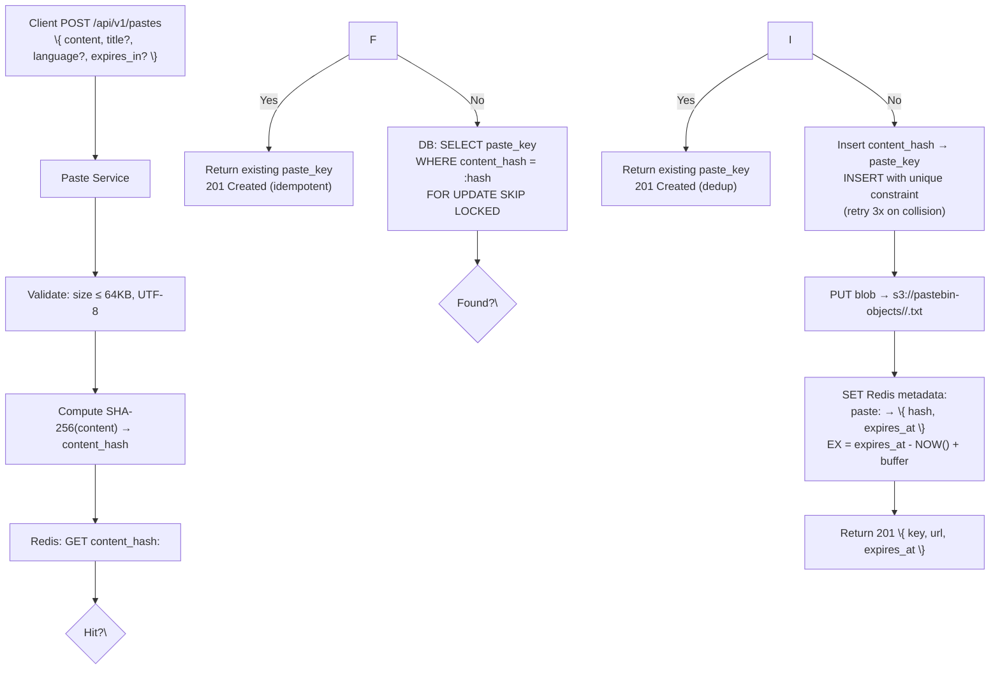

### Paste Storage Engine (Dedup, Compression, Lifecycle, Read/Write Paths)

#### Challenge

Storing 1M+ pastes/day (~3.65 TB/year raw) at 99.99% durability while supporting instant deduplication, lazy expiration, and strict immutability guarantees. The core tension: content must never be lost (durability) but also must not be duplicated (cost), and reads must serve within 100ms P95 despite a 4-tier cache hierarchy (CDN → LRU → Redis → Object Storage) before reaching the blob store.

#### Solution: Content-Addressed Object Storage with Three-Layer Lifecycle

**1. Storage Layout — Content-Addressed by SHA-256**

```
s3://pastebin-objects/<content_hash_prefix(2)>/<content_hash>.txt
# e.g., s3://pastebin-objects/a7/a7f3c8e9d1b2...4f6.txt
```

- **Why prefix directories**: Flat namespaces cause inode exhaustion and S3 key-space hotspots. Two-character prefix distributes writes evenly: 16^2 = 256 prefixes.
- **Key constraint**: Content is **immutable after creation**. The content_hash is the sole address — no updates, no versioning, no soft-delete at the blob level. Soft-delete is a metadata concept only (DB status column).
- **Size envelope**: 1–64KB per paste. Objects are small, single-part, no multipart needed.

**2. Deduplication — Hash-Then-Fetch, Not Fetch-Then-Hash**



**Key decisions**:

- **Double-check pattern** (Redis → DB → write) prevents two concurrent requests with identical content from creating duplicate blobs. The DB `content_hash` unique index is the single source of truth. The Redis pre-check is a performance optimization, not a correctness guarantee.
- **Skip locked scan** (`FOR UPDATE SKIP LOCKED`) avoids deadlocks when two concurrent writes race on the same hash — one wins the DB constraint, the other retries.
- **Blob is written after the DB row** so that a failed blob upload doesn't orphan a metadata row. The retry logic (3 attempts) handles transient S3 errors.

**3. Write Path — End-to-End Flow**

```
Client → API Gateway → Paste Service → [Dedup Check] → [Metadata Insert] → [Blob Write] → [Cache Warm] → Response
                                                                                             │
                                                                                     TTL = expires_at - NOW() + 60s (buffer)
```

**Order**: Metadata insert happens *before* blob upload. If blob upload fails after metadata commit, the paste key is reserved but the blob is missing — the next read will 404 until the orphan scan in this lifecycle section recovers it. This is safer than the reverse order (blob first, then failed metadata = permanent orphan). The metadata insert is the correctness gate; blob upload and cache warm are performance best-efforts.

| Step | Latency Budget | Target | Mitigation |
|------|---------------|--------|------------|
| Validation + SHA-256 | < 2ms | ~0.5ms | Server-side hashing, no crypto-grade needed |
| Dedup check (Redis) | < 5ms | ~2ms | Single key lookup, local Redis endpoint |
| DB fallback dedup | < 10ms | ~5ms | Indexed lookup on `content_hash` |
| Metadata insert | < 20ms | ~10ms | Single-row INSERT, no joins |
| Blob write (S3) | < 50ms | ~20ms | Single-part PUT, connection-pooled SDK |
| Cache warm (Redis) | < 5ms | ~2ms | Pipelined SET for paste:&lt;key&gt; + content_hash:&lt;hash&gt; |
| **Total** | **< 200ms P95** | **~40ms** | 5x headroom |

**4. Read Path — Content Retrieval**

Content is **never stored in the database** — the DB only holds metadata (content_hash, expires_at, access_mode). The actual paste body lives exclusively in object storage.

```
Client → [CDN for public/unlisted] → Paste Service → [Redis metadata] → [DB metadata fallback] → Object Storage → Response
```

| Source | Covers | P95 Latency | Cache Behavior |
|--------|--------|-------------|----------------|
| CDN edge | Public + unlisted reads | < 10ms | TTL = expires_at (from write); private bypasses |
| Local LRU (per-instance) | Hot keys, all reads | < 0.5ms | 100K entries, 5min TTL, fire-and-forget warm |
| Redis metadata | All reads (warm + hot) | < 2ms | LRU, ~20GB total; stores hash + expires_at + access_mode |
| Object Storage | Cache misses | ~20ms | Always the source of truth for content |

**Cold read path** (cache miss):
1. `GET paste:<key>` from Redis → miss
2. `SELECT content_hash, expires_at, access_mode FROM pastes WHERE paste_key = :key` from DB replica
3. If `expires_at < NOW()`: return **410 Gone** (soft-delete or expired)
4. `GET s3://pastebin-objects/<content_hash_prefix>/<content_hash>.txt`
5. Stream content to client, **also** set Redis entry for next read: `SET paste:<key> \{ content_hash, expires_at, access_mode \} EX (expires_at - NOW() + 60)`

The +60s buffer ensures the Redis TTL outlives the `expires_at` check by a grace period, preventing a read that arrives at the exact expiration boundary from seeing inconsistent states.

**5. Lifecycle Management**

| State | Retention | Action |
|-------|-----------|--------|
| **Active** | Indefinite (until TTL expires) | No cleanup — immutable blobs accumulate |
| **Expired (TTL reached)** | Blob retained 7 days, then purge | Lazy: checked on every read. Periodic: background cron purges expired DB rows and orphaned blobs |
| **Soft-deleted (user DELETE)** | 24-hour recovery window | DB `status = 'deleted'`; blob stays in object storage. Background job purges blob after 24 hours |
| **Orphaned blob** (no metadata) | Detected weekly, purged 30 days after detection | Blob exists but no DB row references it (e.g., metadata insert succeeded but blob upload failed, or vice versa). Weekly cron job cross-checks S3 Inventory (weekly CSV export) against DB `content_hash` index; mismatch → archive to cold storage, purge after 30 days. Orphaned blob detection frequency (weekly) is acceptable because orphans are rare and the 30-day grace period provides ample safety margin. |

**Periodic cleanup** (runs hourly, off-peak):
- `DELETE FROM pastes WHERE status = 'deleted' AND deleted_at < NOW() - INTERVAL '24 hours'` — batch by primary key range, LIMIT 10K per batch
- `DELETE FROM pastes WHERE expires_at IS NOT NULL AND expires_at < NOW() AND status = 'active'` — uses the partial index on `idx_expires_at`
- Orphan blob scan: use S3 Inventory reports (weekly CSV export of all objects) to build a complete object catalog, then diff against the DB `content_hash` index to identify mismatches. Mismatch → archive to cold storage, purge after 30 days. Runs weekly during off-peak to minimize operational overhead — the tradeoff (orphan detection window of up to 7 days) is acceptable because orphaned blobs are rare (only occur when metadata insert fails after blob upload) and they represent a minor cost anomaly, not a user-facing error (the paste key becomes unreachable but the orphaned blob is eventually cleaned up).

**6. Compression — Not Applied**

We deliberately skip compression. Rationale:

- **Latency cost**: Decompressing on every read adds 1–5ms P95 to a 100ms budget, for marginal space savings on 64KB objects.
- **Object storage is cheap**: At ~250 GB active set (3.65 TB/year ingress, ~1 month avg TTL), storage cost is ~$6/month at $0.023/GB (S3 Standard). Compression would save perhaps 30% ($2/month) at the cost of CPU and latency.
- **Deduplication already handles redundancy**: Identical content shares one blob. The dominant cost is metadata operations and reads, not storage.
- **Content is already compact**: UTF-8 text at 64KB max, most pastes are 1–5KB. The per-object overhead (S3 key metadata, 1KB per object) dwarfs any compressible content.

If costs grow unacceptably, a **deferred compression migration** can be built: a background job that re-uploads blobs with gzip compression, updates DB metadata, and rotates the cache entry — no client impact.

**7. Failure Modes and Degradation**

| Failure | Behavior | Recovery |
|---------|----------|----------|
| Object Storage outage | Writes rejected (429 Service Unavailable); reads served from cache/DB metadata only | Provider-dependent; degrade to 99.9% availability |
| Blob corruption | DB metadata references wrong content; integrity check fails on read | S3 versioning provides automatic rollback; background audit detects mismatches |
| DB metadata row lost | Blob orphaned in object storage; key becomes unreachable | Orphan scan detects within 1 hour; blob archived then purged |
| SHA-256 collision | Two different contents map to same hash — extremely unlikely (2^128 space) | DB unique constraint catches the second INSERT; collision triggers re-insert with same content_hash but new paste_key, which will 404 the original key until the write flow reassigns it |

**See Also**: [Expiration System](../6-expiration-system) — soft-delete and TTL cleanup coordinates with blob lifecycle; [Migration Strategy](../14-migration-strategy) — deferred compression migration for blob storage.
