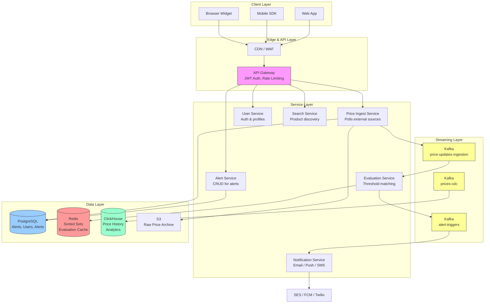
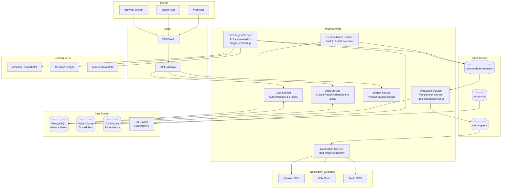

## Architecture Overview

### Design Philosophy

This system has two distinct phases that drive the architecture:

1. **Price Ingestion** — slow, expensive, shared. External APIs are rate-limited and metered. The key optimization is polling once per target and fanning out internally.
2. **Alert Evaluation** — fast, cheap, per-alert. Evaluating a price against a threshold is trivially cheap, but must happen for millions of alerts every cycle. The key optimization is in-memory sorted set lookups.

### System Architecture

### Key Design Decisions

1. **Poll Once, Evaluate Everywhere** — Instead of each evaluation instance independently polling external APIs, a single Price Ingest Service polls each target and broadcasts via Kafka. This reduces external API calls by ~90% compared to naive per-alert polling.

2. **In-Memory Evaluation with Redis Sorted Sets** — Rather than querying PostgreSQL for alerts per target (N+1 queries), active alerts are cached as Redis sorted sets keyed by target_id, scored by threshold_value. Evaluation becomes O(log N) binary search.

3. **Event-Driven Notification** — Alert triggers are published as events to Kafka, decoupling evaluation from notification. This allows the notification service to scale independently and provides durable buffering during spikes.

## Component Diagram

Each component has a single responsibility:
- **Alert Service**: Manages alert lifecycle (create, read, update, delete, pause/resume). Writes alert definitions to PostgreSQL and publishes new/updated alert keys to Kafka for the evaluation cache to pick up.
- **Price Ingest Service**: The shared polling worker. One partition per target product/market. Fetches from external APIs once, writes the raw price event to PostgreSQL and publishes to Kafka for downstream consumers.
- **Evaluation Service**: Consumes `price-updates-ingestion` per partition. Loads active alerts for that target from Redis sorted set, performs O(log N) binary search to find all alerts whose thresholds the current price has crossed. Emits alert-trigger events to Kafka.
- **Notification Service**: Consumes `alert-triggers` with retry logic and per-user rate limiting. Routes to the appropriate channel (email via SES, push via FCM, SMS via Twilio) based on user preferences.
- **Reconciliation Service**: Periodic backfill job that compares PostgreSQL price events with ClickHouse aggregations. Detects data drift and triggers resync when gaps are found.

## Technology Choices

### Data Stores

| Technology | Use Case | Why | Alternative | Rejected Because |
|------------|----------|-----|-------------|-----------------|
| PostgreSQL | Alert state, User data, PriceEvents | ACID compliance for alert state (strong consistency required), partitioning for price history | DynamoDB | Need complex queries (range scans on price history, joins for user-alert correlation) |
| Redis | Alert evaluation cache | Sorted sets enable O(log N) threshold binary search | Memcached + application sort | Need sorted set data structure for efficient evaluation |
| Kafka | Event streaming between services | Decouples ingestion from evaluation, durable buffering for notification dispatch | RabbitMQ | Need ordered per-key partitioning and multi-consumer groups |
| ClickHouse | Price history analytics | Columnar storage for fast aggregation over billions of price records | Elasticsearch | Need true OLAP aggregation (min/max/avg over time ranges) |
| S3 | Raw price data archive | Cheap long-term storage, feeds analytics pipelines | PostgreSQL partition | Cost at scale (years of data) |

### Infrastructure

| Technology | Use Case | Why | Alternative | Rejected Because |
|------------|----------|-----|-------------|-----------------|
| AWS ECS/Fargate | Service deployment | No server management, scales to zero, per-service autoscaling | Kubernetes | Overhead for current scale (10M alerts → ~10 services) |
| AWS SES | Email delivery | Cost-effective ($0.10/1000), high deliverability, CloudWatch integration | SendGrid | Cost at volume (30K+ notifications/day) |
| Firebase FCM | Push notifications | Free, reliable, supports both Android and iOS | OneSignal | FCM is the platform-native default, no vendor lock-in cost |
| Twilio | SMS delivery | Global coverage, reliable delivery, simple API | Plivo | Twilio's documentation and SDK maturity advantage |
