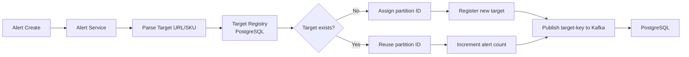
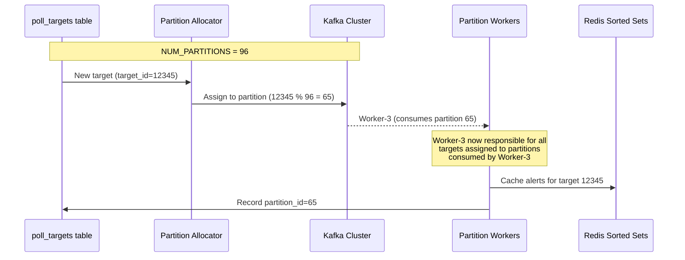
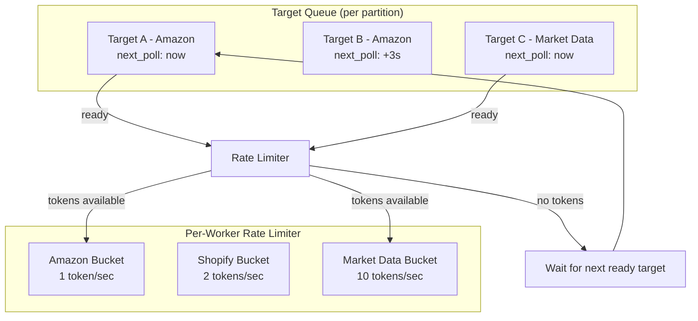
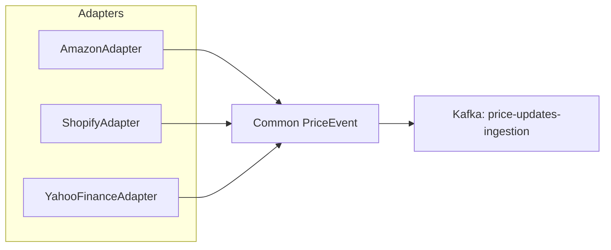

## Poll Target Registry

A poll target is a unique combination of product URL (or SKU) + data source. The registry is the single source of truth that maps alert definitions to their underlying data sources, enabling deduplication.



**Target Registry Schema:**

```sql
CREATE TABLE poll_targets (
    target_id     BIGINT PRIMARY KEY GENERATED ALWAYS AS IDENTITY,
    source        TEXT NOT NULL,          -- 'amazon', 'shopify', 'yahoo_finance'
    source_key    TEXT NOT NULL,          -- ASIN, product URL, ticker symbol
    url           TEXT NOT NULL,          -- Full scraped URL with params
    poll_interval INTERVAL DEFAULT '5m',  -- Configured per-source SLA
    alert_count   INT NOT NULL DEFAULT 1,  -- How many alerts share this target
    partition_id  INT NOT NULL UNIQUE,     -- Kafka partition assigned to this target
    status        TEXT DEFAULT 'active',   -- active, paused, rate_limited, dead
    last_poll     TIMESTAMPTZ,
    last_price    NUMERIC(12,2),
    created_at    TIMESTAMPTZ DEFAULT NOW(),
    UNIQUE(source, source_key)
);

CREATE INDEX idx_poll_targets_status ON poll_targets(status)
    WHERE status = 'active';
```

**Dedup Logic:**
1. When a user creates an alert for "ASIN B08F56... at $50 below", the Alert Service normalizes the URL and looks up `poll_targets` by `(source, source_key)`.
2. If a row exists, `alert_count` is incremented and the existing `partition_id` is returned. No new polling partition is needed.
3. If no row exists, a new `target_id` is created, assigned a Kafka partition (via a partition allocator), and `alert_count` starts at 1.
4. When the last alert on a target is deleted (alert_count reaches 0), the target status is set to `paused`. A reconciliation cron periodically cleans up truly stale targets after 30 days.

**Partition Allocation:** Partitions are allocated via a simple modulo strategy on `target_id`:

```sql
-- Allocate partition_id = target_id % NUM_PARTITIONS
-- NUM_PARTITIONS is configured globally (e.g., 96) and matches Kafka topic partition count.
```

This ensures even distribution and deterministic assignment — the same target always maps to the same partition, which is critical for Redis sorted set keying.

## Partitioning Strategy

The partitioning strategy determines how targets are distributed across polling workers. This choice directly affects load balance, cache locality, and failure isolation.

**Design Choice: One Partition Per Target, Deterministic Assignment**

Each target gets exactly one Kafka partition in the `price-updates-ingestion` topic. All evaluation workers that consume that partition see the same price update sequence for that target.



**Why not hash by alert_id?** Hashing by alert_id would scatter multiple alerts for the same target across different partitions, meaning each partition would independently poll the same external API — defeating the purpose of poll-once dedup.

**Why not one partition per user?** At 10M alerts across 5M users, a user-centric partition would still require 5M partitions (too many for Kafka) and would be imbalanced (power users have 1000x more alerts than casual users).

**Partition distribution:** With `NUM_PARTITIONS = 96` and ~50K unique targets, each partition manages ~520 targets. A partition can easily handle a price update every 5 minutes with minimal compute.

**Worker scaling:** Workers are stateless consumers of Kafka partitions. If we have 32 workers and 96 partitions, each worker owns 3 partitions. Adding workers triggers Kafka consumer rebalancing — partitions migrate smoothly without data loss.

**Failure handling:** If a worker crashes, Kafka's consumer group protocol reassigns its partitions to surviving workers within seconds. Redis sorted sets are ephemeral — the new worker reloads alerts for its newly assigned partitions from Redis on startup.

## Rate Limit Management

External APIs impose different rate limits (Amazon: ~1 req/sec without partnership, Shopify: varies by plan, market data APIs: 60-1200 req/min). Rate limit management must be per-source, not global.

**Token Bucket Per Source:**

Each polling worker maintains an in-memory token bucket per source, replenished at the source's allowed rate. When a target's poll cycle arrives, the worker checks its bucket — tokens must be available before the request is sent.



**Token Bucket Parameters (per source):**

| Source | Bucket Size | Replenish Rate | Max Burst | Source |
|--------|-------------|----------------|-----------|--------|
| Amazon (unauthenticated) | 5 | 1/sec | 5 | Scraper API, no partnership |
| Amazon (authenticated) | 20 | 3/sec | 20 | Partnership API, $5K/mo |
| Shopify | 10 | 2/sec | 10 | Storefront API |
| Yahoo Finance | 60 | 10/sec | 60 | Finance API |
| Alpha Vantage | 120 | 20/sec | 120 | Market data API |

**Backpressure on Slow Sources:** If an Amazon target gets a 429 response, its bucket is frozen for 30 seconds and the worker moves to the next ready target. The failed poll is retried after a random jitter (30-90s) to avoid thundering herd.

**Global rate limiting is worse than per-source:** Amazon's API doesn't limit Shopify requests. A global bucket would waste headroom on one source while another is blocked. Per-source buckets ensure we utilize every source's full allowance.

## External API Integration

The Price Ingest Service must handle diverse external data sources (Amazon product pages, Shopify stores, Yahoo Finance, Alpha Vantage) with a uniform polling interface.

**Adapter Pattern:** Each source implements a common `PriceSource` interface with a source-specific adapter.



**Interface Contract:**

```
interface PriceSource {
    // Returns the latest price event for a given target
    PriceEvent fetch(Target) -> PriceEvent | Error

    // Returns the appropriate rate limit for the source
    RateLimit rateLimit() -> RateLimit
}

struct PriceEvent {
    target_id:      TargetID
    source:         string
    price:          Decimal
    currency:       string
    timestamp:      Time        // Source's reported time
    scraped_at:     Time        // When we scraped it
    raw_response:   JSONBlob    // For debugging & fallback
}
```

**Error Handling Strategy:**

| Error Type | Action | Retry |
|------------|--------|-------|
| HTTP 429 (Too Many Requests) | Respect `Retry-After` header | Deferred, respect cooldown |
| HTTP 5xx | Retry with exponential backoff (1s, 2s, 4s) | Up to 3 attempts |
| 404 / 403 | Mark target as `dead`, notify owner | No retry |
| Parse failure | Log + store raw_response, skip price | No retry |
| Timeout | Log + skip, mark `last_poll` as stale | Schedule next cycle |

**Graceful Degradation:** If a source is persistently down (>3 consecutive failures), the worker marks all its targets as `rate_limited` (effectively paused). The reconciliation service periodically probes dead sources with a probe request to detect recovery.
