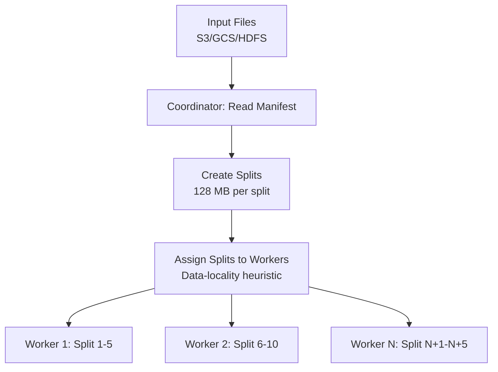
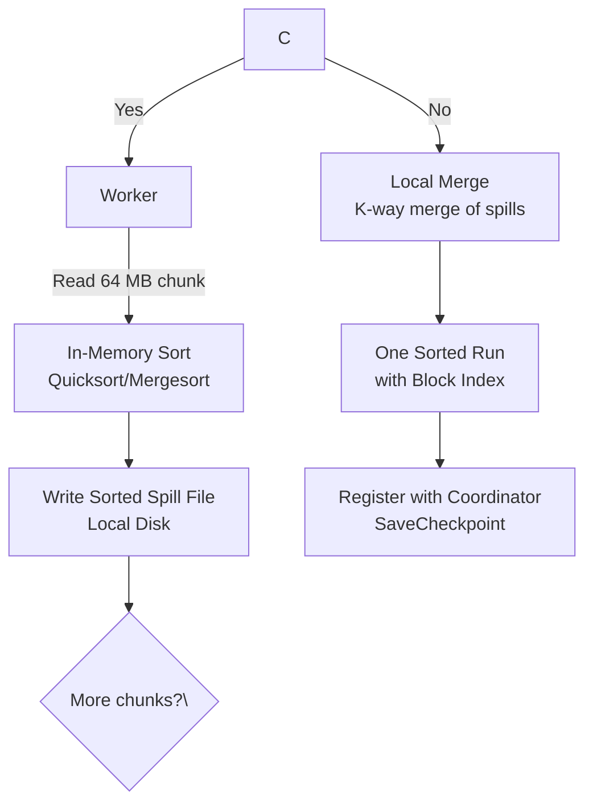
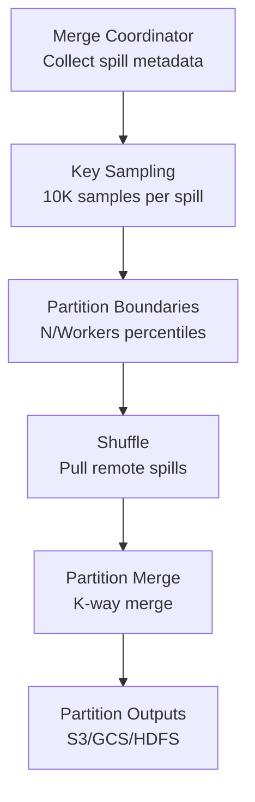

## Input Partitioning



**Split strategy:**
- Parquet/ORC: Split by row group boundaries (preserves record integrity)
- CSV/JSON: Split by byte offset with line-boundary scanning
- Target: 128 MB per split, aligned to file boundaries

**Data locality:** If data is on HDFS/S3, prefer nodes in same rack/region. Round-robin across workers if no data locality.

## Spill Phase



**Spill pipeline:**
1. Read 64 MB chunk → sort in memory → write as spill file (sequential write)
2. Repeat until split fully consumed
3. **Local merge:** K-way merge of all spill files into one sorted run using min-heap
4. Block index added at end of merged spill file for binary search during global merge

**Memory:** Heap capped at 1 GB. If sorted chunk exceeds heap, auto-reduce chunk size.

**Spill file count:** 1 TB / 64 MB = ~16K chunks → local merge → ~16 merged spill files (with configurable merge fan-in).

## Merge Phase



**Merge steps:**
1. **Boundary determination:** 10K samples per spill file → global key histogram → even quantile boundaries
2. **Shuffle:** Workers pull remote spill files via HTTP/TCP, 1 MB chunks with CRC32C checksums
3. **Merge:** Each merge node performs k-way merge on assigned partition (min-heap, O(log k) per record)

**Optimization:** Same-node data transfer skipped (source = target). Parallel merge groups limited by network bandwidth.

**Partial sort (top-K):** Skip global shuffle — all nodes send top-K to coordinator for final merge.

## Result Output

```mermaid
graph LR
    P1[Partition 1] --> FM[Final Merge<br/>O(N log P)]
    P2[Partition 2] --> FM
    P3[Partition N] --> FM
    FM --> OUT\{Output Type\}
    OUT -->|File| F[Parquet/CSV/JSON<br/>with SHA-256 checksum]
    OUT -->|Streaming| S[SSE stream<br/>Backpressure-controlled]
    OUT -->|Database| D[Batch INSERT<br/>Ordered commit]
```

**Final merge:** O(N log P) where P = number of partitions. Single partition: skip.

**Output verification:** Client re-hashes output file and compares SHA-256 checksum.

**Streaming output:** Backpressure-controlled via client buffer size limits.
