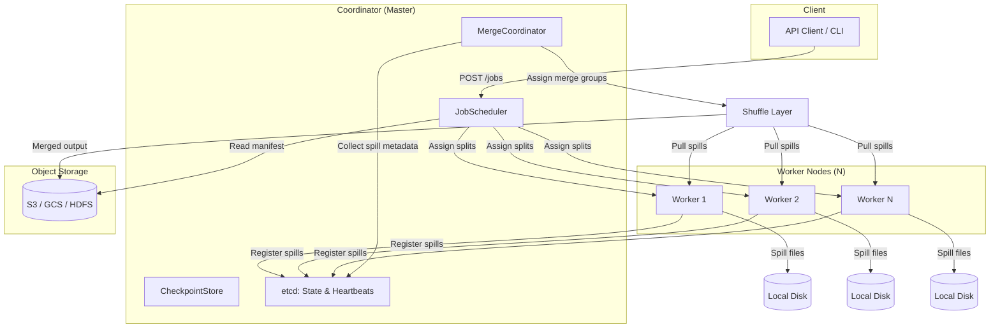

## Architecture Overview

Master-worker architecture with two-phase external merge sort:

### Two-Phase Sort

| Phase | Location | Operation | Data Movement |
|-------|----------|-----------|---------------|
| **Local** | Each worker | Read → In-memory sort → Spill → Local merge | Input: S3 → Worker; Spill: Worker → Local disk |
| **Global** | Shuffle + Merge nodes | Shuffle (pull spills) → K-way merge → Output | Worker → Worker network → Output to S3 |

### Design principles

- **Compute-to-data:** Workers preferentially assigned splits from data on same rack/region
- **External sort:** Memory-limited to 1 GB; dataset exceeds memory → spill to disk
- **Merge-sort decomposition:** Sort large data into small sorted runs, then merge runs globally

## Technology Stack

| Component | Choice | Rationale |
|-----------|--------|-----------|
| Coordination | etcd | Strong consistency, watch API, lease-based heartbeats, simpler than ZooKeeper |
| Input storage | S3/GCS/HDFS with Parquet/ORC | Pluggable connectors; columnar format enables filter pushdown |
| Output storage | S3/GCS/HDFS | Durable, cost-effective, high throughput |
| Spill format | Custom binary with block index | Compactness + binary-searchable during merge |
| Network transfer | HTTP/2 + gzip + CRC32C | Multiplexing, header compression, integrity verification |
| Scheduler | Custom round-robin + locality | Lower overhead than YARN/K8s for dedicated sort clusters |

## Component Responsibilities

| Component | Responsibility |
|-----------|---------------|
| **Coordinator** | Job lifecycle, split assignment, merge orchestration, progress tracking |
| **Worker** | Read input → in-memory sort → spill → serve data during shuffle |
| **Merge Coordinator** | Determine partition boundaries, assign merge groups, track merge progress |
| **CheckpointStore** | Persist spill metadata and job state in etcd for recovery |
| **ResultStore** | Publish final output; provide streaming consumption |

## Fault Tolerance

| Failure Mode | Detection | Recovery |
|-------------|-----------|----------|
| Worker crash | Heartbeat timeout (30s) | Reassign unprocessed splits; restart merge for affected partitions |
| Shuffle failure | CRC32C checksum mismatch | Re-transfer up to 3 times; source node retries |
| Merge failure | Incomplete partition output | Re-merge from spill files (no re-shuffle needed) |
| Coordinator crash | etcd lease expiration | Leader election; new Coordinator loads state from etcd and resumes |
| Network partition | Connection timeout (10s) | Pause shuffle; retry; if > 60s, mark source partition for re-shuffle |
| Disk failure on worker | I/O error on spill write | Move spills to redundant worker; recreate spill from input (partial re-spill) |

**Checkpoint model:** Spill file metadata persisted to etcd after each spill file is written. Recovery resumes from last checkpoint without re-scanning input data.

## Scalability Characteristics

| Metric | Scaling Behavior |
|--------|-----------------|
| Sort throughput | Linear with worker count (data-locality aware) |
| Memory per node | O(chunk_size) = 64 MB, independent of dataset size |
| Network during shuffle | O(total data) × (workers / merge_partitions) |
| Merge latency | O(N log K) where K = spill files per partition |

**Bottleneck analysis:** Network bandwidth during shuffle phase is the primary bottleneck. For 1 TB dataset on 10-node cluster with 1 Gbps links, shuffle takes ~2 hours if fully cross-shuffle. Optimized via data-locality and partition-aware assignment.
