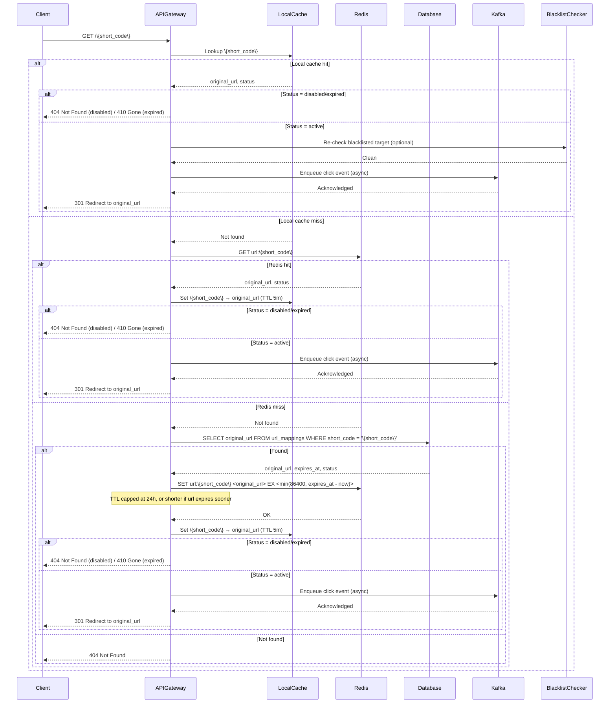
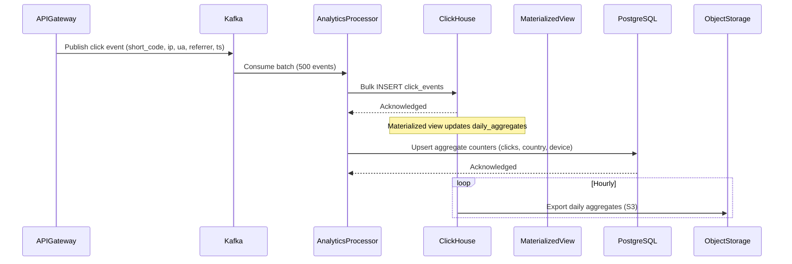
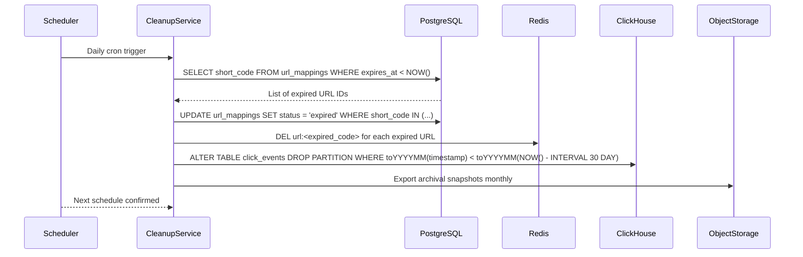
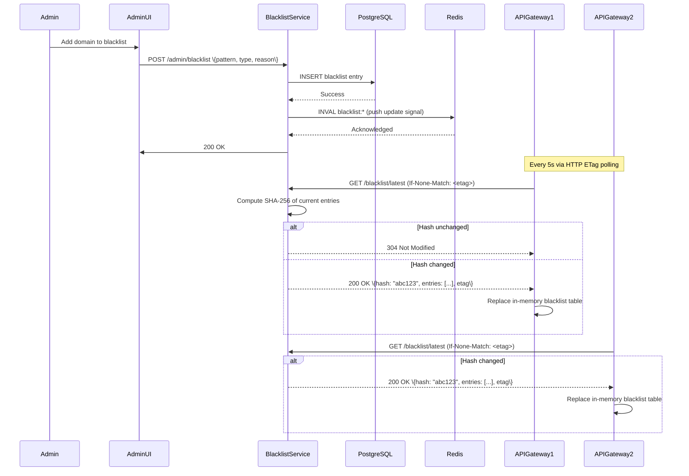

### 1. URL Shortening Flow (Write Path)

```mermaid
sequenceDiagram
    participant Client
    participant APIGateway
    participant RateLimiter
    participant URLValidator
    participant BlacklistChecker
    participant URLShortener
    participant Database
    participant Redis
    participant LocalCache

    Client->>APIGateway: POST /api/shorten (long_url, custom_alias)
    APIGateway->>RateLimiter: Check rate limit
    RateLimiter-->>APIGateway: Allow/Deny

    alt Rate limit exceeded
        APIGateway-->>Client: 429 Too Many Requests
    else Allowed
        APIGateway->>URLValidator: Validate URL format
        URLValidator-->>APIGateway: Valid/Invalid

        alt Invalid URL
            APIGateway-->>Client: 400 Bad Request
        else Valid
            APIGateway->>BlacklistChecker: Check against blacklist (in-memory cache)
            BlacklistChecker-->>APIGateway: Clean/Malicious

            alt Blacklisted
                APIGateway-->>Client: 403 Forbidden
            else Clean
                APIGateway->>URLShortener: Generate short code & persist
                URLShortener->>Database: INSERT url_mapping (unique constraint on short_code)
                Database-->>URLShortener: Success / Conflict

                alt Collision (extremely rare)
                    URLShortener->>URLShortener: Retry generation (max 3 attempts)
                    alt Max retries exceeded
                        URLShortener-->>APIGateway: Service unavailable
                        APIGateway-->>Client: 500 Internal Server Error
                    else Success on retry
                        URLShortener->>Redis: SET url:<code> <original_url> EX <min(86400, expires_at - now)>
                        Note over URLShortener: TTL = min(24h, url's remaining lifetime); no expiry if never expires
                        Redis-->>URLShortener: OK
                        URLShortener->>LocalCache: Warm local LRU entry
                        APIGateway-->>Client: 201 Created (short_url)
                    end
                else Success
                    URLShortener->>Redis: SET url:<code> <original_url> EX <min(86400, expires_at - now)>
                        Note over URLShortener: TTL = min(24h, url's remaining lifetime); no expiry if never expires
                    Redis-->>URLShortener: OK
                    URLShortener->>LocalCache: Warm local LRU entry
                    APIGateway-->>Client: 201 Created (short_url)
                end
            end
        end
    end
```

### 2. Redirect Flow (Read Path)



### 3. Analytics Processing Flow



### 4. Cleanup and Maintenance Flow



### 5. Blacklist Update Flow



### Key Design Principles

1. **Write Path**: Optimized for low-latency creation with async analytics
2. **Read Path**: Optimized for ultra-low-latency redirects with two-tier caching (local LRU + distributed Redis)
3. **Eventual Consistency**: Analytics data is eventually consistent (async processing via Kafka)
4. **Caching Hierarchy**: Three-layered caching — per-instance LRU (sub-ms), Redis distributed (ms), PostgreSQL persistent (10ms)
5. **Decoupling**: Components communicate via Kafka for resilience and backpressure handling
6. **Idempotency**: All write operations accept `Idempotency-Key` header
7. **Observability**: Every critical path is instrumented with metrics, tracing, and structured logging
8. **Fail-Safe**: Default to safe state (404/403) on component failures
9. **Scalability**: Each component independently scaled — stateless API gateways, sharded database, partitioned Kafka
10. **Zero Trust**: All inputs validated against RFC 3986, all outputs sanitized

### Data Flow Performance Targets

- **Shortening**: P95 < 100ms (end-to-end)
- **Redirect**: P95 < 50ms (end-to-end, cache hit path)
- **Cache Hit Rate**: > 95% for redirect flow (combined local + Redis)
- **Analytics Ingestion**: > 10K events/sec sustained via Kafka batch consumers
- **Blacklist Check**: < 20ms per check (in-memory lookup after local cache)
- **Rate Limiting**: < 10ms per check (Redis sorted set pipeline)
- **Database Write**: < 10ms P95 per shard (single-shard indexed insert)
- **Database Read**: < 5ms P95 per shard (single-shard indexed lookup)

### Failure Scenarios

1. **Local Cache Failure**: Fall back to Redis (adds ~1ms latency, negligible)
2. **Redis Failure**: Fall back to database with increased latency (P95 < 50ms per shard, still meets SLA)
3. **Database Failure**: Serve redirects from Redis hot data (remaining 5% not cached); reject new URL creations (503); existing redirects from cache continue — never cascade to DB under Redis failure at 23K RPS.
4. **Analytics Queue Backlog**: Drop non-critical metadata enrichment; keep core click events (short_code, timestamp, ip_prefix)
5. **Blacklist Service Unavailable**: Fail-closed — block all new URL creations; existing redirects continue (cached locally)
6. **Kafka Broker Failure**: With 3× replication, ISR ensures no event loss; consumers use group coordination to rebalance; brief consumer lag (seconds) during rebalance — acceptable for analytics.
7. **Rate Limiter Redis Failure**: Fall back to per-instance in-memory counters (approximate, may allow slightly over limit)

### Data Consistency Model

- **Strong Consistency**: URL mapping (short_code → original_url) — single-shard writes with unique constraint
- **Eventual Consistency**: Analytics data — acceptable delay of seconds to minutes via Kafka batching
- **Cache Coherence**: Redis invalidated on URL updates/deletions; local LRU auto-expires (5m TTL)
- **Eventual Blacklist Sync**: API Gateways poll via ETag every 5s; Redis push invalidation on update

### Scaling Strategy

- **Read Scaling**: Stateless API Gateway instances behind load balancer (100+ instances); redirect traffic routed to any instance
- **Write Scaling**: Horizontal row-level sharding — N independent PostgreSQL instances (shards), each running the same `url_mappings` table schema but storing a disjoint row set keyed by `hash(short_code) % N` (N starts at 10, each shard: 1 primary + 2 read replicas, ~30+ instances total)
- **Analytics Scaling**: Kafka topic with 20 partitions; parallel ClickHouse consumers scaling independently
- **Blacklist Scaling**: Each API Gateway maintains local in-memory copy (O(1) lookup); sync via HTTP ETag polling
- **Rate Limiting**: Redis Cluster sharded by `hash(client_id) % num_slots`; per-instance in-memory fallback counters when cluster is unreachable

### Observability Implementation

1. **Metrics** (Prometheus): HTTP status codes, cache hit/miss rates (per tier), database P95 latency by shard, Kafka lag, queue lengths, rate limit violations
2. **Tracing** (Jaeger): End-to-end request flow with latency breakdown by component (local cache → Redis → DB), dependency call graphs
3. **Logging** (ELK): Structured JSON with request ID, source IP (truncated), user agent (parsed), error context, component name
4. **Alerting** (PagerDuty): Error rate > 1%, latency > 100ms P95, cache hit rate < 85%, queue backlog > 10K, database connection failures, shard disk > 90%

### Integration Points

1. **Redis Cluster**: URL mapping cache (TTL 24h), rate limiting (sorted sets), blacklist distribution
2. **Kafka**: Analytics event ingestion (clicks topic, 20 partitions, 3x replication)
3. **PostgreSQL**: Primary persistent store (sharded by short_code hash, 10+ nodes)
4. **ClickHouse**: Analytics data warehouse (MergeTree, partitioned by month)
5. **S3 + Parquet**: Long-term analytics archive (ClickHouse exports to S3 as Parquet); queried via Athena or ClickHouse for BI — no Redshift needed when ClickHouse handles analytical workloads.
6. **PgBouncer**: Connection pooling for PostgreSQL shards
7. **Prometheus/Grafana**: Monitoring and alerting
8. **Jaeger**: Distributed tracing
9. **ELK Stack**: Log aggregation and search
