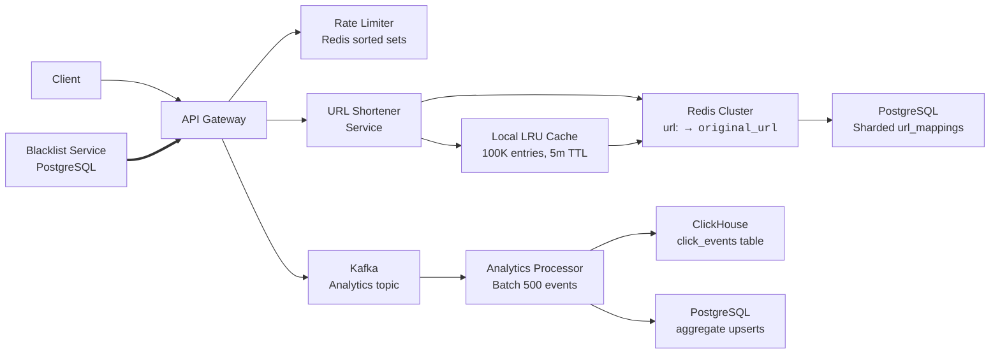

### Architecture Overview

The system follows a distributed, microservices-based architecture with clear separation of concerns:



Key architectural decisions:

1. **Stateless API Gateway**: Scales independently; handles TLS termination, rate limiting, request routing, and request ID generation for tracing
2. **Two-tier caching**: Per-instance LRU (sub-ms, 100K entries) for hot URLs, Redis Cluster (ms) for distributed caching (TTL = min(24h, url's remaining lifetime), 5m for blacklist sync)
3. **Decoupled analytics**: Async event ingestion via Kafka with batch consumers (500 events/batch) writing to ClickHouse for time-series and PostgreSQL for aggregated counters
4. **Row-level sharding**: URL mappings distributed across N independent PostgreSQL instances by `hash(short_code) % N` (N=10+), each with 1 primary + 2 read replicas
5. **Fail-safe design**: Default to 404/403 on component failures; local cache fallback on Redis failure; fail-closed on blacklist service outage
6. **Eventual consistency**: URL mappings strongly consistent within a shard; analytics data eventually consistent via Kafka batching (seconds to minutes)

### Component Breakdown

#### 1. API Gateway

- Entry point for all client requests (100+ instances behind load balancer)
- Handles:
  - TLS 1.3 termination (HTTPS)
  - CORS policy enforcement (trusted origins only)
  - API key validation (for authenticated endpoints)
  - Rate limiting via Redis sorted set pipeline (< 2ms)
  - Blacklist check via in-memory cache (< 1ms)
  - Request routing to URL Shortener Service
  - Request ID generation for Jaeger distributed tracing
- Stateless: No server-side session state
- Performance: P95 < 5ms (excluding downstream calls)
- Language: Go or Rust for low memory footprint and high concurrency

#### 2. Local LRU Cache (Per-Instance)

- Embedded in-memory LRU cache on each API Gateway instance (100K entries, ~10MB)
- TTL: 5 minutes
- Key format: `short_code` → `original_url|status`
- Purpose: Sub-millisecond redirect for hot URLs, eliminates network round-trip
- Eviction: LRU policy; auto-expires on TTL
- **Hit rate target**: ~60-70% of all redirects (covers top 5% of URLs driving 80%+ of traffic)
- **Consistency**: Warm on read-through; invalidated on URL deletion/disabling

#### 3. URL Shortener Service

Core service responsible for generating short codes and persisting URL mappings.

**Workflow**:

1. Validate URL format (RFC 3986)
2. Check blacklist (in-memory cache)
3. Handle custom alias requests (if provided)
4. Generate short code (cryptographically secure random, base62, 6-8 chars)
5. Persist URL mapping to target shard primary
6. Warm Redis cache (`SET url:<code> <url> EX <min(86400, expires_at - now)>`; no expiry if never expires)
7. Warm local LRU cache on the API Gateway instance
8. Return 201 Created

**Short Code Generation**:

- Cryptographically secure random generation (`secrets` module)
- Collision detection via database unique constraint (3 retries max)
- Custom alias: check local cache → Redis → DB before assignment
- Character set: `a-z`, `A-Z`, `0-9` (62^6 = ~56.8B combinations, 62^8 = ~218T)
- Avoids ambiguous characters: 0, O, 1, I, l

**Per-Shard Database Schema** (identical on every shard):

```sql
CREATE TABLE url_mappings (
    short_code VARCHAR(8) NOT NULL,
    original_url TEXT NOT NULL,
    created_at TIMESTAMPTZ DEFAULT NOW(),
    expires_at TIMESTAMPTZ,
    click_count BIGINT DEFAULT 0,
    created_by VARCHAR(36),
    status VARCHAR(10) DEFAULT 'active',
    metadata JSONB,
    hash VARCHAR(64),
    PRIMARY KEY (short_code)
);

CREATE INDEX idx_url_hash ON url_mappings(hash);
CREATE INDEX idx_expires_at ON url_mappings(expires_at)
    WHERE expires_at IS NOT NULL AND status = 'active';
CREATE INDEX idx_status ON url_mappings(status);
```

**Performance Targets**:

- P95 creation latency: < 100ms
- Database write (per shard): < 10ms P95
- Cache set (Redis): < 1ms

#### 4. Cache Layer (Two-Tier)

**Tier 1: Local LRU Cache (Per-Instance)**

- Embedded in each API Gateway instance (100K entries, ~10MB, 5m TTL)
- Sub-millisecond lookup, zero network cost
- Covers top 5% of URLs driving 80%+ of traffic (~60-70% hit rate)

**Tier 2: Redis Cluster**

- Distributed cache for cold and warm URLs
- Key format: `url:<short_code>` → `original_url|status`
- TTL: min(24h, url's remaining lifetime); no expiry if URL never expires
- Eviction: LRU policy, ~100GB total for ~1.8B hot entries (5% of 36.5B total; ~55 bytes per entry including overhead)
- Consistency: Write-behind on creation (DB first, then Redis), invalidate on update/delete
- High Availability: Redis Cluster with replication and automatic failover

**Cache Hit Rate Target**: > 95% combined (local + Redis)

**Read Path**: Local cache → Redis → PostgreSQL
**Write Path**: PostgreSQL primary → Redis → Local cache warm

#### 5. Database Layer (PostgreSQL — Row-Level Sharded)

- **Primary storage**: URL mappings with strong consistency within a shard
- **Sharding strategy**: Row-level sharding — N independent PostgreSQL instances, each running the same `url_mappings` table schema but storing a disjoint row set
- **Routing key**: `hash(short_code) % N` (FNV-1a 32-bit, N starts at 10)
- **Each shard**: 1 primary (handles all writes) + 2 read replicas (serve redirect lookups and admin queries)
- **Total instances**: ~30+ for 10 shards (each shard: 1 primary + 2 replicas)
- **Connection pooling**: PgBouncer in transaction mode per shard
- **Replication**: Async replication; failover via PgBouncer + keepalived
- **Backups**: Daily `pg_basebackup` to S3 + WAL archiving for point-in-time recovery (7-day window)
- **Durability**: 99.9999% (6 nines) via synchronous replication within each shard
- **Scaling**: Add 3rd replica if shard CPU/memory > 70%; add new shard and rebalance rows if all shards > 80% rows

#### 6. Analytics Pipeline

- **Event Ingestion**: API Gateway publishes click events to Kafka topic (`clicks`, 20 partitions, 3x replication)
- **Consumer**: Analytics Processor (single consumer group `analytics-processor`) consumes in batches of 500 events
- **Processing**:
  - Extract IP prefix (first 24 bits IPv4 / first 96 bits IPv6) → geolocation (MaxMind GeoIP2)
  - Parse User-Agent → device/browser/OS (via ua-parser)
  - Bulk INSERT raw events into ClickHouse `click_events` table (MergeTree engine)
  - Upsert aggregate counters into PostgreSQL `daily_aggregates` table
- **Storage**: ClickHouse for raw time-series events (partitioned by month), PostgreSQL for fast query aggregates
- **Aggregation**: ClickHouse materialized view auto-updates `daily_aggregates` on insert; hourly S3 export for archival
- **Retention**: Raw events in ClickHouse for 30 days, aggregated counters for 2 years, then exported to S3 Glacier
- **Throughput**: Sustained 10K events/sec (2B/day ÷ 86,400s average)

#### 7. Blacklist Service

- **Storage**: PostgreSQL with indexed `pattern` and `type` columns
- **Pattern types**: Exact domain matches, regex patterns (with backtracking protection), keyword substring filters
- **Sync protocol**: API Gateway instances poll `/blacklist/latest` every 5s via HTTP ETag/`If-None-Match`; Redis push invalidation on update
- **Caching**: Local in-memory hash map on each API Gateway instance (10K entries, ~500KB, 10m TTL)
- **Performance**: < 1ms per check (local hash map lookup)
- **Fail-Safe**: Fail-closed on service outage — block all **new** URL creations; existing redirects continue (cached locally)

#### 8. Rate Limiter

- **Algorithm**: Sliding window via Redis sorted set — each request is a ZADD with Unix timestamp as both member and score; expired entries removed via ZREMRANGEBYSCORE; current count via ZCARD, all in a single Redis pipeline (< 2ms)
- **Keys**: `rate:<client_id>:<endpoint>` with auto-expire TTL
- **Windows**: 1-minute (per request) and 1-hour (per IP, for redirect abuse)
- **Policies**:
  - 100 requests/minute per IP (public creation API)
  - 1,000 requests/minute per API key (enterprise/bulk API)
  - 10,000 requests/hour per IP (redirect endpoint)
- **Distributed architecture**: Redis Cluster with consistent hashing by `client_id`; 5 nodes, replication factor 2
- **Fallback**: If Redis down, use per-instance in-memory counters (approximate, may slightly over-allow)
- **Response headers**: `X-RateLimit-Limit`, `X-RateLimit-Remaining`, `X-RateLimit-Reset`

### Data Flow Optimization

**Redirect Path (Hot Path — 95%+ traffic)**:

1. Client requests `/abc123`
2. Local LRU cache lookup (~0.1ms, zero network)
3. **Local hit** → redirect immediately with 302 (default) + enqueue click to Kafka (total ~1ms)
4. **Local miss** → Redis lookup (~1ms)
5. **Redis hit** → warm local cache → redirect (total ~2ms)
6. **Redis miss** → PostgreSQL shard lookup (~10-30ms network + query) → write to Redis + warm local → redirect (total ~40-50ms)
7. All paths publish click event to Kafka asynchronously (non-blocking)

**Creation Path (Cold Path)**:

1. Client POSTs long URL
2. API Gateway checks rate limit (Redis sorted set) and blacklist (local cache)
3. URL Shortener Service:
   - Validates URL format (RFC 3986)
   - Generates short code (cryptographically secure random)
   - Computes target shard: `hash(short_code) % N`
   - Inserts into target shard's primary (single-shard write, < 10ms)
   - Writes to Redis (`url:<code>`, TTL = min(24h, url's remaining lifetime))
   - Warms local LRU cache on the instance
4. Return 201 Created
5. No analytics event on creation (only on redirect)

### Scaling Strategy

| Component         | Scaling Method                                              | Capacity            |
| ----------------- | ----------------------------------------------------------- | ------------------- |
| API Gateway       | Horizontal (Kubernetes deployment)                          | 100+ instances      |
| Local LRU Cache   | Embedded per-instance (100K entries)                        | No network overhead |
| Redis Cluster     | Cluster (Sharding + Replication)                            | 500K QPS total      |
| PostgreSQL Shards | Row-level sharding (10+ nodes, each 1 primary + 2 replicas) | 1K writes/sec/shard |
| Kafka             | Partitioned topic (20 partitions, 3x replication)           | 50K events/sec      |
| ClickHouse        | Distributed cluster (MergeTree, monthly partitions)         | 1M writes/sec       |
| Blacklist         | Local in-memory per instance (O(1) lookup)                  | 100K+ checks/sec    |
| Rate Limiter      | Redis Cluster with consistent hashing by client_id          | 20K ops/sec/node    |

### Availability and Fault Tolerance

- **Multi-region deployment**: Primary in us-east-1, secondary (active-passive) in eu-west-1
- **Failover**: DNS-based routing (Route 53/Cloudflare) with health checks on `/health` endpoint, TTL 30s
- **Graceful degradation**:
  - Local cache failure → fallback to Redis (adds ~1ms, negligible)
  - Redis failure → serve from local cache + remaining hot data only; reject new URL creations (503); do NOT cascade to PostgreSQL at 23K RPS — would cause a thundering herd.
  - PostgreSQL shard failure → serve redirects from Redis (if available), reject new creations with 503
  - Analytics queue backlog → drop non-critical metadata enrichment; keep core click events (short_code, timestamp, ip_prefix)
  - Blacklist service down → fail-closed (block all new URL creations; existing redirects unaffected)
  - Kafka broker failure → ISR ensures no data loss; consumers rebalance via group coordinator; brief lag (seconds) during rebalance — acceptable for analytics.
  - Rate limiter Redis failure → fallback to per-instance in-memory counters (approximate, slightly over-allow)
- **SLA**: 99.99% uptime (52.6 minutes/year max downtime)

### Observability

- **Metrics** (Prometheus): HTTP status codes, cache hit/miss rates (per tier), database P95 latency by shard, Kafka lag, queue lengths, rate limit violations, shard disk usage
- **Tracing** (Jaeger): End-to-end request flow with latency breakdown by component (local cache → Redis → DB), dependency call graphs
- **Logs** (ELK): Structured JSON with request ID, source IP (truncated), user agent (parsed), error context, component name
- **Alerting** (PagerDuty): Error rate > 1%, latency > 100ms P95, cache hit rate < 85%, queue backlog > 10K, database connection failures, shard disk > 90%
- **Dashboards** (Grafana): Real-time traffic volume, success/error rates, system health, storage usage, analytics trends

### Security

- **Input validation**: RFC 3986 URL validation
- **Content filtering**: Regex-based blacklist
- **Rate limiting**: Prevent DDoS and abuse
- **HTTPS**: TLS 1.3+ enforced
- **API key rotation**: Automated key rotation every 90 days
- **Admin MFA**: Multi-factor authentication required
- **Audit logs**: All admin actions logged
- **DDoS protection**: Cloud provider integrated
- **Data sanitization**: All user input sanitized before storage

### Cost Optimization

- **Caching**: 95%+ cache hit rate reduces database load
- **Sharding**: Efficient resource utilization across partitions
- **Storage tiers**: Hot data in SSD, cold analytics in object storage
- **Auto-scaling**: Scale down during off-peak hours
- **Spot instances**: Use for analytics processing and batch jobs
- **Compression**: Rely on PostgreSQL's built-in TOAST compression for the `original_url` column — application-level gzip adds CPU overhead for marginal gain.
