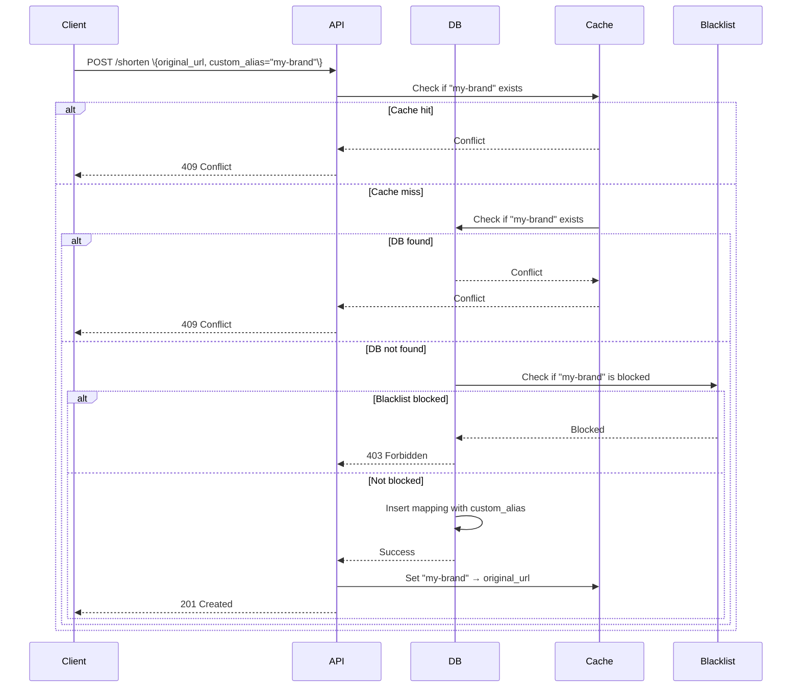

### Short Code Generation Algorithm

#### Challenge

Generating unique, non-guessable short codes at scale (2B+ cumulative) while maintaining low collision rates and human readability.

**Why this matters:** The short code is the primary key users interact with. It affects security (guessability), UX (typing/sharing errors), storage (code length vs. combinations), and performance (collision handling latency). The choice between sequential, random, or hybrid approaches has cascading implications across the entire system.

#### Solution: Hybrid Approach

1. **Base57 Encoding** (reduced from base62):
   - Character set: `a-z`, `A-Z`, `0-9` minus ambiguous chars (`0/O`, `1/I/l`) = 57 total
   - 6-character code: 57^6 = ~34.3 billion combinations
   - 8-character code: 57^8 = ~111 trillion combinations (future-proof)
   - Avoids ambiguous characters to reduce user errors when typing/sharing

2. **Generation Strategy**: Three approaches, with tradeoffs:
   - **Option A — Sequential + Base57 Encode**: Monotonic counter encoded to base57.
     - Pros: Deterministic, no collisions, compact index, easy compaction
     - Cons: Fully guessable (enables enumeration, spam abuse, competitor scraping)
   - **Option B — Cryptographic Random**: `secrets.token_urlsafe`-style random generation.
     - Pros: Non-guessable by default, no collision tracking needed for uniqueness
     - Cons: Birthday paradox — collision probability grows quadratically with scale; requires collision detection on insertion
   - **Option C — Sequential with Random Offset**: Assign a monotonic ID, then mix it through a Feistel network or multiplicative shuffle before encoding.
     - Pros: Non-guessable (looks random), zero collisions, predictable capacity planning
     - Cons: Requires a reversible permutation function; slightly more CPU

3. **Recommended: Sequential + Feistel Shuffle + Random Fallback**:
   Use sequential IDs for correctness, apply a Feistel network to make them look random (non-guessable), then encode to base57. Keep a random fallback when the code pool is exhausted.

   ```python
   # 64-bit Feistel cipher with 4 rounds (sufficient for shuffling)
   FEISTEL_ROUNDS = 4
   FEISTEL_MASK_32 = (1 &lt;&lt; 32) - 1

   def feistel_shuffle(id: int, round_key: int) -> int:
       # Split 64-bit ID into two 32-bit halves
       left, right = (id &gt;&gt; 32) & FEISTEL_MASK_32, id & FEISTEL_MASK_32
       for i in range(FEISTEL_ROUNDS):
           f_output = (right + round_key + i) & FEISTEL_MASK_32
           left, right = right, left ^ f_output
       return (left &lt;&lt; 32) | right

   def encode_base57(n: int, length: int = 8) -> str:
       alphabet = "abcdefghijklmnopqrstuvwxyz" \
                  "ABCDEFGHIJKLMNOPQRSTUVWXYZ" \
                  "23456789"
       if n == 0:
           return alphabet[0] * length
       chars = []
       while n:
           n, rem = divmod(n, 57)
           chars.append(alphabet[rem])
       return "".join(reversed(chars)).zfill(length)[-length:]

   def generate_short_code(id: int) -> str:
       return encode_base57(feistel_shuffle(id, 0xdeadbeef))
   ```

   **Key insight — bijectivity:** Feistel ciphers produce a bijective (one-to-one) permutation of the input space. Every input ID maps to exactly one shuffled output and vice versa. This means:
   - **Zero collisions by construction** — no DB uniqueness check needed on generated codes
   - **Deterministic capacity:** `N` possible IDs always produces exactly `N` unique codes
   - **Reversible:** can recover original ID from code (useful for analytics queries that reference original insertion order)
   - **CPU cost:** 4 rounds of 32-bit XOR + add = ~15ns per encode (vs ~5ms for a DB lookup)

   **Why not pure random with collision detection?** Random generation with retry on collision requires a DB existence check on every insert. At scale, even with a Bloom filter, false positives cause unnecessary writes. Sequential+Feistel eliminates the problem at the source. The random fallback (Section 5) is only needed when IDs exceed the 64-bit range, which would require ~500 years at current growth rates.

   **Why Feistel over pure random:** Pure random with collision detection requires DB lookups on every insert (~5-10ms extra latency in worst case). Sequential+Feistel is **zero-collision by construction** — just an integer multiply and a few XORs (~0.1ms). The Feistel shuffle guarantees bijectivity: every input ID maps to exactly one shuffled value, so the capacity is always deterministic. This is the approach used by several production URL shorteners.

4. **Random Fallback** (custom aliases, edge cases):
   For custom alias flows that bypass the sequential ID generator, use random generation with collision detection:
   - Pre-generate 100K codes during off-peak, store in Redis set as a pool
   - Use `SRANDMEMBER` to peek without consuming (SPOP is destructive — if DB insert fails after pop, that code is permanently lost; SRANDMEMBER lets us retry on collision)
   - Bloom filter for probabilistic existence check (tunable false-positive rate)
   - Fall back to sequential counter with random offset if pool exhausted

5. **URL Normalization & Deduplication**:

Before creating a new short URL, normalize and check for duplicates. This saves storage, provides consistent redirects (same URL → same code), and prevents spam by catching repeated identical submissions.

```python
from urllib.parse import urlparse, urlunparse, unquote
import idna

def normalize_url(raw_url: str) -> str:
    parsed = urlparse(raw_url)

    # Lowercase scheme and host (case-insensitive per RFC 3986)
    scheme = parsed.scheme.lower()
    netloc = parsed.netloc.lower()

    # Resolve IDN (internationalized domain names) to ASCII punycode
    try:
        host, port = netloc.rsplit(":", 1) if ":" in netloc else (netloc, None)
        host = idna.encode(host).decode('ascii')
        netloc = f"\{host\}:\{port\}" if port else host
        # Re-append userinfo if present (rare)
        if "@" in parsed.netloc:
            userinfo, _ = parsed.netloc.split("@", 1)
            netloc = f"\{userinfo\}@" + netloc
    except (idna.IDNAError, UnicodeError):
        pass  # Not an IDN, keep as-is

    # Remove default ports
    if scheme == "http" and parsed.port == 80:
        netloc = netloc.replace(":80", "")
    if scheme == "https" and parsed.port == 443:
        netloc = netloc.replace(":443", "")

    # Remove trailing slashes except for root
    path = parsed.path.rstrip("/") or "/"

    # Strip fragment (browser-only, never sent to server)
    # Sort query params for canonicalization (a=1&b=2 == b=2&a=1)
    query = canonicalize_query(parsed.query)

    return urlunparse((scheme, netloc, path, parsed.params, query, ""))

def canonicalize_query(query: str) -> str:
    """Sort query parameters for canonicalization."""
    if not query:
        return ""
    params = sorted(query.split("&"))
    return "&".join(params)
```

- **What gets normalized**: host casing, default port removal, trailing slash, fragment removal, query param ordering, IDN→punycode
- **What does NOT get normalized**: query parameter values (e.g., `?utm_source=email` vs `?utm_source=sms` are intentionally different URLs)
- **Hash-based lookup**: Store `SHA-256(normalized_url)[:16]` as a unique B-tree index for O(log n) dedup check (logarithmic in total URL count)
- **Trade-off**: Dedup adds ~2ms (hash computation + DB lookup). Acceptable because creation rate is 100-1000x lower than redirect rate
- **Anti-abuse**: Duplicate submissions of malicious/phishing URLs get the same short code, preventing repeated indexing and enabling batch blocking via blacklist
- **Note on query sorting**: Sorting params is imperfect — some APIs treat parameter order as significant. As an alternative, accept a `canonicalize_query` client hint that lets power users opt out.



