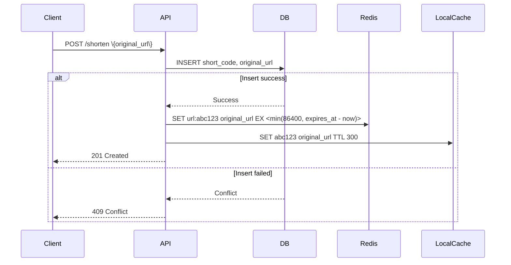

### Cache Layer Optimization

#### Challenge

Serving 2B+ daily redirects with < 50ms P95 latency while minimizing database load.

#### Solution: Multi-Tier Caching Architecture

1. **Tier 1: In-Memory Local Cache (Per Instance)**
   - Use LRU cache (e.g., `concurrent-map` in Go, `Caffeine` in Java)
   - Size: 100K-500K entries per instance (~10-50MB per node)
   - TTL: 5 minutes
   - **Why this tier exists:** At 2B daily redirects (~23K QPS), a single node with 100K entries and 5-minute TTL covers ~0.5% of active URLs. Across 20 nodes, that's ~0.5% hit rate — modest but cuts 1000+ Redis round-trips per second. The real value is **latency**: ~0.1ms vs ~0.5ms for Redis (same region).
   - **Inconsistency tradeoff:** Different instances may have different contents. Acceptable for reads (cache is transparent). For writes, the DB is source of truth.
   - **Eviction impact:** LRU eviction means hot URLs survive but long-tail URLs get evicted. This is desired behavior — cache should follow the access distribution (which is typically Zipfian).

2. **Tier 2: Distributed Redis Cache**
   - Cluster of 5+ nodes, 50GB total
   - Key format: `url:<short_code>` → `original_url|expires_at`
   - TTL: min(24h, url's remaining lifetime); no expiry if never expires
   - Consistency: Write-behind on creation (DB first, then Redis), invalidate on update/delete
   - Pros: High availability, shared state, scales horizontally

3. **Cache Hit Rate Target**: >95%

4. **Negative Caching** (prevents DB hit storm from invalid queries):

   When a short code is not found in the DB, cache the "not found" result so repeated lookups never hit the DB again.
   - **Valid URL key**: `url:<short_code>` → TTL 24h (long-lived)
   - **Negative key**: `url:nf:<short_code>` → TTL 10 minutes (short-lived)

   This handles:
   - **Typo/dumb traffic**: users mistyping short codes
   - **Enumeration attacks**: attackers probing sequential or brute-force codes
   - **Dead link bleed**: expired/deleted URLs still shared on social media
   - **Phishing takedowns**: blocked URLs that still receive traffic

   At 2B daily redirects, even 0.01% invalid queries = 200K unique invalid lookups/day. Without negative caching, each unique invalid code is a DB round-trip. With 10-min TTL, the working set of negative entries stays bounded (~350K entries at most).

   ```mermaid
   graph LR
       Valid["url:abc123" → TTL 24h]
       Neg["url:nf:xyz789" → TTL 10m]
       Redis[(Redis)]
       Redis --> Valid
       Redis --> Neg
       style Valid fill:#e8f5e9,stroke:#388e3c
       style Neg fill:#ffebee,stroke:#d32f2f
   ```

5. **Read Path Optimization**:

```mermaid
sequenceDiagram
    participant Client
    participant API
    participant LocalCache
    participant Redis
    participant DB

    Client->>API: GET /abc123
    API->>LocalCache: Lookup abc123
    alt Local cache hit
        LocalCache-->>API: original_url
        API->>Blacklist: Validate
        alt Blacklist allowed
            Blacklist-->>API: Allowed
            API->>Analytics: Enqueue click
            API-->>Client: 302 Redirect (default; configurable ?type=301 for enterprise)
        else Blacklist blocked
            Blacklist-->>API: Blocked
            API-->>Client: 403 Forbidden (with /blocked page)
        end
    else Local cache miss
        API->>Redis: Lookup abc123
        alt Redis hit
            Redis-->>API: original_url
            API->>LocalCache: Set abc123
            API->>Blacklist: Validate
            alt Blacklist allowed
                Blacklist-->>API: Allowed
                API->>Analytics: Enqueue click
                API-->>Client: 302 Redirect (default; configurable ?type=301 for enterprise)
            else Blacklist blocked
                Blacklist-->>API: Blocked
                API-->>Client: 403 Forbidden (with /blocked page)
            end
        else Redis miss
            API->>Redis: Lookup url:nf:abc123 (negative cache)
            alt Negative cache hit
                Redis-->>API: Not found (cached)
                API->>LocalCache: Set abc123 → 404
                API-->>Client: 404 Not Found
            else Negative cache miss
                API->>DB: SELECT original_url WHERE short_code='abc123'
                alt DB found
                    DB-->>API: original_url
                    API->>Redis: Set url:abc123 with TTL=min(24h, expires_at - now)
                    API->>LocalCache: Set abc123
                    API->>Blacklist: Validate
                    alt Blacklist allowed
                        Blacklist-->>API: Allowed
                        API->>Analytics: Enqueue click
                        API-->>Client: 302 Redirect (default; configurable ?type=301 for enterprise)
                    else Blacklist blocked
                        Blacklist-->>API: Blocked
                        API-->>Client: 403 Forbidden (with /blocked page)
                    end
                else DB not found
                    DB-->>API: Not found
                    API->>Redis: Set url:nf:abc123 with TTL=10m (negative cache)
                    API->>LocalCache: Set abc123 → 404
                    API-->>Client: 404 Not Found
                end
            end
        end
    end
```

6. **Write Path Optimization**:



7. **Cache Invalidation**:

- On URL deletion: `DEL url:<short_code>` and `DEL url:nf:<short_code>`
- On URL update: `DEL url:<short_code>`
- On blacklist update: Invalidate all cached URLs that match blacklisted patterns

8. **Memory Efficiency**:

- Store only `short_code → original_url` in cache
- Use compression (gzip) for long URLs — only worth it for URLs >1KB; for typical ~200-byte entries the CPU overhead exceeds the memory savings.
- Use Redis hashes for batch operations

