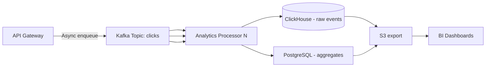

### Analytics Pipeline Design

#### Challenge

Ingesting 2B+ daily click events with low latency (~100ms end-to-end) while enabling real-time analytics. The pipeline must be fire-and-forget: analytics events should never block the redirect path.

#### Solution: Event-Driven Architecture

1. **Event Structure**:

```json
{
  "short_code": "abc123",
  "timestamp_ms": 1745385600000,
  "ip_prefix": "192.168.1",
  "country_code": "US",
  "device_type": "mobile",
  "browser": "Chrome",
  "os": "iOS",
  "referrer": "https://twitter.com/user",
  "request_id": "req-1234567890"
}
```

- **Design note:** All enrichment (IP→country, UA→device) happens synchronously in the API *before* enqueuing. The analytics processor only writes events — no additional enrichment needed. This keeps the processor pipeline thin and fast.
- **Privacy:** Only IP /24 prefix is stored (no full IPs). GDPR-compliant by design.

2. **Pipeline Architecture**:



3. **Kafka Configuration**:

- **Topic:** `clicks` (single topic — no need for separate topics at this scale)
- **Partitions:** 20 (one per analytics processor instance; scales to ~5K events/sec per partition at 100K/sec peak)
- **Replication factor:** 3 (required for durability)
- **Retention:** 7 days (enough for replay/reprocessing; analytics processors should keep up)
- **Message format:** JSON is simple but adds ~30% overhead vs Protobuf/Avro. At ~2B/day (~23K/sec avg, 92K/sec peak), JSON serialization overhead is significant. Use Protobuf or Avro to reduce payload size and CPU overhead in the processor pipeline.

4. **Analytics Processor**:

- **Consumer group:** `analytics-processor`
- **Batch size:** 1000 events or 500ms timeout (whichever comes first)
- **Responsibilities:**
  - Write raw events to ClickHouse in batch inserts
  - Aggregate counters into PostgreSQL (hourly rollup, not every 10s — saves write amplification)

5. **ClickHouse Schema**:

```sql
CREATE TABLE click_events (
    short_code String,
    timestamp DateTime64(3),
    ip_prefix String,
    country_code FixedString(2),
    device_type LowCardinality(String),
    browser LowCardinality(String),
    os LowCardinality(String),
    referrer String,
    request_id String
) ENGINE = MergeTree()
PARTITION BY toYYYYMM(timestamp)
ORDER BY (short_code, timestamp);

-- Daily aggregate table (written by processor, not MV)
CREATE TABLE daily_aggregates (
    short_code String,
    day Date,
    total_clicks UInt64,
    unique_countries UInt16,
    top_device_type AggregateFunction(argMax, LowCardinality(String), clicks),
    top_country AggregateFunction(argMax, FixedString(2), clicks),
    clicks_by_device Map(LowCardinality(String), UInt64),
    clicks_by_country Map(FixedString(2), UInt64)
) ENGINE = AggregatingMergeTree()
PARTITION BY toYYYYMM(day)
ORDER BY (short_code, day);
```

- **Why `AggregatingMergeTree`:** Required for non-summable fields like `top_device_type` (use `argMaxState`) and `clicks_by_country` (use `groupArrayState` or Map aggregation). `SummingMergeTree` only works correctly for truly numeric sum fields.
- **Why not a Materialized View:** At 23K events/sec average, a MV would fire constantly for single-event inserts. Better to batch in the processor, compute aggregates locally, and do a single `INSERT INTO daily_aggregates SELECT ... GROUP BY ...` per batch.
- **LowCardinality optimization:** `device_type`, `browser`, `os` have a small, known set of values. LowCardinality reduces storage by ~5-10x for these columns.
- **Partition strategy:** Monthly partitions keep partition count manageable (~36 partitions for 3 years of data).

6. **Upsert Conflict Handling** (when two processor instances write the same hour's aggregates):
   - Use `AggregatingMergeTree` with `INSERT INTO ... SELECT ... GROUP BY` from batched processor output — deduplication via ORDER BY key during merge handles late/duplicate writes. For true upsert semantics (overwrite rather than accumulate), use a ReplacingMergeTree with version column or a dedicated keyed MergeTree engine per shard.
   - For PostgreSQL aggregates: `INSERT ... ON CONFLICT (short_code, day) DO UPDATE SET total_clicks = EXCLUDED.total_clicks` works correctly for atomic upsert.

7. **Async Guarantee**: Analytics is fire-and-forget. The API:
   - Enqueues to Kafka with `acks=all` (producer-side durability)
   - Does NOT wait for processor acknowledgment before returning the redirect
   - If Kafka is down, fail open: return redirect without analytics (availability > analytics)
   - Add a dead letter queue (DLQ) topic for poison messages (malformed events)

8. **Query Performance Targets**:
   - Single short code, last 7 days: < 100ms (indexed by `(short_code, timestamp)`)
   - Multi-code comparison: < 500ms (uses daily_aggregates, not raw events)
   - Top N codes globally: < 200ms (scan daily_aggregates only)

