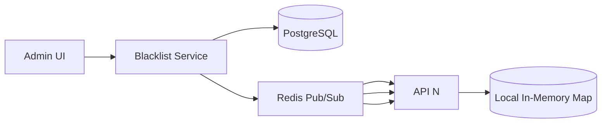

### Blacklist Management System

#### Challenge

Preventing malicious URLs (phishing, malware) with sub-5ms lookup latency at every redirect. The blacklist must be:
- **Fast:** < 5ms per lookup (ideally < 1ms from local cache)
- **Consistent:** updates propagate within seconds
- **Safe:** fail-closed on all component failures
- **Flexible:** support exact match, domain/subdomain patterns, and keywords

#### Solution: In-Memory Lookup with Background Sync

1. **Blacklist Types**:

| Type | Example | Match | Use Case |
| --- | --- | --- | --- |
| Exact Domain | `phishing-site.com` | Exact string equality | Known bad domains |
| Domain Prefix | `*.malware-site.com` | `domain.endswith(prefix)` | Subdomain sweeps |
| Keyword | `free-bitcoins` | `original_url.contains(keyword)` | Content filtering |

2. **Architecture** — Push-based sync to API instances:



- **Why push, not poll:** Polling every 5 seconds wastes network and introduces up-to-5-second stale windows. Pub/Sub gives near-instant propagation (~10ms typical).
- **API instances hold a full copy** of the blacklist (~5-10MB in memory). This is trivial cost for a service already running 512MB+ nodes.

3. **In-Memory Data Structure** (lookup is O(1)):

```python
import re
from dataclasses import dataclass

@dataclass
class BlacklistEntry:
    pattern: str
    match_type: str  # "exact" | "domain_prefix" | "keyword"
    active: bool = True

class Blacklist:
    def __init__(self):
        self.exact_set: set[str] = set()           # exact domain lookup
        self.domain_prefixes: list[str] = []        # sorted for binary search
        self.keyword_patterns: list[tuple[str, re.Pattern]] = []

    def load_from_entries(self, entries: list[BlacklistEntry]):
        self.exact_set.clear()
        self.domain_prefixes.clear()
        self.keyword_patterns.clear()
        for entry in entries:
            if not entry.active:
                continue
            if entry.match_type == "exact":
                self.exact_set.add(entry.pattern.lower())
            elif entry.match_type == "domain_prefix":
                # Strip leading "*." for storage
                prefix = entry.pattern.lstrip("*.").lower()
                self.domain_prefixes.append(prefix)
                self.domain_prefixes.sort()
            elif entry.match_type == "keyword":
                # Pre-compile for speed
                self.keyword_patterns.append(
                    (entry.pattern, re.compile(re.escape(entry.pattern), re.IGNORECASE))
                )

    def is_blocked(self, original_url: str) -> bool:
        from urllib.parse import urlparse
        domain = urlparse(original_url).netloc.lower().split(":")[0]  # strip port

        # 1. Exact domain — fastest, most common
        if domain in self.exact_set:
            return True

        # 2. Domain prefix (e.g., *.evil.com)
        for prefix in self.domain_prefixes:
            # Check: domain ends with ".prefix" or equals prefix (not just substring match)
            if domain == prefix or domain.endswith("." + prefix):
                return True

        # 3. Keyword in full URL
        url_lower = original_url.lower()
        for keyword, _pattern in self.keyword_patterns:
            if keyword in url_lower:
                return True

        return False
```

- **Why not regex on the full URL:** Compiling arbitrary regex per request is slow and enables ReDoS attacks. Pre-compile once at load time (done above). Even better, prefer exact/prefix matching over keyword/regex in the admin UI — require admin justification for regex patterns.
- **No SQL LIKE queries at lookup time:** The entire blacklist lives in memory. Database queries only happen at load time.

4. **Sync Protocol** — Pub/Sub with full reload:

```python
import redis

class BlacklistSync:
    def __init__(self, redis_url: str):
        self.r = redis.Redis.from_url(redis_url)
        self.blacklist = Blacklist()

    def start(self):
        # Subscribe to blacklist update channel
        pubsub = self.r.pubsub()
        pubsub.subscribe("blacklist:update")

        # Initial load from DB
        self._load_from_db()

        for message in pubsub.listen():
            if message["type"] == "message":
                self._load_from_db()  # full reload on any update
                pubsub.close()
                pubsub = self.r.pubsub()
                pubsub.subscribe("blacklist:update")

    def _load_from_db(self):
        # Use parameterized queries — NEVER string interpolation
        entries = self.db.execute(
            "SELECT pattern, match_type FROM blacklist WHERE active = %s",
            (True,)
        )
        blacklist_entries = [
            BlacklistEntry(pattern=e[0], match_type=e[1])
            for e in entries
        ]
        self.blacklist.load_from_entries(blacklist_entries)
```

5. **Admin API** — Create and notify:

```python
# Admin adds a new blacklist entry
@blacklist_service.post("/admin/blacklist")
def add_entry(pattern: str, match_type: str):
    # Parameterized INSERT — no SQL injection risk
    db.execute(
        "INSERT INTO blacklist (pattern, match_type, active) VALUES (%s, %s, %s)",
        (pattern, match_type, True)
    )
    # Publish update event
    redis.publish("blacklist:update", \{"timestamp": time.time()\})
    return \{"status": "updated"\}
```

6. **Fail-Safe Behavior**:
   - **Redis Pub/Sub down:** API instances keep serving their last known-good local cache (stale). This is **fail-open** — inconsistent with the fail-closed policy elsewhere in the design. Supplement with a periodic ETag poll (every 10s) as a consistency backstop; if Pub/Sub is down, ETag polling ensures eventual sync. Do not rely on stale cache indefinitely.
   - **Blacklist Service DB down:** Same as above — serve stale local cache until ETag poll catches up.
   - **Blacklist Service completely unavailable:** The admin UI shows an error; in-flight lookups are unaffected.
   - **Recommendation:** Add a health check endpoint `/health/blacklist` that returns the cache version timestamp. Alert if any instance has a cache older than 2 minutes.

7. **Scale Considerations**:
   - ~10K entries: exact/prefix sets ~1-2MB (simple strings); keyword entries with compiled regex patterns ~50KB each — 1K keyword entries ≈ 50MB. Total worst-case ~60MB per API instance. Negligible on 512MB+ nodes but the 500-byte estimate was too optimistic for regex entries.
   - Loading takes ~10ms (DB scan + Python set insertion)
   - Memory impact is negligible on 512MB+ nodes
   - Lookup is deterministic: 1 set lookup + N domain prefix checks + M keyword checks