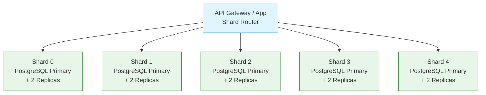

### Database Sharding Strategy

#### Challenge

Storing billions of URL mappings with 10K+ writes/sec and sub-30ms read latency. A single PostgreSQL instance cannot handle the write throughput or storage requirements at scale.

#### Architecture: Horizontal Sharding with Consistent Hashing

The database is horizontally partitioned across multiple independent PostgreSQL instances (shards). Each shard holds the same table schema but stores a disjoint subset of rows based on the `short_code` hash.



#### 1. Sharding Key: `short_code`

- **Deterministic:** Same code → same shard always
- **Uniformly distributed:** FNV-1a hash produces even distribution across the 32-bit space
- **No cross-shard queries needed:** Every lookup targets exactly one shard by design
- **Why not `created_at` or `user_id`:** These create hotspots (recent URLs all on one shard, popular users' URLs all on one shard). The short_code is already uniformly distributed by construction.

#### 2. Sharding Algorithm: Hash-Based

```python
import fnv1a

NUM_SHARDS = 16  # starts at 16, scales as needed

def get_shard(short_code: str, num_shards: int = NUM_SHARDS) -> int:
    hash_value = fnv1a.fnv1a_32(short_code.encode("ascii"))
    return hash_value % num_shards
```

- **Why FNV-1a:** O(1) per byte, excellent avalanche property (1-bit input change → ~50% output bits flip), built into many languages, no crypto overhead needed.
- **Why not base62 decoding:** Base62 decoding of the short_code gives a sequential number, which is deterministic but guessable. FNV-1a adds an extra layer of permutation, making the shard assignment less obvious.
- **Why 16 shards initially:** At 23K RPS, each shard handles ~1.4K QPS. A single PostgreSQL instance handles 5-10K QPS comfortably on moderate hardware. 16 provides headroom for growth and shard failures.

#### 3. Database Schema (identical on every shard)

```sql
CREATE TABLE url_mappings (
    short_code VARCHAR(8) NOT NULL,
    original_url TEXT NOT NULL,
    created_at TIMESTAMPTZ DEFAULT NOW(),
    expires_at TIMESTAMPTZ,
    status VARCHAR(20) DEFAULT 'active',
    metadata JSONB,
    PRIMARY KEY (short_code)
);

-- Filtered index for expiration checks
CREATE INDEX idx_expires_at ON url_mappings(expires_at)
    WHERE expires_at IS NOT NULL AND status = 'active';
```

#### 4. Read Path

```mermaid
flowchart LR
    Client["GET /abc123"] --> Router["Shard Router"]
    Router -->|hash('abc123') % 16| S1["Shard 1 Replica"]
    S1 -->|P95 < 15ms| Router
    Router --> Client
```

1. Compute `shard_id = hash(short_code) % 16`
2. Route to that shard's **read replica** (not primary — saves primary write capacity)
3. Single indexed lookup: `SELECT original_url FROM url_mappings WHERE short_code = $1`
4. No cross-shard queries

**Replication lag caveat:** If a URL was just created (write to primary), a read to the replica may not see it yet due to async replication (typically 10-100ms lag). This means:
- **Freshly created URLs:** First redirect may hit the replica and return 404. The URL will exist in cache (written synchronously during creation) or on the primary.
- **Mitigation:** Route "fresh" lookups (URL created < 1s ago) to the primary. Use a TTL-based flag: when inserting, also write `url:fresh:\{short_code\}` to Redis with TTL=1s. The router checks this flag first and routes to primary if present.

#### 5. Write Path

1. Client `POST /api/shorten`
2. Shard router computes `shard_id = hash(short_code) % 16`
3. Insert to the target shard's **primary**
4. Single-shard write, no distributed transactions

#### 6. Replication and Read Routing

- Each shard: **1 primary + 2 read replicas**
- Read replicas serve redirect lookups (the dominant traffic pattern: 95% reads)
- **Routing reads to replicas:** A connection pooler (PgBouncer in transaction mode) sits in front of each shard and distributes read queries across replicas using a `/health` endpoint.
- **Replication lag:** Async replication at 10-100ms. For URL shorteners this is acceptable because:
  - Stale reads are fine (a redirect to the wrong URL is rare and recoverable — the user just tries again)
  - Freshness window handled by primary routing (see above)

#### 7. Shard Router HA

The shard router is a **stateless function** (hash + modulo) embedded in each API instance. No separate router service is needed.

- **No single point of failure:** Each API instance computes the shard locally. If one instance fails, other instances continue routing correctly.
- **What if the routing table changes (rebalancing)?** See Section 9.

#### 8. Scaling: Adding Shards

When all shards approach capacity (> 80% CPU or disk), add new shards:

1. **Create N new shards** (e.g., go from 16 to 24)
2. **Migrate data:** Move rows from existing shards to new shards using `pgcopydb` or logical replication
3. **Update routing table:** Change `NUM_SHARDS` from 16 to 24
4. **BUT:** Changing modulo base changes the hash → shard mapping for **ALL keys**. This means existing cached data (URL→shard mapping) becomes stale.

**Routing table push invalidation** — how to handle the transition:

```python
class ShardRouter:
    VERSION = 2  # increments on rebalance

    def __init__(self, num_shards, version):
        self.num_shards = num_shards
        self.version = version
        self._version_ttl = {}  # tracks last known version per instance

    def get_shard(self, short_code: str) -> int:
        return fnv1a_32(short_code.encode()) % self.num_shards

    def get_version(self) -> int:
        return self.version
```

When `NUM_SHARDS` changes:
1. **Increment VERSION** (1 → 2)
2. **Push the new version** to all API instances via Redis Pub/Sub (`routing_table:update`)
3. API instances reload the routing config **asynchronously** (not blocking the request path)
4. **Grace period (10s):** During this window, some instances use v1 (old mapping), others use v2 (new mapping). This is **safe** because:
   - The short_code → shard mapping is deterministic
   - The data migration is **complete** before the version push — all rows are already on their target shards
   - Requests using v1 will route to the old shard, which still has the data (migration copies before deleting from source)
5. **After grace period:** Remove old shard(s) that are now empty

**Key insight:** The order matters — migrate data FIRST, then push version. Reversing this causes requests to route to empty shards.

#### 9. Backup Strategy

- Daily `pg_basebackup` to S3 for each shard independently
- WAL archiving for PITR (point-in-time recovery)
- 7-day recovery window per shard
- Test restore quarterly — a backup that can't be restored is worse than no backup

#### 10. Monitoring

- Per-shard: query latency (P50/P95/P99), write throughput, connection pool usage, disk usage
- Replication lag: alert if any replica is > 5s behind primary
- Shard router version drift: alert if any instance has a stale routing table version
- Alert thresholds: CPU > 80%, disk > 90%, replication lag > 5s