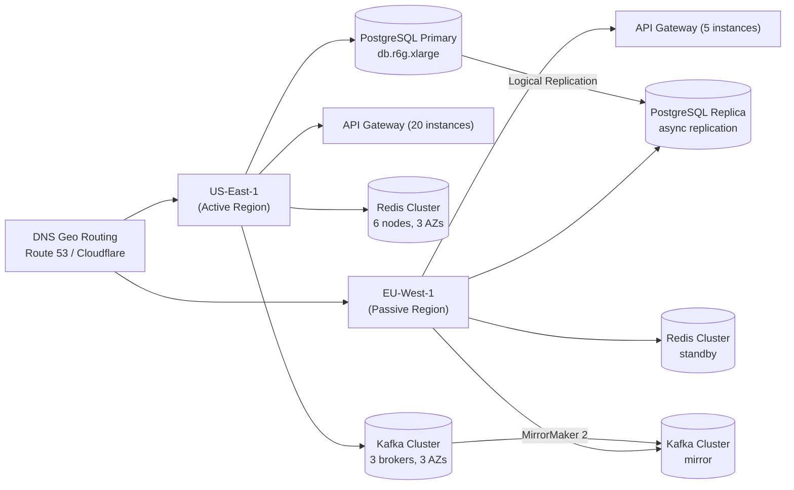
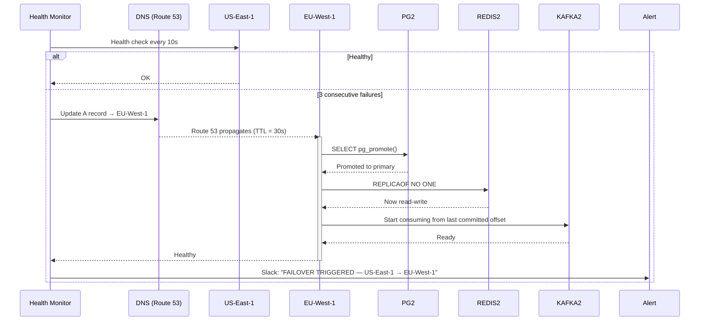

### High Availability and Disaster Recovery

#### Challenge

Achieving 99.99% uptime (~52.6 minutes downtime/year) with global traffic distribution. The system must survive complete region failures (network partition, cloud provider outage) with minimal data loss and service disruption.

#### Solution: Active-Passive Multi-Region

**Architecture decision: Active-Passive, not Active-Active.**

For a URL shortener, active-passive is correct because:
- **Conflict avoidance:** Two regions accepting writes for the same short code would create split-brain conflicts (Feistel-based generation doesn't solve this — both regions generate codes independently, collision probability increases).
- **Lower operational complexity:** Active-active requires conflict resolution, data sync, and consensus protocols. Active-passive is simpler and sufficient for this scale.
- **RPO tradeoff:** Active-passive with async replication means some data loss during failover (seconds of writes), which is acceptable for a URL shortener.

#### 1. Regional Architecture (Active Region)

Each active region operates as a fully independent deployment:
- **API Gateway:** 20 instances behind ALB, auto-scaled
- **Redis:** 6-node cluster (3 AZs, 3 replicas)
- **PostgreSQL:** Single primary, 2 read replicas within region
- **Kafka:** 3 brokers (1 per AZ), replication factor 3

#### 2. Cross-Region Replication

| Component | Mechanism | RPO | RTO | Notes |
| --- | --- | --- | --- | --- |
| PostgreSQL | Logical replication (pg logical / Debezium CDC) | 1-10s | 2-5 min | Reads on passive are stale during active phase; write during failover: some seconds of writes lost |
| Redis | Async replica sync | < 30s | 1-2 min | Passive region redis is not warmed; cold start after promotion |
| Kafka | MirrorMaker 2 (cluster-to-cluster) | ~10s | 5 min | MirrorMaker runs in passive region, pulling from active |
| Blacklist | Local in-memory cache (loaded at startup + ETag poll) | N/A | 10-30s | Passive region loads full blacklist at startup; ETag poll syncs updates every 10s. After failover, passive region may serve stale blacklist for up to one poll cycle (~10s). |

**Important caveats:**
- **PostgreSQL logical replication** does NOT replicate `DROP TABLE` or `TRUNCATE` by default. Schema changes on the primary must be replicated manually to the replica.
- **Redis passive region** is a read-only replica during normal operation. After failover, it must be promoted (`REPLICAOF NO ONE`). Any data written to primary in the RPO window (1-30s) is lost.
- **Kafka MirrorMaker 2** introduces its own lag (~10-30s typical). Analytics dashboards may show a gap during failover.

#### 3. Failover Process

- **Total failover time:** ~2-5 minutes (health check interval 10s + 3 failures = 30s detection + DNS propagation 30s TTL + replication promotion 2-5 min)
- **RPO:** 1-10s for PostgreSQL (logical replication lag), up to 30s for Redis
- **RTO:** 2-5 minutes (not seconds — DNS TTL is the minimum delay)
- **Post-failover:** Engineers restore the failed region as a new passive replica using `pg_basebackup` from the new primary

#### 4. DNS Configuration

- **TTL:** 30 seconds (minimum for most DNS providers). Shorter TTL reduces failover time but increases DNS query volume.
- **Health checks:** Route 53 health checks probe `/health` every 10 seconds. 3 consecutive failures trigger failover.
- **Geo-routing:** During normal operation, EU clients route to EU-West-1 (low latency). During failover, all clients route to EU-West-1 (single active region).

**Why not active-active with geo-routing:**
- Both regions accepting writes → each region has an independent sequential ID counter. Feistel-shuffled outputs from independent counters can overlap across regions (non-deterministic collision). Without a global coordinator, uniqueness cannot be guaranteed across regions.
- Requires conflict resolution (last-write-wins? unique constraint across regions?)
- More operational complexity for marginal benefit (one region failing = the other absorbs all traffic, which is exactly what active-passive does)

#### 5. Client Behavior

- **Retry on 5xx:** Exponential backoff (1s, 2s, 4s), max 3 attempts
- **Timeout:** 5 seconds for redirect, 10 seconds for shorten
- **Connection pooling:** Persistent connections to reduce TLS handshake overhead
- **Graceful degradation:** If the API returns 503, show a "service temporarily unavailable" page (not a raw 503)

#### 6. Disaster Recovery Testing

- **Monthly:** Simulated region failure (disable health checks, verify failover triggers)
- **Quarterly:** Full DR drill — promote passive region, verify data integrity, restore failed region as new passive
- **Chaos engineering:** Randomly kill instances within a region to test replication and failover

#### 7. SLA Reality Check

| Metric | Target | Actual (typical) | Notes |
| --- | --- | --- | --- |
| Uptime (per region) | 99.99% | ~99.95% | Single-region cannot guarantee 99.99% |
| Failover time | < 5 min | 2-5 min | DNS TTL + detection + promotion |
| RPO | < 10s | 1-10s (Postgres), up to 30s (Redis) | Replication lag dependent |
| RTO | < 5 min | 2-5 min | Faster than initial estimate thanks to automated promotion |
