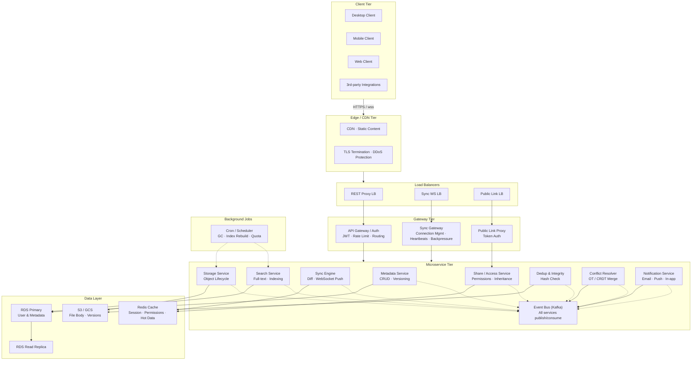

## Architecture Overview

## Service Responsibilities

### Metadata Service
- Central service managing File, FileReference, User records.
- RDS (PostgreSQL) with read replicas.
- Sharding by userId for isolation and horizontal scale — each user's metadata lives on one shard.
- Each user's data is strictly owned — no cross-user joins on File/Meta tables.

### Storage Service
- Wraps cloud object storage (S3 / GCS / MinIO).
- Manages object lifecycle: put, get, delete by ObjectRef (bucket + key).
- Handles encryption at rest (KMS-managed keys).
- Object key format: `\{sha256_prefix\}/\{contentHash\}` (content-addressable; multiple versions across users share the same object).
- **Deduplication:** `DedupCheck(sha256)` before write — if hash exists, reuse existing object. Reference-count each content object; garbage-collect when refcount reaches zero. Shared files' versions all point to the same object, so refcount survives all users.
- **Integrity:** SHA256 verified on upload; content-addressable keys make accidental corruption detectable.

### Sync Engine
- Consumes SyncOperation journal entries.
- Computes diffs between sync checkpoints.
- Manages WebSocket connections to clients for real-time push.
- Handles backpressure — drops idle connections, queues bursty clients.

### Share / Access Service
- Enforces permissions on every request via Permission service.
- Permission cache (Redis) to avoid database lookups per request.
- Public token service for share links — generates unguessable UUIDs.

### Search Service
- Maintains a reverse index of file names + content (for indexed types).
- Elasticsearch cluster with a shared index per data type (e.g., `files_index`, `content_index`), using `userId` as the routing key to ensure all of a user's data lands on the same shard. At 100M users, separate per-tenant indexes are infeasible — a shared index with routing is the standard pattern.
- Content extracted via worker pool (Tika for Office docs, OCR for images/PDFs).

### Dedup & Integrity Service
- Content-addressable storage: compute sha256 before write.
- If hash exists, reuse existing object — no duplicate writes.
- **Reference counting:** Each FileVersion record holds a reference to the content object. On upload, if hash exists, increment refcount; on version delete, decrement. Object is garbage-collected only when refcount reaches zero.
- For shared files, a single content object may have many FileVersion references across different users — refcount ensures the object outlives all of them.

### Conflict Resolver
- For text files: OT (Operational Transformation) or CRDT-based merge.
- For binary files: last-write-wins + conflict copy ("conflicted copy").
- Conflict events published for user notification.

### Notification Service
- Sends emails, push notifications when files are shared or conflicts arise.

## Key Design Decisions

| Decision | Choice | Rationale |
|---|---|---|
| Data isolation | Per-user sharding on userId | No cross-user joins; scales horizontally |
| Sync model | Event journal + client polling / WebSocket | Handles offline-first; strong ordering |
| Versioning | Content-addressable + ref counting | Enables dedup, space savings |
| Storage | Cloud object storage (S3/GCS) | Durability, scale, cost-effective |
| Database | PostgreSQL (RDS) | ACID for metadata; well-understood |
| Cache | Redis | Sessions, permission cache, hot metadata |
| Events | Kafka | Ordered, durable, fan-out for consumers |
