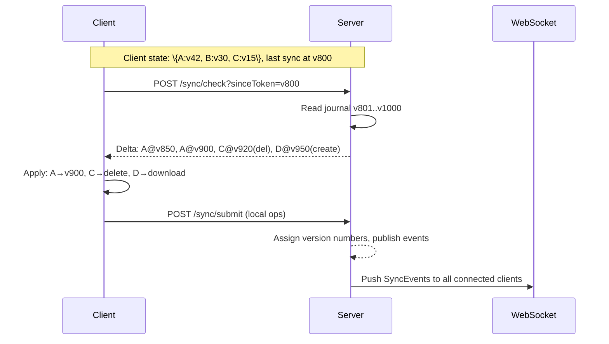
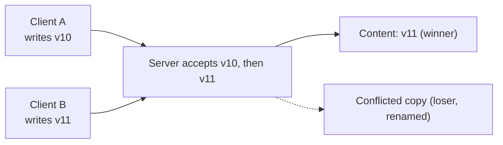

## Change Detection

### Client-side

1. **File system watch** (inotify / FSEvents) triggers on any file change.
2. **Scan-based fallback** runs every N seconds to catch unwatched changes.
3. Each file is fingerprinted by `\{size, mtime\}` for quick comparison.
4. For changed files, **sha256** is computed to detect content-level changes vs metadata-only.

### Server-side

1. Append-only **SyncOperation journal** (stored in RDS, partitioned by userId).
2. Each operation gets a monotonically increasing **version number** (server-assigned).
3. Journal version acts as a **causal clock** — total order on all changes.

## Sync Protocol

1. Client sends `POST /sync/check?sinceToken=v800`.
2. Server reads journal from v801, returns diff as list of `\{fileId, operation, version\}`.
3. Client applies operations, sends back any local ops via `POST /sync/submit`.
4. Server assigns new version numbers, publishes events.
5. For real-time: **WebSocket stream** pushes SyncEvents from server to all connected clients.

## Conflict Resolution Strategies

### Binary files (images, videos, PDFs)

**Last-write-wins + conflict copy:**

1. Two clients write simultaneously to the same binary file.
2. Server accepts both, but the later one wins for the content.
3. The earlier version becomes a "conflicted copy" with suffix `_conflicted_copy`.
4. User sees both files and can merge manually.

### Text files (documents, code)

**Operational Transformation (OT) approach:**

1. Each edit is expressed as an **operation** `\{insert(pos, text)\}`, `\{delete(from, to)\}`, `\{replace(old, new)\}`.
2. Operations are sent to server, which normalizes them (transforms against concurrent ops).
3. Server applies in journal order, broadcasts transformed ops to all connected clients.
4. Clients render the transformed ops locally — all converge to the same state.

**Why OT over CRDTs here?**
- CRDTs (e.g., Yjs, Automerge) work for collaborative doc editors but add complexity.
- For a general cloud storage product, text OT covers 95% of cases with simpler integration.
- Conflict-copy for unresolvable edits avoids data loss.

## Edge Cases

| Scenario | Handling |
|---|---|
| Device offline for days | Full state sync on reconnect — client sends local checkpoint, server returns full diff |
| Same file edited on 3 devices simultaneously | Server serializes via journal; for text files, OT merges all changes; for binary files, last-write-wins with conflict copy |
| File renamed and moved concurrently | Renamed in new location; original path becomes orphan or is resolved by app |
| Delete during active edit | Treated as a conflict — server marks the file deleted, client's pending edit becomes a conflict copy; no silent data loss |
| Network partition between sync engine nodes | Sync engine is stateless; state lives in journal. Any node can resume. |

## Performance Optimizations

1. **Delta compression** — Only send fileIds and operations, not full content.
2. **Batched sync** — Client batches changes (e.g., folder move = N operations, one sync event).
3. **Checkpoint-based full sync** — When journal gap is too large, client falls back to full state snapshot (`GET /sync/state`).
4. **WebSocket multiplexing** — One connection per client, multiple streams per userId.
