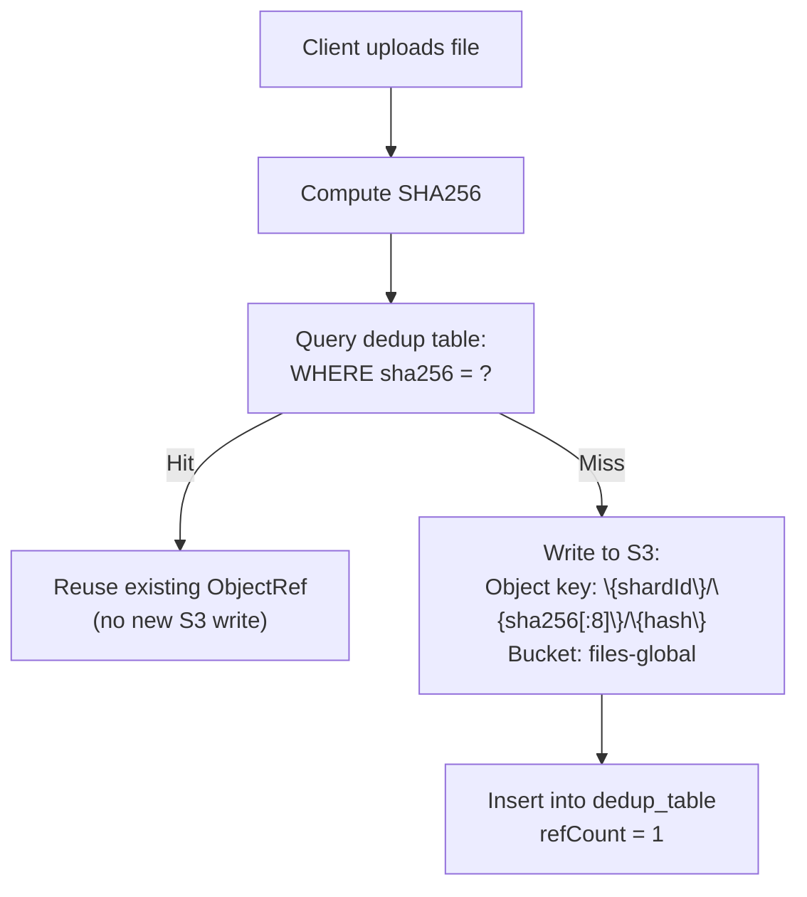
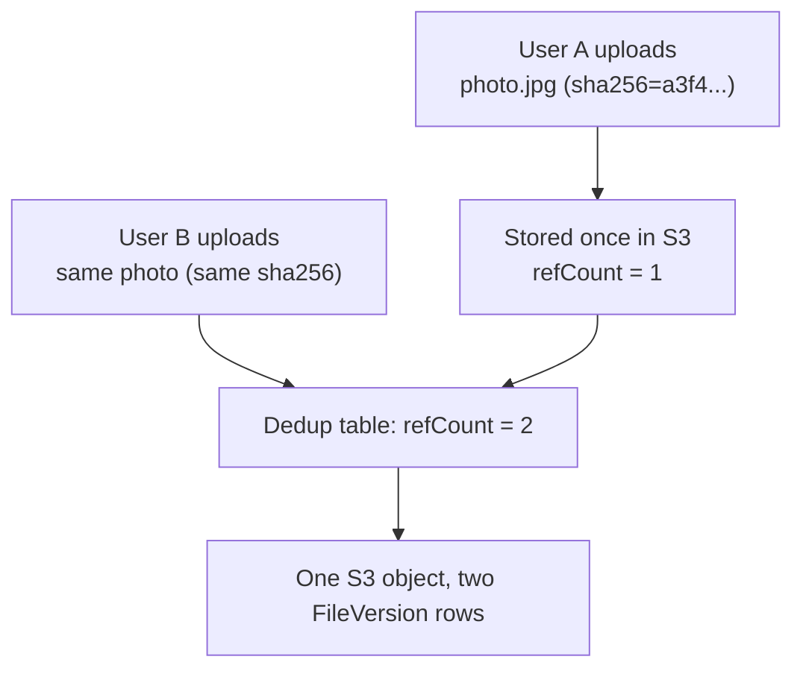
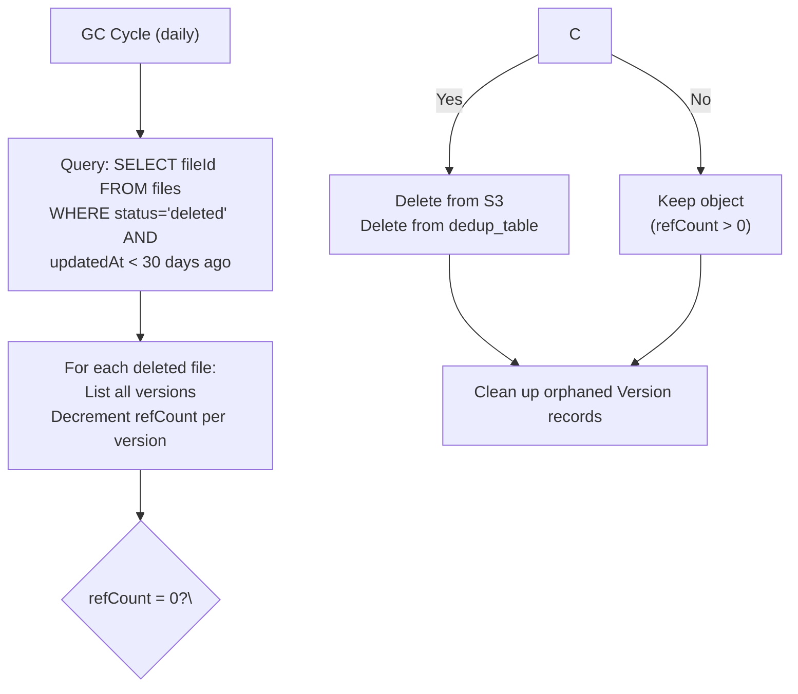

## Content-Addressable Storage

Every file object is identified by its content hash (sha256). Before storing a new file:

## Reference Counting

Multiple users uploading the same content creates references:

Sharing a file grants permission via the Permission table — it does not increment refCount.

### Ref count management

| Event | Action |
|---|---|
| New file upload (unique hash) | Insert into dedup_table, refCount = 1 |
| Duplicate upload (same hash) | Increment refCount, no S3 write |
| Share file | No refCount change — sharing grants permission via Permission table, not a new content reference |
| Delete file (grace period) | Decrement refCount (deferred until GC) |
| GC runs after 30-day grace | Delete from S3 if refCount = 0; remove dedup row |

## Space Savings Estimates

| Scenario | Typical savings |
|---|---|
| Team shares same design assets | 30–60% reduction in stored bytes |
| Multiple devices upload same photo | ~50% for that file (one copy) |
| OS/framework files in dev projects | 70–90% dedup (node_modules, etc.) |
| Unique personal photos/docs | 0% (content differs) |

## Encryption & Dedup

**Problem:** Encrypting file content before hashing prevents dedup (same content → different ciphertext).

**Solutions:**

1. **Server-side encryption (default):** Encrypt with KMS key *after* hashing. Dedup works on plaintext hash.
2. **Client-side encryption (optional):** If user enables it, dedup is disabled for that file. No hash comparison; every upload is a unique write.
3. **Hybrid:** Hash a truncated/normalized version of content (e.g., first 1MB) for approximate dedup even with encryption.

## Garbage Collection

**GC characteristics:**
- Runs as a scheduled cron job (AWS EventBridge + Lambda or Airflow).
- Batched: processes 10K files per batch, respects S3 rate limits.
- Idempotent: safe to re-run; refCount is the source of truth.
- Monitoring: alerts if refCount drops below zero (bug!) or if orphaned objects accumulate.

## Compression

| Type | Strategy | Impact |
|---|---|---|
| In transit | gzip / brotli on API responses | Reduces bandwidth for metadata (JSON) |
| At rest | S3 native compression (optional) | 10–20% space savings for text-heavy content |
| Upload | Client-side compression (images) | Automatic on upload; reduces transfer size |
