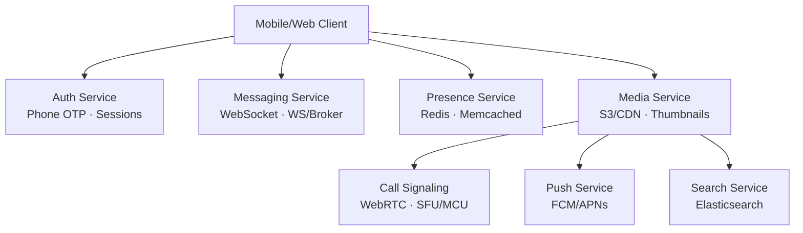

## Client-Side APIs (HTTP/REST)

### Authentication
| Endpoint | Method | Purpose |
|---|---|---|
| `/auth/login` | POST | Login with phone number + OTP |
| `/auth/verify-otp` | POST | Verify OTP, receive session token |
| `/auth/register-device` | POST | Register device, receive push token |
| `/auth/logout` | POST | Invalidate device session |

### Conversations
| Endpoint | Method | Purpose |
|---|---|---|
| `/conversations` | GET | List user's conversations (paginated) |
| `/conversations` | POST | Create a new conversation/group |
| `/conversations/\{id\}` | GET | Get conversation details |
| `/conversations/\{id\}` | PUT | Update group name/avatar |
| `/conversations/\{id\}` | DELETE | Leave/delete conversation |

### Messages
| Endpoint | Method | Purpose |
|---|---|---|
| `/conversations/\{id\}/messages` | POST | Send a message |
| `/conversations/\{id\}/messages` | GET | Fetch message history (cursor pagination) |
| `/messages/\{id\}` | PUT | Edit a message |
| `/messages/\{id\}` | DELETE | Delete a message |

### Media
| Endpoint | Method | Purpose |
|---|---|---|
| `/media/upload` | POST | Upload media, returns media URL |
| `/media/\{id\}` | GET | Download media |

### Search
| Endpoint | Method | Purpose |
|---|---|---|
| `/search` | GET | Search messages within a conversation |

### Users
| Endpoint | Method | Purpose |
|---|---|---|
| `/users/\{id\}` | GET | Get user profile |
| `/users/\{id\}/presence` | GET | Get online/offline status |
| `/users/me` | PUT | Update profile |

## Real-Time Protocol (WebSocket)

### Client -> Server
```json
// Send message
\{"type": "message.send", "data": {"conversation_id": "...", "type": "text", "content": "Hello"\\&#125;&#125; 

// Typing indicator
\{"type": "typing", "data": {"conversation_id": "...", "state": "typing"\\&#125;&#125; 

// Read receipt
\{"type": "ack", "data": {"message_id": "...", "status": "read"\\&#125;&#125; 
```

### Server -> Client
```json
// New message
\{"type": "message.new", "data": {/* Message object */\\&#125;&#125; 

// Status update
\{"type": "message.status", "data": {"message_id": "...", "status": "delivered", "user_id": "..."\\&#125;&#125; 

// Typing indicator
\{"type": "typing", "data": {"user_id": "...", "state": "typing"\\&#125;&#125; 

// Conversation update
\{"type": "conversation.update", "data": {"conversation_id": "...", "updated_at": "..."\\&#125;&#125; 
```

## Call System
- **Signaling**: WebSocket events (`call.invite`, `call.answer`, `call.hangup`, `call.ice`)
- **Media**: WebRTC (P2P for 1-to-1, SFU for group calls)

## Push Notifications
- Triggers when recipient is offline (APNs for iOS, FCM for Android)
- Payload: sender name, message type, preview snippet

## System Service Boundaries


