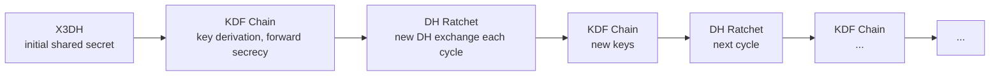

## Problem

Messages must be readable only by sender and recipient — even the service provider cannot decrypt content.

## Approach: Double-Ratchet Algorithm (Signal Protocol)

### Key Exchange (X3DH)
1. When User A messages User B for the first time, A fetches B's public key from server (stored permanently)
2. A performs Extended Triple Diffie-Hellman key exchange with B's keys
3. Result: shared secret known only to A and B (no server involvement)

```mermaid
sequenceDiagram
    participant A as Client A
    participant S as Server
    participant B as Client B

    Note over B: B pre-publishes public keys to server
    A->>S: Fetch B's public keys (stored on server)
    S-->>A: Return B's public keys
    A->>A: Compute X3DH shared secret with B's keys
    A->>S: Send initial E2EE message (encrypted to B's key)
    S->>B: Forward encrypted message
    B->>S: Acknowledge receipt (encrypted)
    S-->>A: Encrypted ack

    Note over A,B: Shared secret established; server never sees plaintext
```

### Ratchet Structure



### Per-Message Key
- Each message gets a unique key via HKDF from ratchet state
- Even if one key is compromised, past/future messages remain secure (forward + future secrecy)

## Storage Implications

| Aspect | E2EE Design |
|---|---|
| **Message content** | Stored encrypted on server; cannot be indexed for search |
| **Media** | Encrypted before upload; keys shared separately |
| **Search** | Only on-device search (client decrypts); server-side search disabled |
| **Multi-device** | Keys must sync across devices; double-ratchet state per peer per device |
| **Message deletion** | Server deletes encrypted blob; client deletes local decrypted copy |

## Group Chat E2EE

- **Key Distribution**: One sender sends individual E2EE keys to each participant via their device keys
- **Optimized**: Use Key Prefix Tree (Double Ratchet with Group Key Tree) for O(log n) per participant
- **Ratchet State**: Each member maintains ratchet state with all other group members

## Trade-offs

| Trade-off | Decision |
|---|---|
| Searchability | No server-side search; only client-side |
| Multi-device complexity | Key sync adds latency and state management |
| Deleted messages | Server can delete, but recipient's device may still have plaintext |
| Metadata exposure | Message content hidden; timestamps, senders, recipients still visible |
| Key recovery | No central backup; losing all devices = losing messages |
