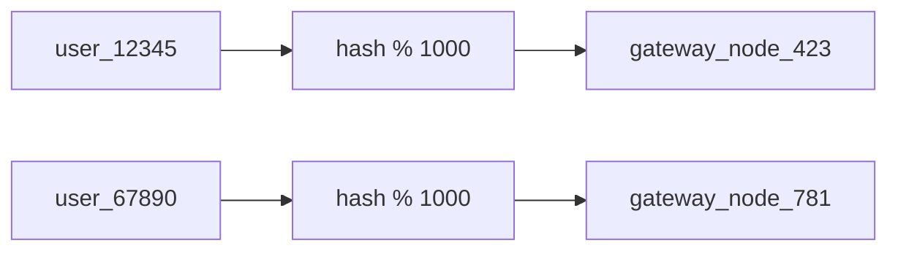
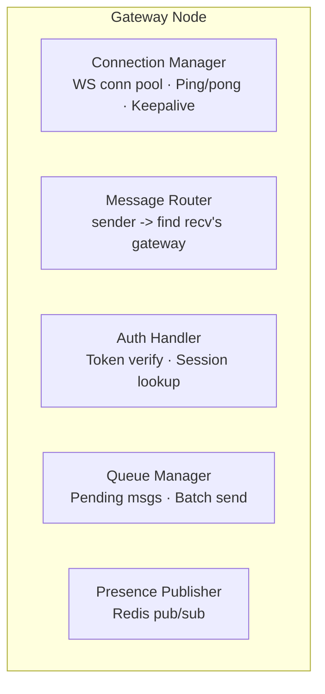
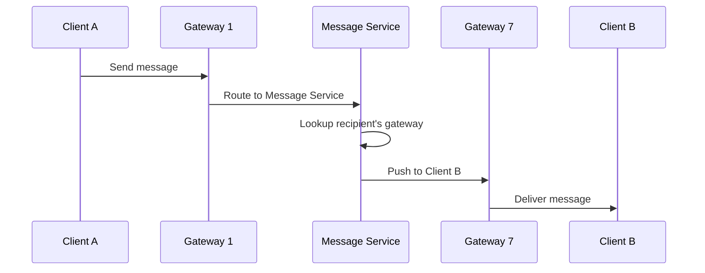
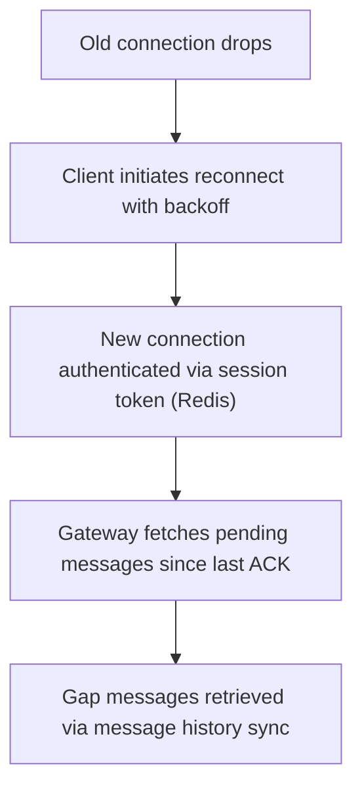

## Problem

Gateway must handle hundreds of millions of persistent WebSocket connections with sub-second message delivery, across global regions, with graceful degradation on network instability.

## Architecture

### Connection Routing: Hash-Based Sharding

Each gateway node is responsible for a fixed range of user_ids (by hash mod N, where N = gateway pool size).

### Gateway Node Responsibilities

### Message Routing Flow

### Heartbeat & Recovery
| Mechanism | Detail |
|---|---|
| **Ping/pong** | Server pings every 30s; client responds within 10s |
| **Backoff** | Exponential backoff on reconnect (1s, 2s, 4s, ..., 60s cap) |
| **Stateless sessions** | Session stored in Redis; any gateway node can resume |
| **Message queue** | Pending messages queued per user; delivered on reconnect |

### Scaling the Gateway Pool

When adding gateway nodes:
1. Add new node to pool
2. Update hash ring: `hash(user_id) % (N+1)`
3. Users whose range changes reconnect to new node on next heartbeat
4. During transition, both old and new gateway route to Message Service

### Handling Network Instability (Mobile)

### Capacity Planning

| Metric | Target |
|---|---|
| Concurrent connections per node | 500K - 1M |
| Messages per second per node | 50K - 100K |
| Memory per connection | ~2KB (buffer, state) |
| Node memory needed (1M conns) | ~2GB |

**Mitigation**: Use connection-aware deployment (users in same region to same node pool) to reduce cross-region latency.
