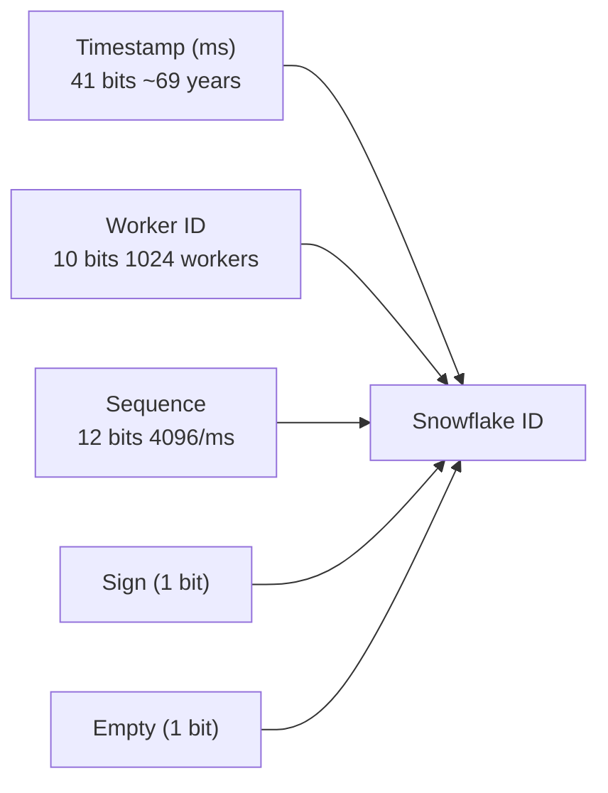
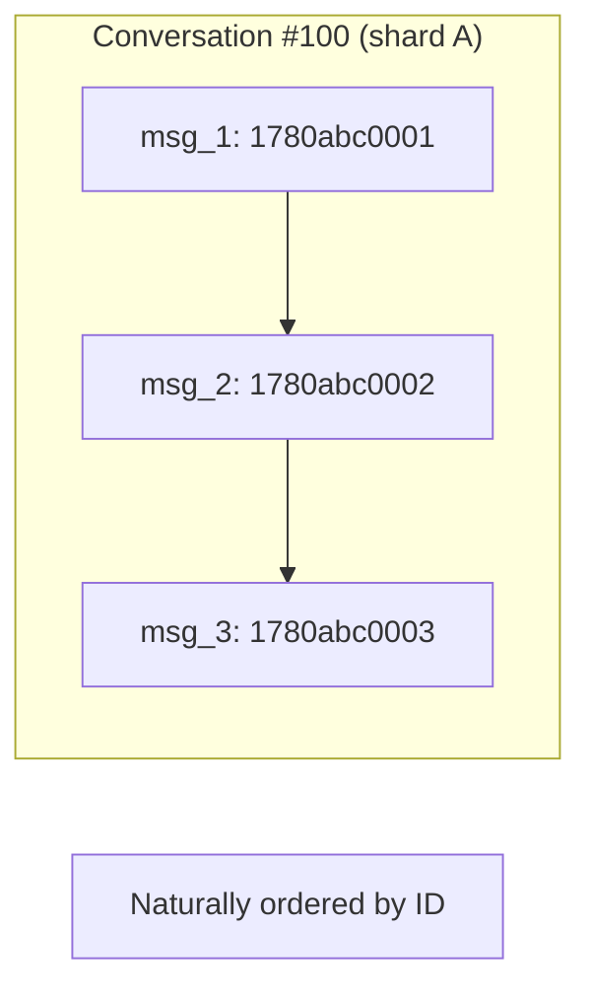
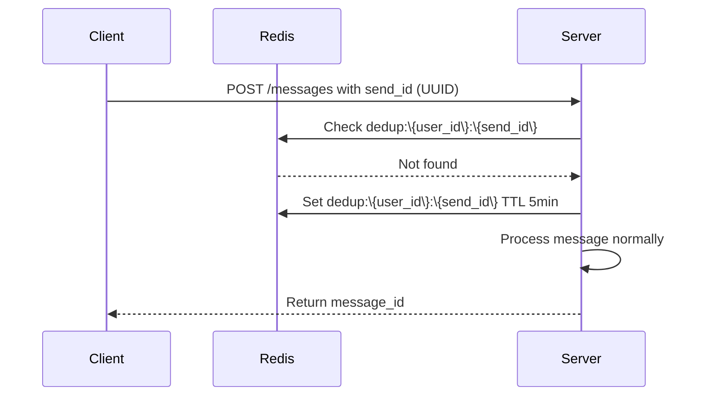
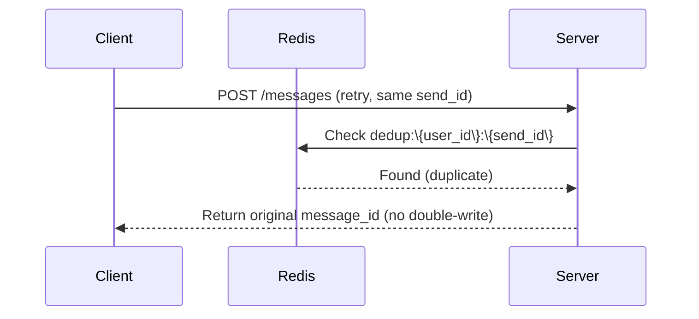
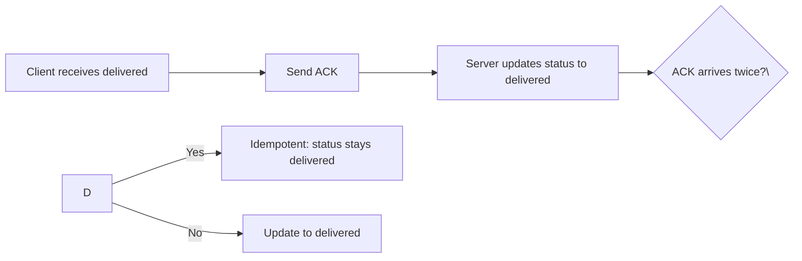

## Problem

Messages within a conversation must arrive in the correct order. Network retries and client crashes can cause duplicate messages. Both ordering and deduplication must work across distributed, sharded infrastructure.

## Message ID: Snowflake / ULID

### Snowflake Format (64-bit)

- **Timestamp**: Current time in milliseconds (41 bits = ~69 years)
- **Worker ID**: Message Service shard/instance ID (10 bits = 1024 workers)
- **Sequence**: Monotonic counter per worker per millisecond (12 bits = 4096 msgs/ms)

**Property**: IDs are globally unique and monotonically increasing by send time.

### ULID Alternative
- 48-bit timestamp (milliseconds) + 80-bit random
- Not guaranteed monotonic by sender (random component), but sortable by time prefix

## Ordering Guarantee

### Within a Conversation
All messages in one conversation are stored on the same DB shard (sharded by conversation_id). The Message Service assigns IDs sequentially within the shard.

### Cross-Conversation
No ordering needed between conversations. Each conversation has independent ordering.

### Client-Side Ordering
- Client receives messages via WebSocket in ID order (guaranteed by server)
- If out-of-order delivery occurs (rare, due to network), client sorts by message ID before rendering

## Deduplication

### Idempotent Message Send

On retry with same send_id:

### Delivery ACK Handling

## Edge Cases

| Scenario | Handling |
|---|---|
| Worker restart (sequence reset) | Sequence resets to 0; timestamp advances, so ID still unique |
| Clock skew | Use monotonic clock; if skew detected, increment sequence instead |
| High throughput (>4096 msgs/ms per worker) | Overflow: use next millisecond, increment sequence to 0 |
| Cross-worker ordering | Same conversation on same shard = same worker, so no cross-worker ordering needed |
| Client crash mid-send | send_id dedup handles retries; DB unique constraints prevent double-insert |
