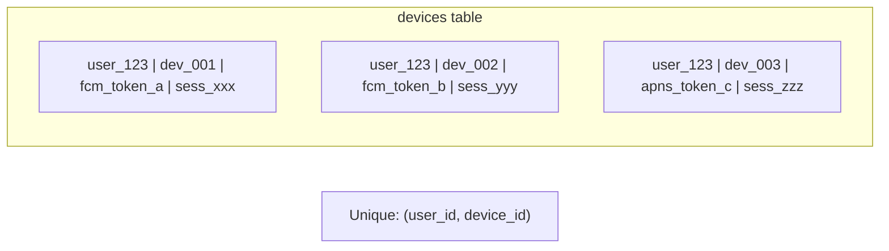
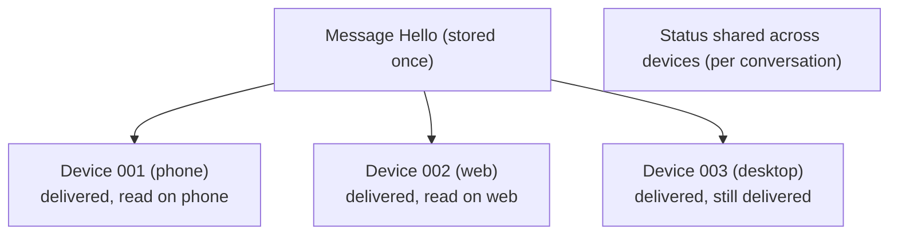
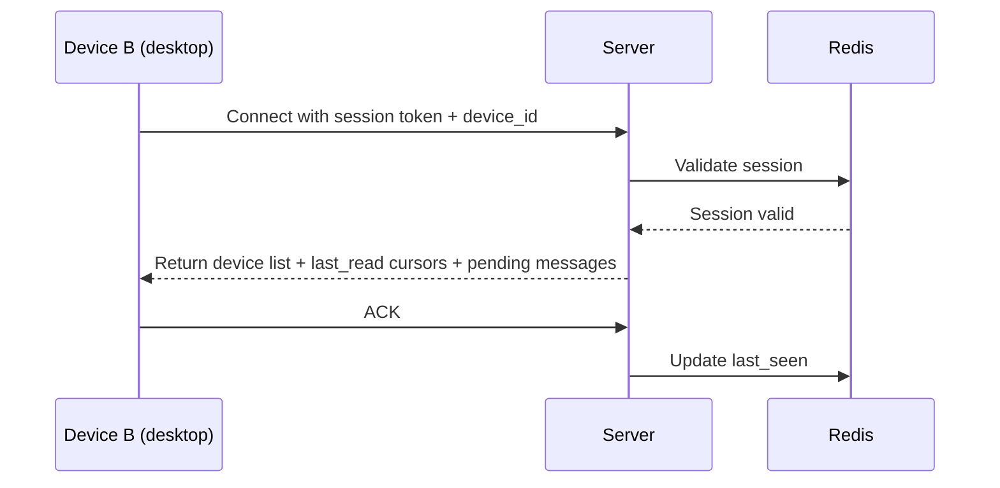
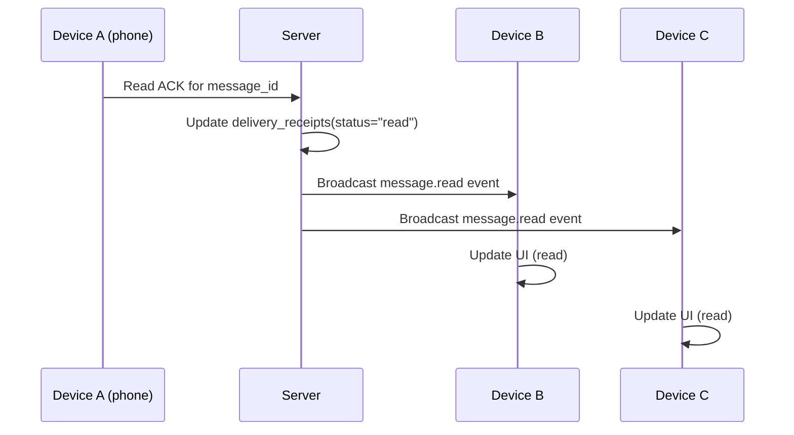
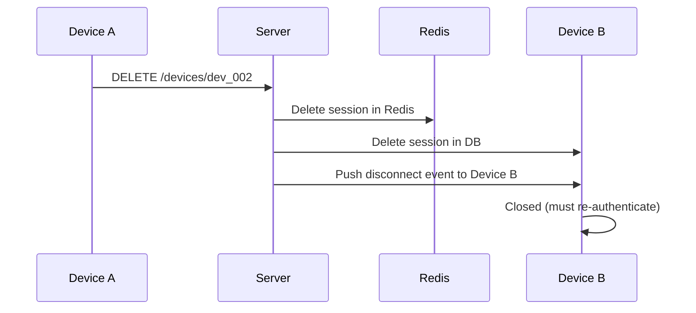

## Problem

A single user may be logged in on multiple devices (phone, tablet, desktop, web). All devices must see the same messages, conversation state (last read, typing), and user preferences with eventual consistency.

## Device Registration

### Device Registration

## Message Delivery Model

## Sync Protocol

### On Device Connect

### Cross-Device Status Sync

## Key Challenges

### Device List Management
- User sees list of active devices
- Can revoke any device remotely (invalidate session in Redis + DB)
- Revoked device gets disconnected immediately

### Timestamp Consistency

Problem: Different devices may send messages with different local timestamps.

Solution:
- Server assigns canonical timestamp on write (always)
- Client uses server timestamp for display and ordering
- Client-local timestamps only used for draft/pre-send state

### Offline Device Handling

| Scenario | Behavior |
|---|---|
| Device offline, user reads on another device | Push notification triggers device to sync |
| Device offline, new message sent | Push notification with preview; device fetches full message on connect |
| Device long-inactive (>30 days) | Mark as stale; may be removed from active device list |

## Security Implications

- Each device has independent session token
- Revoking one device doesn't affect others
- New device registration may require re-verification (SMS/OTP)
- All devices share E2EE key material (per-device ratchet chains)
