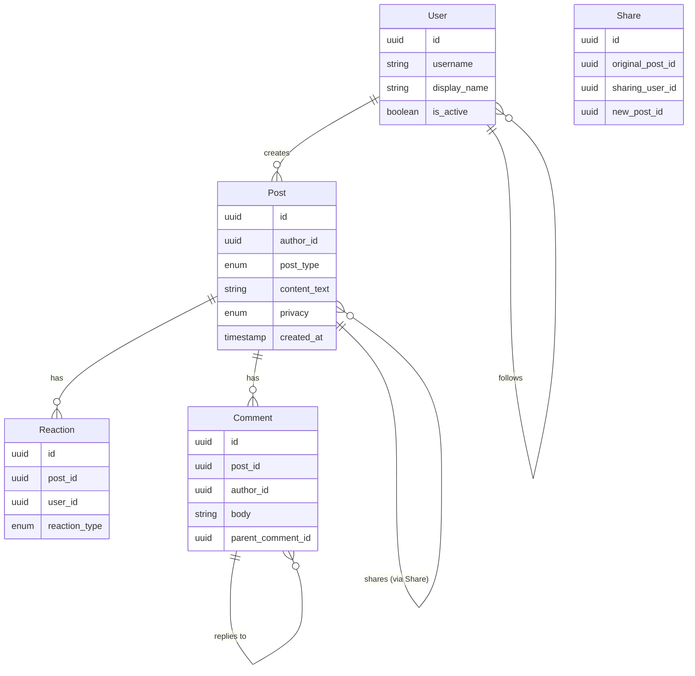

## Entity Definitions

### Post

| Field | Type | Notes |
| --- | --- | --- |
| id | UUID | Primary key, globally unique |
| author_id | UUID (FK→User) | Who created the post |
| post_type | enum | `text`, `photo`, `video`, `link`, `reaction`, `story`, `event` |
| content_text | string (nullable) | Caption/body, up to 63,206 chars |
| media_urls | JSON array (nullable) | CDN URLs for attached media |
| link_url | string (nullable) | For link posts, the shared URL |
| created_at | timestamp | When the post was published |
| updated_at | timestamp (nullable) | Nullable, for post edits |
| privacy | enum | `public`, `friends`, `self`, `custom` |
| location_id | UUID (nullable) | Geo-tag if provided |
| is_deleted | boolean | Soft delete flag |

### Reaction

| Field | Type | Notes |
| --- | --- | --- |
| id | UUID | Primary key |
| post_id | UUID (FK→Post) | The post being reacted to |
| user_id | UUID (FK→User) | The user who reacted |
| reaction_type | enum | `like`, `love`, `haha`, `wow`, `sad`, `angry`, `care` |
| created_at | timestamp | Reaction timestamp |

### Comment

| Field | Type | Notes |
| --- | --- | --- |
| id | UUID | Primary key |
| post_id | UUID (FK→Post) | The post being commented on |
| author_id | UUID (FK→User) | Who wrote the comment |
| parent_comment_id | UUID (nullable) | Nullable, enables threaded replies |
| body | string | Comment text |
| created_at | timestamp | |

### Share

| Field | Type | Notes |
| --- | --- | --- |
| id | UUID | Primary key |
| original_post_id | UUID (FK→Post) | The post being shared |
| sharing_user_id | UUID (FK→User) | Who shared it |
| new_post_id | UUID (FK→Post, nullable) | If the share created a new post entry |
| created_at | timestamp | |

### User

| Field | Type | Notes |
| --- | --- | --- |
| id | UUID | Primary key |
| username | string | Unique identifier |
| display_name | string | Optional, shown on feed |
| is_active | boolean | For stale-account detection |

### Follow Graph

| Field | Type | Notes |
| --- | --- | --- |
| follower_id | UUID (FK→User) | Who is following |
| followee_id | UUID (FK→User) | Who is being followed |
| follow_type | enum | `friend`, `follower`, `page`, `group` |
| created_at | timestamp | |
| is_snoozed | boolean | If snoozed, exclude from feed |
| snooze_until | timestamp (nullable) | When snooze expires |

## Feed Render Snapshot

A feed render is not a persisted entity — it's a transient ranked list. But for analytics and A/B testing, we log a snapshot:

| Field | Type | Notes |
| --- | --- | --- |
| render_id | UUID | Primary key |
| user_id | UUID | The viewer |
| cursor | string | Pagination cursor (last post ID) |
| post_ids | UUID[] | Ordered list of post IDs in the feed page |
| render_type | enum | `relevant`, `recent`, `reels`, `groups` |
| created_at | timestamp | When the render was created |

## Relationships

