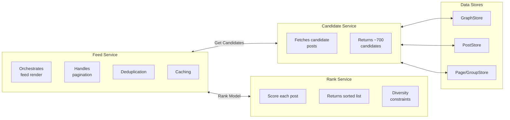

## REST API — Feed Read

### Home Feed (Ranking Mode)

```
GET /api/v1/feed/home?order=ranking&limit=20&cursor=
```

**Response**:

```json
{
  "posts": [
    {
      "post_id": "post_123",
      "author": \{ "id": "user_456", "name": "Jane Doe" \},
      "type": "photo",
      "content_text": "Beautiful sunset!",
      "media_urls": ["https://cdn.example.com/img_789.jpg"],
      "created_at": "2026-05-02T14:30:00Z",
      "reactions": \{ "like": 42, "love": 8, "total": 50 \},
      "comments_count": 12,
      "shares_count": 3,
      "score": 0.94
    }
  ],
  "cursor": "post_123",
  "has_more": true
}
```

### Most Recent (Chronological Mode)

```
GET /api/v1/feed/home?order=recent&limit=20&cursor=
```

Returns posts sorted by `created_at` descending, bypassing the ranking model. Used for the "Most Recent" toggle.

## REST API — Feed Write (Publishing)

### Create Post

```
POST /api/v1/feed/post
Content-Type: application/json

{
  "post_type": "photo",
  "content_text": "Hello world",
  "media_urls": ["https://cdn.example.com/img_789.jpg"],
  "privacy": "friends",
  "location_id": "loc_100"
}
```

### Reaction

```
POST /api/v1/feed/post/\{post_id\}/reaction
{
  "reaction_type": "love"
}
```

- Idempotent: same user posting same reaction is a no-op.
- Changing reaction type is a `POST` with the new type (not `PUT`).
- Removing reaction: `DELETE /api/v1/feed/post/\{post_id\}/reaction/\{user_id\}`

### Comment

```
POST /api/v1/feed/post/\{post_id\}/comment
{
  "body": "Nice photo!",
  "parent_comment_id": "comment_abc"  // nullable for replies
}
```

## REST API — Feed Controls

### Unfollow / Snooze

```
PUT /api/v1/feed/settings/unfollow/\{user_id\}
PUT /api/v1/feed/settings/snooze/\{user_id\}?duration=30d
```

## Internal Service Interfaces



### RankService

```
rank(candidates: Post[], user_id: string): RankedPost[]
```

1. Extract features for each candidate post.
2. Score using ML model (binary classification: P(engage)).
3. Apply diversity constraints (max 2 per author, max 30% video).
4. Sort by score descending.
5. Return top 30.

### CandidateService

```
get_candidates(user_id: string): Post[]  // ~700 candidates
```

Sources:
1. Friends' recent posts (last 14 days)
2. Page posts (last 7 days)
3. Group posts (last 7 days)
4. Suggested content (from new sources the user engages with)

### GraphService

```
get_follower_graph(user_id: string): \{ friends: [], pages: [], groups: [] \}
```

### RankService

```
rank(candidates: Post[], user_id: string): RankedPost[]
```

1. Extract features for each candidate post.
2. Score using ML model (binary classification: P(engage)).
3. Apply diversity constraints (max 2 per author, max 30% video).
4. Sort by score descending.
5. Return top 30.

### CandidateService

```
get_candidates(user_id: string): Post[]  // ~700 candidates
```

Sources:
1. Friends' recent posts (last 14 days)
2. Page posts (last 7 days)
3. Group posts (last 7 days)
4. Suggested content (from new sources the user engages with)

### GraphService

```
get_follower_graph(user_id: string): \{ friends: [], pages: [], groups: [] \}
```
