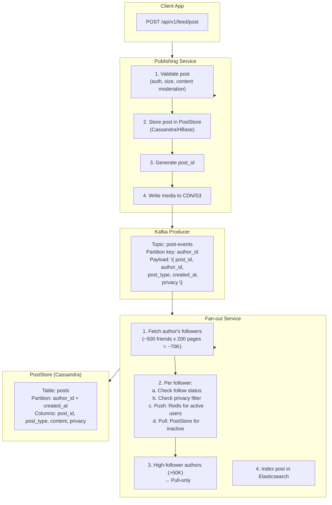
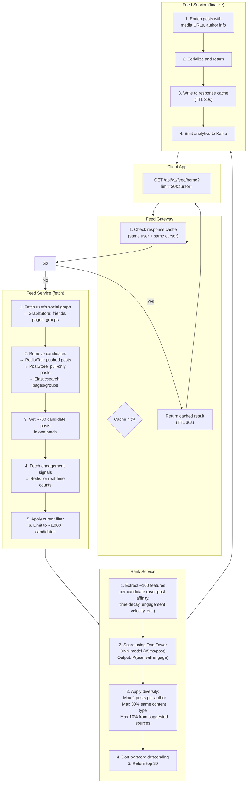
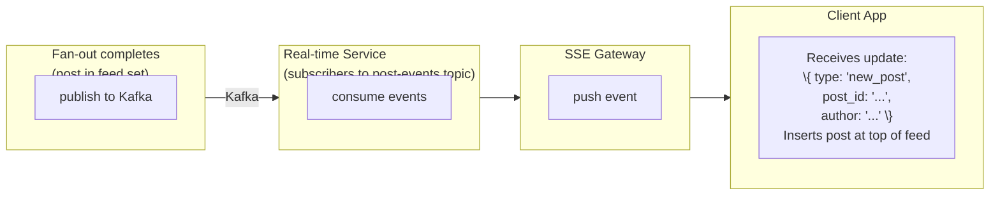
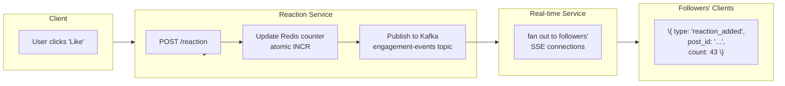

## Write Path

When a user publishes a post, the system must make it visible to followers' feeds within seconds.

### Push vs. Pull Decision

The system uses a **hybrid fan-out** strategy:

| Author Follower Count | Strategy | Why |
| --- | --- | --- |
| < 500 | **Push** | Cheap to fan out eagerly |
| 500–5,000 | **Mixed** | Push to close friends, pull for pages |
| 5,000–50,000 | **Mixed** | Push only to very close connections |
| > 50,000 | **Pull-only** | Too expensive to push; fans out on read |

This reduces fan-out writes by ~60% because the top 1% of authors account for ~40% of all posts but have ~80% of all followers.

## Read Path

When a user opens the app and requests their feed.

### Feature Categories for Ranking

| Category | Example Features |
| --- | --- |
| User affinity | How often does this user engage with this author's content? |
| Post type preference | Does this user prefer photos/videos over text? |
| Relationship strength | How frequently does this user interact with this author? |
| Time decay | How old is the post? (exponential decay with time) |
| Engagement velocity | How many reactions in the first hour? |
| Content diversity | How many posts from the same author already in feed? |
| Author reach | How many total followers does this author have? |
| Content freshness | How recently was the post published? |

## Real-time Update Path

New posts and engagement updates must reach followers within seconds.

### Engagement Updates

When a reaction, comment, or share occurs:

The system uses **SSE (Server-Sent Events)** for feed updates because:
- Simpler than WebSocket (HTTP-based, easier to proxy/load-balance)
- Automatic reconnection on disconnect
- One-directional (server → client is all we need)
- Compatible with existing HTTP infrastructure
