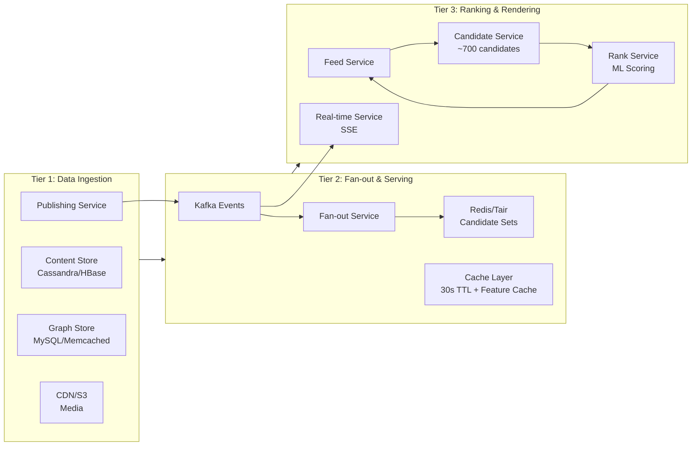
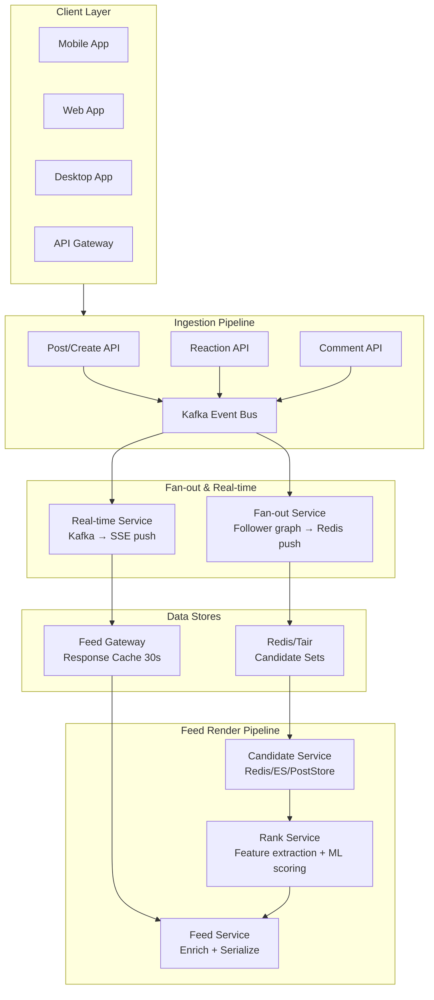

## Architecture Overview

The Facebook News Feed system follows a **rank-then-return** architecture with a hybrid push-pull fan-out model.

**Three-tier design:**

**Key design decisions:**

1. **Ranking at render time, not pre-computation**: We cannot pre-compute feeds for 1B+ users because each user has unique preferences. Instead, we generate the feed on-demand by ranking candidates in real-time.

2. **Hybrid push-pull fan-out**: For authors with &lt;500 followers, push the post to followers' Redis sets eagerly. For authors with >50K followers, use pull-only — candidates are discovered during ranking. This handles the long tail of follower counts gracefully.

3. **Candidate pool reduction**: We don't rank all posts. We narrow to ~700 candidates per render using heuristics (recency, affinity, relationship strength) before scoring. This reduces ranking cost from billions to hundreds per request.

4. **Response caching**: Since feeds change slowly for inactive users, we cache responses for 30 seconds. Hot users (scrolling actively) bypass the cache.

## Component Diagram

## Technology Choices

| Component | Choice | Why |
| --- | --- | --- |
| **Post Store** | Cassandra (HBase) | Write-heavy, large-scale, eventually consistent. Linear scaling for billions of posts. |
| **Graph Store** | MySQL (read replicas) + Memcached | Relational integrity for friend graph. Read caching for 500:1 ratio. |
| **Candidate Sets** | Redis (Tair) | In-memory for sub-ms reads during feed generation. Set operations for dedup. |
| **Response Cache** | Redis + Memcached | Same-user + same-cursor cache. 30s TTL reduces redundant renders. |
| **ML Serving** | Ray / TensorFlow Serving | Low-latency prediction (&lt;5ms per candidate). Supports batch scoring. |
| **Message Queue** | Apache Kafka | Durable, ordered event stream for fan-out and real-time updates. |
| **Real-time** | SSE (Server-Sent Events) | Simpler than WebSocket, HTTP-based, auto-reconnect, compatible with CDN. |
| **Search** | Elasticsearch | Full-text search across posts, comments. Index for page/group discovery. |
| **Media** | S3 + CDN (CloudFront/Fastly) | S3 for storage, CDN for edge delivery. Critical for photo/video performance. |
| **Serving Layer** | Go / C++ | Low-latency, high-throughput. C++ for ranking (critical path), Go for orchestration. |
