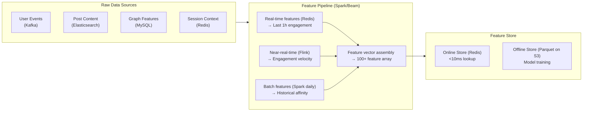

## Feature Extraction Pipeline

A feature extraction pipeline transforms raw user behavior, post content, and social graph data into numerical features that the ML model uses for scoring.

**Feature Categories (100+ total):**

| Category | Features | Example |
| --- | --- | --- |
| **User-Post Affinity** | Historical engagement rate, time since last engagement | `engagements_with_author / total_posts_by_author` |
| **Author Relationship Strength** | Interaction frequency, recency, reaction depth | `comments_with_friend_in_last_7d`, `reactions_with_friend_30d` |
| **Post-Type Preference** | User preference for photo/video/link/text | `photo_engagement_rate / avg_engagement_rate` |
| **Engagement Velocity** | Likes/comments/shares in first hour | `likes_per_hour`, `comment_velocity_slope` |
| **Time Decay** | Exponential decay based on post age | `exp(-lambda * hours_since_posted)` |
| **Content Quality** | Click-through rate, dwell time, negative feedback | `ctr`, `scroll_past_velocity`, `hide_rate` |
| **Author Popularity** | Follower count, post frequency, engagement avg | `log(author_follower_count)`, `posts_per_day` |
| **Social Proof** | Number of friends who engaged | `friends_who_liked_count`, `friends_commented` |
| **Session Context** | Time of day, device, session length | `hour_of_day`, `is_mobile`, `session_post_index` |

**Extraction Pipeline:**

**Why hybrid real-time/batch:** Real-time features (engagement velocity) capture recency. Batch features (long-term affinity) capture stable preferences. The model benefits from both signals.

## ML Model Architecture

The ranking model is a two-stage pipeline: a lightweight **Candidate Generator** narrows ~700 candidates to ~200, then a **Scorer Model** ranks the 200 and selects top 30.

**Stage 1 — Candidate Generator (Lightweight):**
- Model: Logistic Regression with feature crosses
- Latency: < 1ms per post
- Purpose: Quick filter to remove clearly irrelevant posts
- Features: Recency, author relationship, post type match

**Stage 2 — Scorer Model (Deep Learning):**

Architecture: Two-Tower DNN

```mermaid
flowchart LR
    subgraph UserTower["User Tower"]
        direction TB
        UE["User ID Embedding"]
        SF["Session Features"]
        HE["Historical Engagement"]
        DT["Device / Time"]
        DL1["Dense Layers\n512 → 256 → 128"]
        UV["User Vector (128-d)"]
        UE --> DL1 --> UV
        SF --> DL1
        HE --> DL1
        DT --> DL1
    end

    subgraph Match["Match Layer"]
        DOT["Dot Product\nUser × Post Vector"]
    end

    subgraph PostTower["Post Tower"]
        direction TB
        AE["Author Embedding"]
        PTE["Post Type Embedding"]
        CE["Content Embedding"]
        EV["Engagement Velocity"]
        SP["Social Proof"]
        DL2["Dense Layers\n512 → 256 → 128"]
        PV["Post Vector (128-d)"]
        AE --> DL2 --> PV
        PTE --> DL2
        CE --> DL2
        EV --> DL2
        SP --> DL2
    end

    UV --> DOT
    PV --> DOT
```

**Training:**
- Objective: Binary classification — P(user clicks on post, reacts, comments, or shares)
- Loss: Weighted cross-entropy (weighted by engagement value: share > comment > like > click)
- Data: Negative sampling — show posts the user ignored, contrasted with engaged posts
- Refresh: Model retrained weekly, deployed via blue-green with canary rollout

**Why DNN over tree-based models:**
- Embeddings capture non-linear relationships between users and authors
- Better at handling sparse, high-dimensional features (millions of user IDs, author IDs)
- Can incorporate content embeddings (image features, text embeddings from NLP models)
- Transferable across product lines (same architecture works for Instagram, WhatsApp Channels)

## Feature Store

A feature store serves as the single source of truth for all features used in ranking.

**Online Store (Redis for &lt;10ms):**
- Stores per-user, per-author feature vectors
- Key: `user:\{id\}:features:post:\{id\}` → `\{feature1: 0.5, feature2: 3, ...\}`
- TTL: 1 hour (features evolve as users interact)
- Hot partition handling: Redis Cluster sharded by user_id

**Offline Store (Parquet on S3):**
- Historical feature snapshots for model training
- Daily rollups (Spark jobs)
- Used for backtesting new model versions

**Feature Consistency:**
- Same computation graph for online (real-time) and offline (batch) to avoid training/serving skew
- Flink for real-time feature computation, Spark for batch — both read from the same feature definitions
