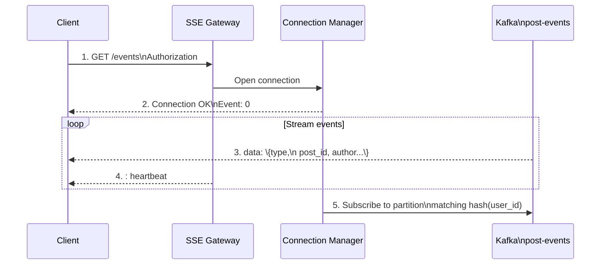
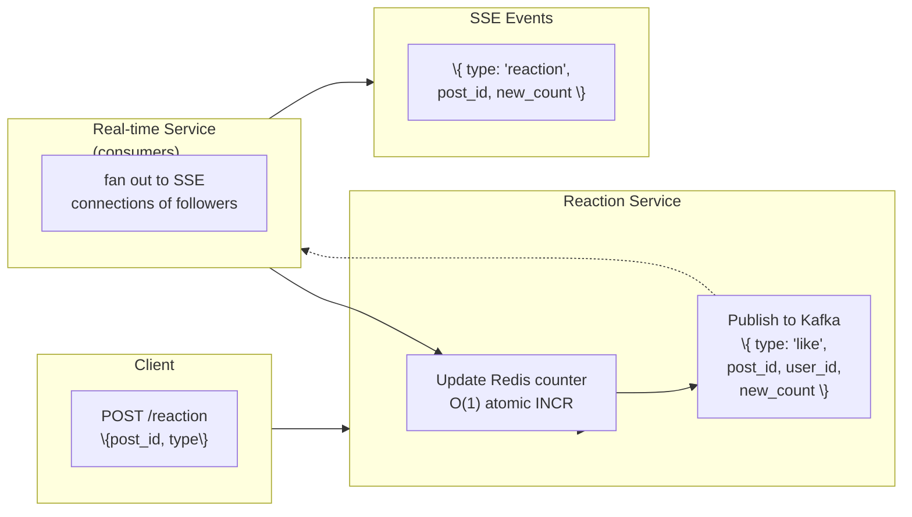

## SSE Architecture

We use **Server-Sent Events (SSE)** instead of WebSocket for feed updates because:
- Simpler than WebSocket (HTTP-based, works through any proxy)
- Automatic reconnection with last-event-id
- One-directional (server → client is all we need)
- Compatible with existing load balancers and CDN edge

**Connection lifecycle:**

**Scaling the SSE Gateway:**

The bottleneck is connection count, not message processing. Each SSE connection uses ~1MB of memory (buffers, TCP buffers).

- **1B users x ~50% concurrent = 500M connections** → 500 GB memory
- Solution: **Sticky sessions via consistent hashing**
  - Hash(user_id) % num_gates → gateway affinity
  - 64 gateway instances in production, each handling ~8M connections
  - Connection state (last_event_id, subscriptions) stored in Redis for failover

**Reconnection handling:**
- Client sends `Last-Event-ID` header on reconnect
- Gateway replays missed events from Redis stream (TTL 60s)
- If gap > 60s, client does full feed refresh (no delta)

## Engagement Broadcasting

When a user likes, comments on, or shares a post, the change must reach all followers' feeds within seconds.

**Flow for a "Like" event:**

**Optimizations:**
- **Batch reactions:** If 5 people like the same post within 500ms, broadcast one aggregated event instead of 5
- **Suppress self-updates:** Don't broadcast to the user who triggered the event
- **Throttle high-engagement posts:** For posts with >10K reactions/min, sample at 10% (user can see count via polling anyway)

**Comment and share flows** follow the same pattern but with a difference:
- Comments generate a full comment object in the event (short, &lt;500 bytes)
- Shares create a new Post entry + push to sharer's followers' feeds

## Conflict Resolution

Two conflict scenarios arise in real-time feed updates:

**Scenario 1: Race condition between cache and SSE**

The user's feed is cached (30s TTL). An SSE event arrives for a post that should be in the feed, but the cache hasn't expired yet.

**Solution:** On SSE event reception, check if the event post ID matches the cached feed. If yes, **do not invalidate** the cache (the post will appear on next render). If the event represents a significant engagement change (e.g., count doubles), update the count in the cache via a targeted key update.

**Scenario 2: Duplicate SSE events on reconnect**

The client reconnects and replays `Last-Event-ID`. Some events may have already been processed but the ACK didn't reach the server.

**Solution:** Client-side deduplication via `Set<post_id>`. Events with already-seen `post_id` are silently dropped.

**Scenario 3: Stale follower graph during fan-out**

The fan-out service writes to a user's feed set, but the user unfollowed the author 2 seconds ago. The post appears in the feed despite the unfollow.

**Solution:** Soft delete + periodic cleanup. The unfollow marks the post as "hidden" in a separate Redis set (`feed_hidden:\{user_id\}`). During feed render, the Feed Service checks `SISMEMBER feed_hidden:\{user_id\} \{post_id\}` and filters out any matches. A background job purges hidden posts after 24 hours.
