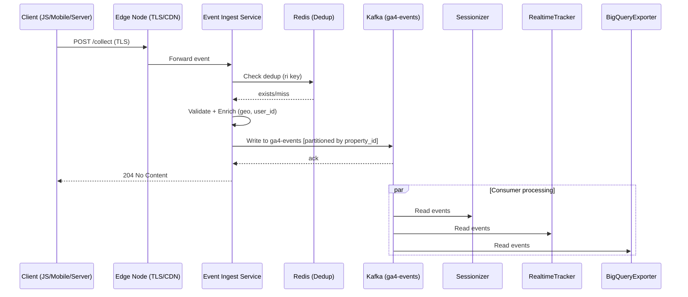
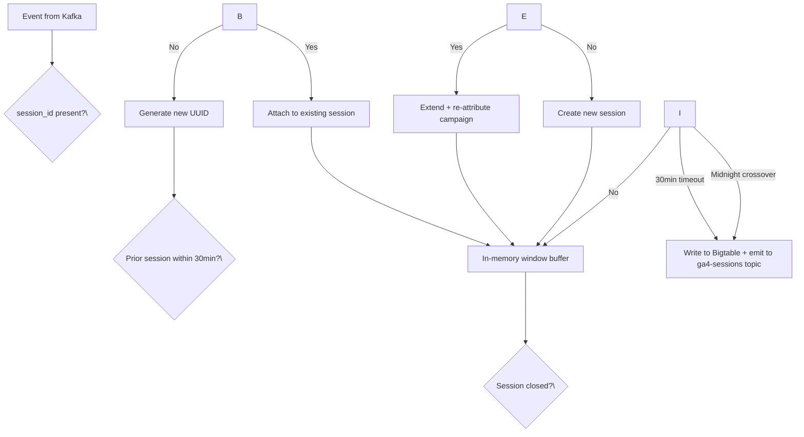
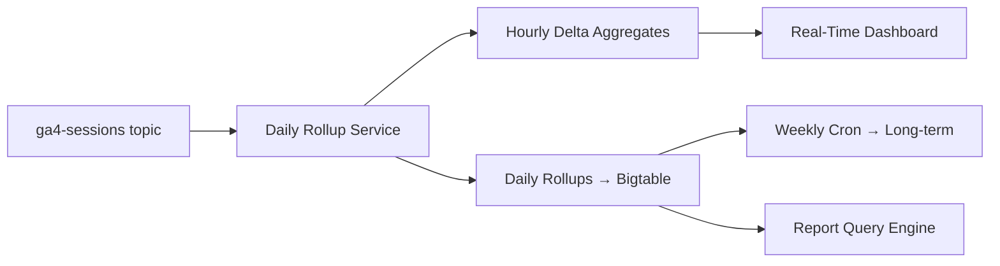
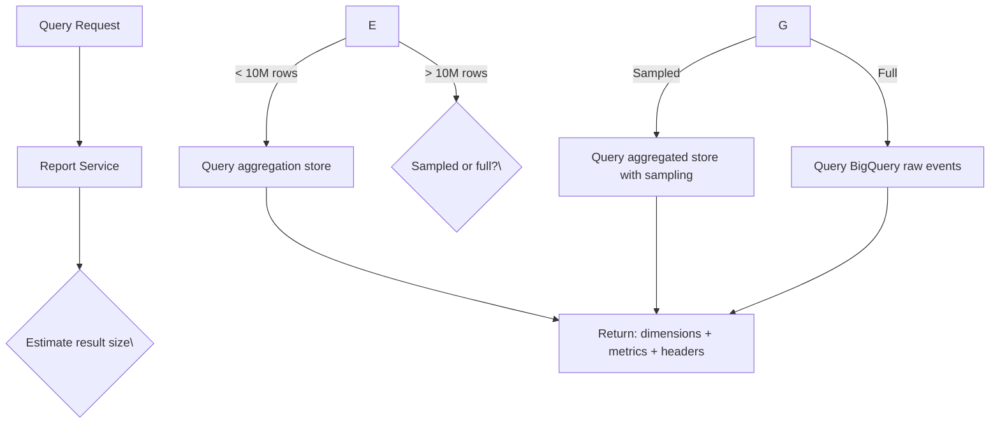

## Event Ingestion Path



**Ingestion Latency Budget:**

| Step | Component | Budget | Actual |
|------|-----------|--------|--------|
| TLS termination | Edge (nginx/ALB) | 5ms | 1ms |
| Validation + enrichment | Ingest Service | 20ms | 8ms |
| Kafka write | Kafka producer | 10ms | 3ms |
| Dedup check | Redis | 2ms | 1ms |
| **Total** | | **37ms** | **~13ms** |

**Key design decisions:**
- Partitioning by `property_id` ensures all events for a property go to same partition, preserving ordering for sessionizer
- Dedup via `ri` (request ID) in Redis with 5min TTL handles client retries
- Async write model: client gets ack immediately, processing is fire-and-forget

## Sessionization



**Session rules:**
- **Timeout:** 30 minutes of inactivity creates new session
- **Midnight crossover:** events after UTC midnight start new session regardless of inactivity
- **Campaign re-attribution:** if prior session found within 30min, inherit campaign from prior session

**Session state management:**
- In-memory window buffer: 10K sessions per instance; LRU eviction under memory pressure
- Redis `session:\{client_id\}` (TTL=30min): lookup for existing session continuity
- Closed sessions written to Bigtable (key: `property_id:session_id`) and emitted to `ga4-sessions` Kafka topic

## Aggregation & Rollup



**Aggregation tiers:**

| Tier | Frequency | Purpose | Latency |
|------|-----------|---------|---------|
| Hourly delta | Every hour | Real-time dashboard updates | Near real-time |
| Daily | 00:00 UTC | Finalized day report | < 2h after midnight |
| Weekly | Sunday 02:00 UTC | Long-term trend analysis | 24h stale |
| Monthly | 1st of month 04:00 UTC | Year-over-year comparison | 30d stale |

**Aggregation store key scheme:** `property_id:date:dimension_hash`

Example: `G-12345:2026-05-01:country_US:device_mobile` → `\{users: 12345, sessions: 15678, pageviews: 45678, engagements: 8901, revenue: 2345.67\}`

**Rollup strategy:**
- Read from `ga4-sessions` Kafka topic
- Group by property, apply dimension breakdown (country, device, source/medium, page_path)
- Incremental aggregation: each session record adds to running counters
- At midnight UTC: finalize previous day, atomically switch to new day counters

## Report Query Path



**Query latency by type:**

| Query Type | Data Source | Budget | Actual |
|------------|-------------|--------|--------|
| Standard report (aggregated) | Aggregation store | 2s | 500ms |
| Custom report (aggregated) | Aggregation store | 10s | 3s |
| Custom report (raw/BigQuery) | BigQuery | 30s | 15s |
| Real-time report | In-memory window | 500ms | 200ms |
| Active user count | In-memory counter | 100ms | 50ms |

**Query execution flow:**
1. Parse query: dimensions, metrics, date ranges, filters, segments
2. Estimate result size using metadata / histogram
3. If estimated rows > 10M: apply sampling and return `samplingSpaceSizes` in response
4. Execute against appropriate source (aggregated store, BigQuery, or in-memory)
5. Merge results by dimension, apply order-by and limit

## BigQuery Export Path

```mermaid
graph TD
    KafkaE[ga4-events topic] --> Batch[BigQueryExporter]
    Batch -->|Batch: 500 events / 1MB| GCS[Google Cloud Storage]
    GCS -->|gs://ga4-export/\{property\}/\{date\}/| Load[BigQuery Load Job]
    Load --> BQT[Table: events_\{date\} partitioned by _PARTITIONTIME]
```

**Export pipeline:**
1. BigQueryExporter consumer reads from `ga4-events` topic
2. Batches events by `property_id` + UTC date (500 events or 1MB per batch)
3. Writes JSON/Avro files to GCS: `gs://ga4-export/\{property_id\}/\{date\}/events-\{batch_id\}.json`
4. At 00:00 UTC: triggers BigQuery load job for previous day
5. Table partitioned by `_PARTITIONTIME`; schema matches GA4 event model (nested repeated records)
6. Export available 2-4 hours after UTC midnight (depends on data volume)

## Real-Time Tracking Path

```mermaid
graph TD
    KafkaR[ga4-events topic] --> RT[RealtimeTracker Consumer]
    RT --> RedisRT[Redis: rt:active_users:\{property_id\}]
    RT --> MemWin[In-memory sliding window]
    RT --> TopN[Redis sorted sets: top pages/events]
    MemWin --> API[Realtime API]
    RedisRT --> API
    TopN --> API
    API --> User[Dashboard / Realtime API client]
```

**Real-time data structures:**

| Structure | Key | TTL | Operation |
|-----------|-----|-----|-----------|
| Active user counter | `rt:active_users:\{property_id\}` | 30min | INCR + EXPIRE |
| Event sliding window | `rt:events:\{property_id\}` | 30min | ZADD (timestamp as score) |
| Top pages | `rt:top_pages:\{property_id\}` | 30min | ZINCRBY |
| Top events | `rt:top_events:\{property_id\}` | 30min | ZINCRBY |
| Traffic sources | `rt:top_sources:\{property_id\}` | 30min | ZINCRBY |

**Real-time latency:** event → visible in dashboard ≤ 30s (determined by consumer poll interval + API response time).

**Active user counting:** each event increments counter and resets TTL to 30min. Counter naturally decays as TTLs expire without re-increment.
